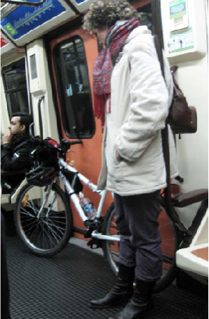
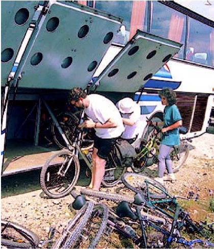

+++
title = 'Intermodalidad'
# linktitle = ''
date = 2019-03-01T11:11:29+02:00
draft = false
weight = 8
+++

De acuerdo al estudio técnico “[Intermodality: Bikes, Greenways and public transport. Best Practice Guide][1]”, en esta propuesta se quiere enfatizar sobre las siguientes buenas prácticas en materia de movilidad e intermodalidad:

- **Es necesario actuar desde una estrategia y campaña global**: A nivel europeo, es comúnmente aceptado considerar la bicicleta como una pieza clave en el engranaje del transporte público. De hecho, las bicicletas pueden desempeñar un papel importante en una o más etapas de los viajes diarios, independientemente de su origen o destino: residencia, trabajo, escuela… Esto debe explicarse a la ciudadanía, quien debe sentirse animada y apoyada para circular en bicicleta a diario. Por ejemplo, esto incluye, en el nivel más general, establecer una estrategia global para proporcionar información sobre los diversos beneficios y regulaciones a través de una campaña específica.

- **Viajero + Bicicleta en un mismo billete**: Permitir el transporte de bicicletas en vehículos de transporte público sin ningún cargo adicional, o con un importe muy atractivo, tiene un claro efecto positivo directo para promocionar las bicicletas como un modo de transporte complementario.

- **Buena práctica: el transporte de bicicletas en el transporte público**: puede convertirse en un problema en países con una gran tradición ciclista, como Dinamarca o los Países Bajos; mientras que puede ser un activo importante para la promoción de bicicletas en países sin un uso tan arraigado.

   

- **Buena práctica: facilitar las bicicletas en las estaciones intermodales**: Con parkings rápidos, consignas, zonas vigiladas.

- **Buena práctica: Bus+Bicis. Particularidades de las vías verdes**: Las estaciones de transporte público y las áreas de intercambio pueden incluir estas actividades de ocio alternativas como un objetivo complementario a los viajes diarios de traslado. La cercanía de las vías verdes al entorno urbano fomenta que sean más accesibles mediante el transporte público. Esto supone un beneficio para un grupo más amplio de ciudadanía, especialmente aquella que, por cualquier motivo, no tiene la posibilidad de acceder a vías verdes en un vehículo privado.

   

**El objetivo** de este documento al que se ha hecho referencia es ofrecer a políticos, técnicos, gerentes y otros profesionales y público en general un documento de recopilación de buenas prácticas sobre intermodalidad entre bicicletas y transporte público, conectado a vías verdes según la definición presentada en el proyecto de referencia.

**La tendencia actual** en muchos países de Europa de aumentar el uso de la bicicleta para cada tipo de viaje, mientras que otros países están desarrollando políticas de soporte de bicicletas durante varios años, hace que sea difícil pero también interesante recopilar una colección completa de todas las buenas prácticas.

Por lo tanto, es un documento complementario y valioso para esta propuesta que se está formulando.

<!-- Referencias externas -->

[1]: https://viasverdes.com/pdf/BestPracticesGuide_IntermodalityPT&Greenways.pdf "Intermodality: Bikes, Greenways and public transport. Best Practice Guide"
