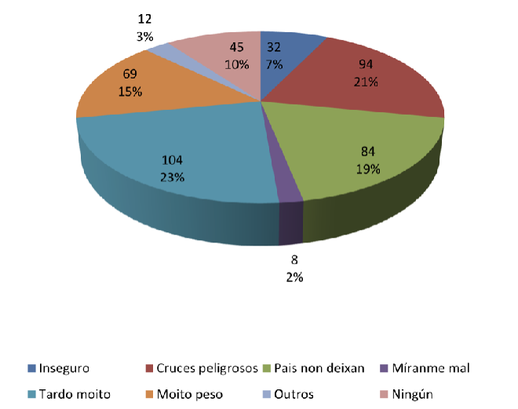
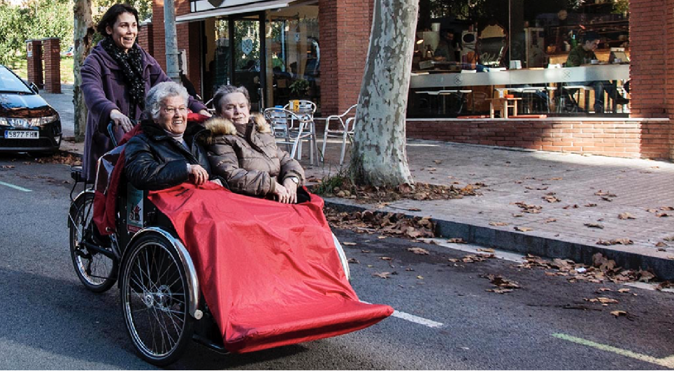

+++
title = 'Seguridad del recorrido y edades'
linktitle = 'Seguridad y edades'
date = 2024-09-28T11:11:29+02:00
draft = false
weight = 2
+++

**La seguridad se considera especialmente relevante**, ya que supone una de las causas fundamentales por las que la bicicleta no llega a suponer un medio mayoritario de movilidad. Por ello este aspecto se quiere abordar desde diferentes perspectivas, recordando el propósito de aportar una vía segura para personas de edad comprendida [entre 8 y 80 años (fundación 8-80)][1].

- [Perspectiva niñ@ desde los 8 años](#perspectiva-niñ-desde-los-8-años)
- [Perspectiva persona de 80 años](#perspectiva-persona-de-80-años)

### Perspectiva niñ@ desde los 8 años

Desde esta propuesta se quiere destacar el proyecto [“Camino Escolar Seguro” de la DGT][3] que persigue las siguientes metas:

- **Seguros**: Crear una red de itinerarios seguros y cambiar hábitos de desplazamiento caminando, en bicicleta o en transporte público.

- **Sostenibles**: Reducir el número de vehículos a motor que trasladan a los niños al colegio, aminorando el exceso de emisiones contaminantes y el ruido, actuando en favor de la mejora del medio ambiente, la recuperación del espacio público y la seguridad vial infantil.

- **Saludables**: Promover la movilidad activa, caminar y pedalear, favoreciendo el desarrollo de una actividad física cotidiana y hábitos de vida saludable, disminuyendo la obesidad y mejorando la salud.

- **Con autonomía**: Fomentar que los niños recuperen la calle y vayan solos o en compañía de sus amigos al colegio. De este modo se favorecerá la autoestima, la socialización y el proceso de aprendizaje por medio de la interacción y la cooperación.

En el marco local y de la iniciativa pionera en Compostela “*Cole Camiños. Camiño Escolar Seguro*” que se justifica como:

> En la actualidad son pocos los niños que disfrutan de esa experiencia, motivado por las prisas y los ritmos de vida excesivamente acelerados y también por un proteccionismo exagerado que están sufriendo por parte de sus familias.
>
> Además, la necesidad de acompañar a los niños y niñas hasta la misma puerta de las escuelas provoca un impacto negativo en la fluidez del tráfico de la ciudad al tiempo que genera demasiadas situaciones de riesgo para la seguridad de los propios escolares, convirtiendo a los padres y madres en los peores modelos a seguir en el que la educación viaria se refiere.
>
> Con estas bases, el proyecto Colecamiños, que surge desde la Policía Local con la consciencia del importante papel de la infancia en la ciudad, pretende favorecer la seguridad y la autonomía de los niños y niñas en sus desplazamientos al colegio.”

Un estudio ha recogido las opiniones de los propios niños acerca de los **inconvenientes de ir caminando al colegio** y las causas fundamentales por las que no van solos ([Fuente Policía Local de Santiago][2]):

El motivo principal que argumentan los niños es que tardan mucho. Sería interesante conocer su respuesta si en lugar de ir caminando, se les preguntase sobre la posibilidad de ir en bici.

Por otra parte, el segundo inconveniente que declaran es la peligrosidad en los cruces, seguramente porque perciben que el actual modelo de movilidad urbana no favorece su autonomía ya que tienen constante percepción de peligro.

El tercer inconveniente significativo es que las familias directamente no les dejan. Seguramente porque los adultos comparten y probablemente infundan la percepción de peligrosidad en la actual movilidad urbana.

Que una Vía como la que se propone pueda **favorecer un cambio de hábitos** y la consecución de las metas propuestas en el programa “Camino Escolar Seguro” justifica la creación de la infraestructura planteada en este documento, ya que como se ha indicado anteriormente se pone especial énfasis en la conectividad de colegios e institutos. Por otra parte, y dado el declarado y contrastado problema de fluidez del tráfico, esta infraestructura contribuiría a un claro beneficio global para la ciudad.

### Perspectiva persona de 80 años

Se refleja esta perspectiva inspirándose de proyectos en curso en otras ciudades.
Un rickshaw (triciclo taxi), ciclistas voluntarios y personas con ganas de volver a sentir el viento son los ingredientes de la iniciativa “En bici sense edat”, que desde octubre de 2016 puede verse por las calles de Barcelona. El proyecto, llega desde Dinamarca y ya se ha implantado con éxito en varios países. El objetivo es devolver a las personas mayores la capacidad de ir en bicicleta por su ciudad.

La propuesta que se describirá puede posibilitar estos programas, también atendiendo con que residencias de personas mayores colindan con el recorrido propuesto.

<!-- Referencias externas -->

[1]: https://www.880cities.org 'Compartiendo y promoviendo la idea del sentir general de ConBici junto con la fundación 8-80, que propone la conocida regla 8-80: una infraestructura ciclista es segura cuando puede ser usada confiadamente tanto por personas de 8 años como de 80 años'
[2]: http://policialocal.santiagodecompostela.gal/info.php?sec=33&idioma=es 'Cole Camiños. Policía Local de Santiago de Compostela'
[3]: https://www.dgt.es/conoce-la-dgt/que-hacemos/educacion-vial/camino-escolar/ 'Camino escolar DGT'
