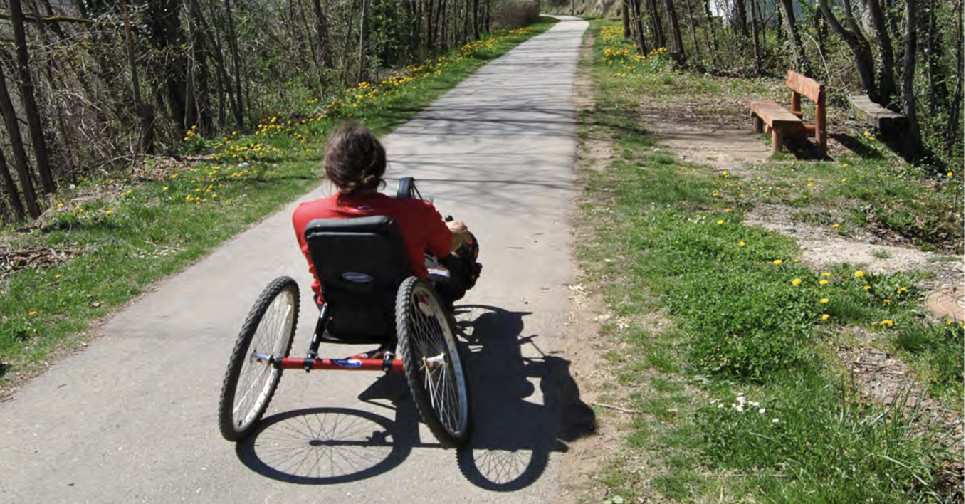

+++
title = 'Perspectiva de personas con movilidad reducida'
linktitle = 'Perspectiva mobilidad reducida'
date = 2019-03-01T11:11:29+02:00
draft = false
weight = 4
+++

Atendiendo a la adaptabilidad de la vía, se propone como punto de certificación de las características que debe tener la Vía O Milladoiro la “[*Guía Técnica y de diseño sobre accesibilidad en Vías Verdes*][1]” desarrollada por la plataforma Prefif (Plataforma Representativa Estatal de Personas con Discapacidad Física).

Actualmente, y dada la situación en la que se encuentra parte del recorrido propuesto, esta perspectiva no es asumible. Por ello, hay convencimiento de que con el trazado que se expone en este documento se abre una puerta a la movilidad desde dicha perspectiva.

<!-- Referencias externas -->
[1]: https://old.viasverdes.com/VVandalucia/pdf/GuiaTecnicaAccesibilidad-ViasVerdes.pdf 'Guía Técnica y de diseño sobre accesibilidad en Vías Verdes'
