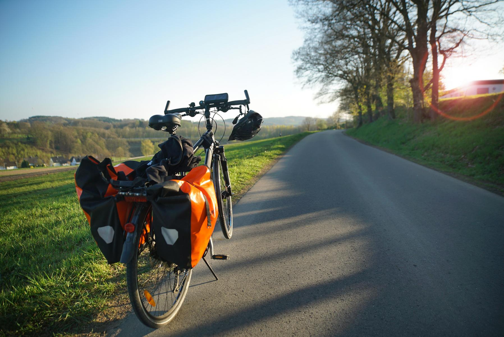

+++
title = 'Perspectiva de cicloturista'
linktitle = 'Perspectiva cicloturista'
date = 2019-03-01T11:11:29+02:00
draft = false
weight = 7
+++

Compostela es una ciudad a la que llegan muchos turistas, y frente a otras ciudades, recibe ciclo-turistas en un número significativamente más alto a causa de las rutas peregrinas. Por este motivo la infraestructura propuesta, que en un contexto más amplio se puede conectar con otras infraestructuras ciclistas, puede articular y extender un turismo hacia zonas rurales del entorno de Santiago. Es un turismo sostenible, ya que se distribuye mejor la riqueza que aporta, y resulta muy respetuoso con el medio ambiente.

Desde esta perspectiva, disponer de vías que proporcionen rutas seguras para continuar su viaje puede suponer un valor añadido y atractivo más para visitar la ciudad.

[El cicloturismo según paradores del Estado][1], es una forma saludable y sostenible de viajar, y un atractivo económico para nuestro país.

[1]: https://paradores.es/es/cicloturismo-en-paradores 'Cicloturismo en Paradores'
