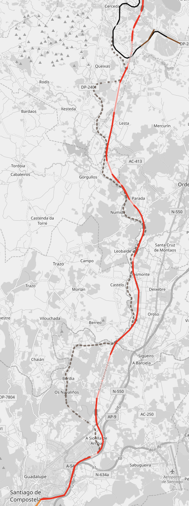

+++
title = 'Contexto de la Ciclovía y propósito'
linktitle = 'Contexto y propósito'
date = 2024-09-28T11:11:29+02:00
draft = false
weight = 10
+++

Una aspecto relevante para comprender la propuesta en cuanto al trazado de su recorrido, es **contextualizarlo con otras posibilidades que doten a la Senda de un propósito más amplio**. Por ejemplo, desde la perspectiva del turista que llega a la ciudad, de los ciclo-viajeros que han llegado a Santiago y derivan su recorrido a otros lugares de Galicia, o de los compostelanos que quieren utilizar la bicicleta para realizar actividades de fin de semana, sin necesidad de salir de la ciudad utilizando un coche.

Para comprender este contexto más amplio y comprender el propio alcance del recorrido, se deben **analizar los extremos de la senda propuesta y su posible conectividad con otras opciones**. La siguiente imagen ilustra la senda propuesta (en rojo), conectando con O Milladoiro al sur (camino natural a las Rías Baixas - Camino Portugués y Gran Recorrido Rural Gallego) y lindando al norte con la Ruta Peregrina (en azul celeste) que transita de oeste a este. Se ilustra también una posible conexión (en amarillo) con la futura Vía Verde que podría enlazar la Sionlla con Cerceda a través de un trazado ferroviario actualmente en desuso.

> En rojo, la Y que forma la Senda propuesta; En azul, actual paso de peregrinos y Eurovelo; En amarillo, una posibilidad de conexión con la Vía Verde Sionlla-Cerceda.

Una Vía Verde desde la Sionlla hasta Cerceda, utilizando una valiosa infraestructura ferroviaria que cumple unas características óptimas para la circulación en bicicleta, dispondría a la ciudad de una “zona de práctica ciclista” que repercutiría muy positivamente en un cambio en el modelo de movilidad. Una de las principales barreras para la asimilación de la bicicleta en la ciudad es la poca práctica o poca experiencia de circular con ellas y estas infraestructuras facilitarían la asimilación y la normalización de los desplazamientos por la propia ciudad.

No parece razonable que exista una Vía Verde tan próxima al núcleo urbano (apenas 6km), y que se deba requerir de un vehículo para transportar a personas y a bicicletas de forma segura hasta un punto de partida de esta vía.

> Captura del trazado ferroviaria actualmente operativo (en Rojo) y la infraestructura abandonada (en línea discontinua gris)

Aunque queda fuera del alcance de estar propuesta se pretende ilustrar con imágenes las posibilidades del recorrido así como el estado de abandono en el que se encuentra.

{}
  Las imágenes y el recorrido fueron tomadas gracias a la publicación de estas entradas en Wikiloc: [1](https://es.wikiloc.com/rutas-senderismo/por-la-antigua-via-ferrea-a-pontraga-ordes-a-sionlla-santiago-4205836) y [2](https://es.wikiloc.com/rutas-senderismo/por-la-antigua-via-ferrea-cerceda-a-pontraga-ordes-5718851)
{}

La ruta peregrina (Eurovelo-3) y su requerida adaptación a la circulación ciclista, también quedan fuera del alcance de esta propuesta.
