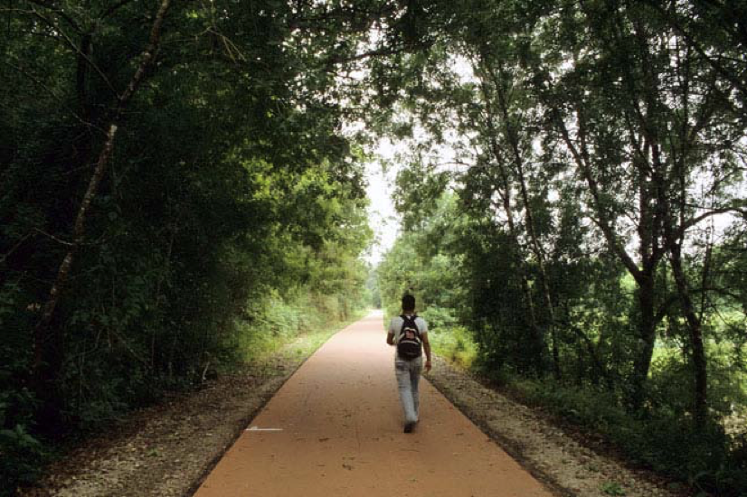

+++
title = 'Sensibilidad ambiental y paisajística de la Senda Fluvial de las Brañas do Sar'
linktitle = 'Sensibilidad ambiental'
date = 2024-09-28T11:11:29+02:00
draft = false
weight = 11
+++

Una parte de la propuesta planteada utiliza una senda que discurre próxima al río Sar. Conscientes del elevado valor ambiental y paisajístico que poseen las zonas próximas a los cursos fluviales, y en particular, el entorno del río Sar a su paso por la ciudad Santiago de Compostela, se quiere dejar constancia de que se considera primordial que, en caso de que sea necesario acometer alguna solución técnica para habilitar la circulación de bicicletas por estos tramos, se asegure su estricta compatibilidad ambiental y paisajística.

Por ello se exponen una serie de consideraciones de carácter más o menos genérico, a tener en cuenta a la hora de actuar en estas zonas tan sensibles.

Conscientes de la necesidad de preservar un espacio fluvial que respete al máximo la dinámica natural de los ríos, más allá de evitar actuaciones que supongan una mayor artificialización o intervención sobre estas zonas, se considera que se deben evitar actuaciones que puedan dar lugar a alteraciones sustanciales de la permeabilidad superficial, o de la naturalidad tanto del cauce como de la zona de ribera.

Así, no se consideran apropiadas medidas que impliquen la impermeabilización de superficies, o que produzcan afecciones a la vegetación de ribera. Incluso podría ser necesario asumir la inundación periódica (y por tanto la no utilización) de ciertos tramos, dado que estas zonas próximas a los cauces fluviales forman parte en muchas ocasiones de sus llanuras de inundación, zonas de elevado valor funcional y ecológico.

De igual modo, de ser necesario mejorar la iluminación de algunos tramos, no se debería contemplar la iluminación total o incluso parcial del cauce, para evitar una contaminación lumínica que afecte a los ecosistemas acuáticos o a los ecosistemas terrestres asociados, y evitando su iluminación durante toda la noche.

> Ecovía do Migno. Portugal
