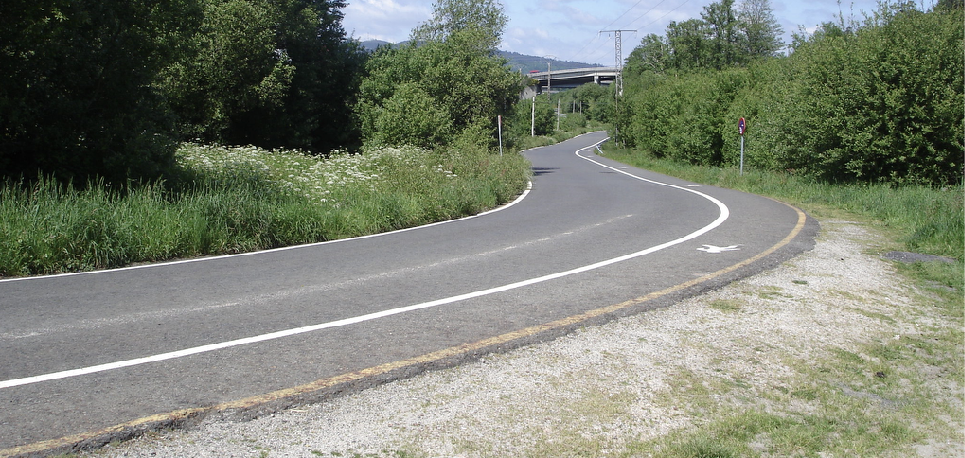
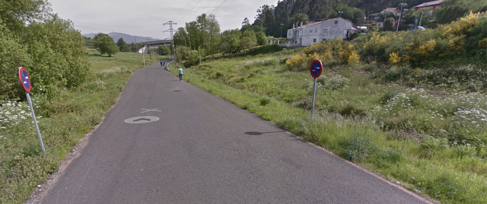
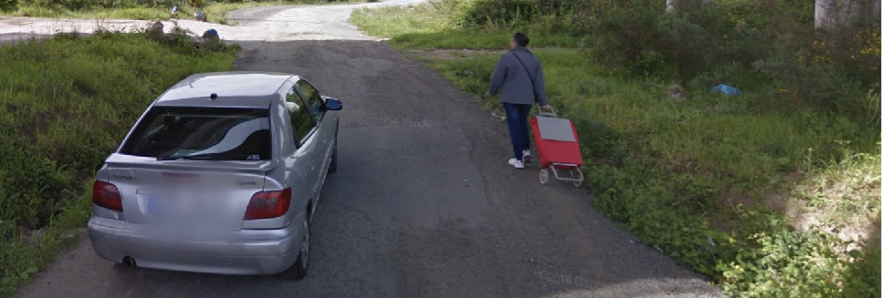
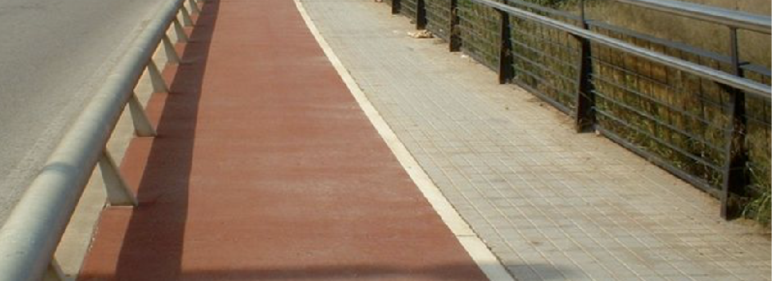
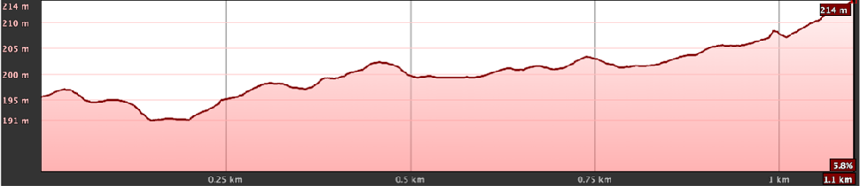
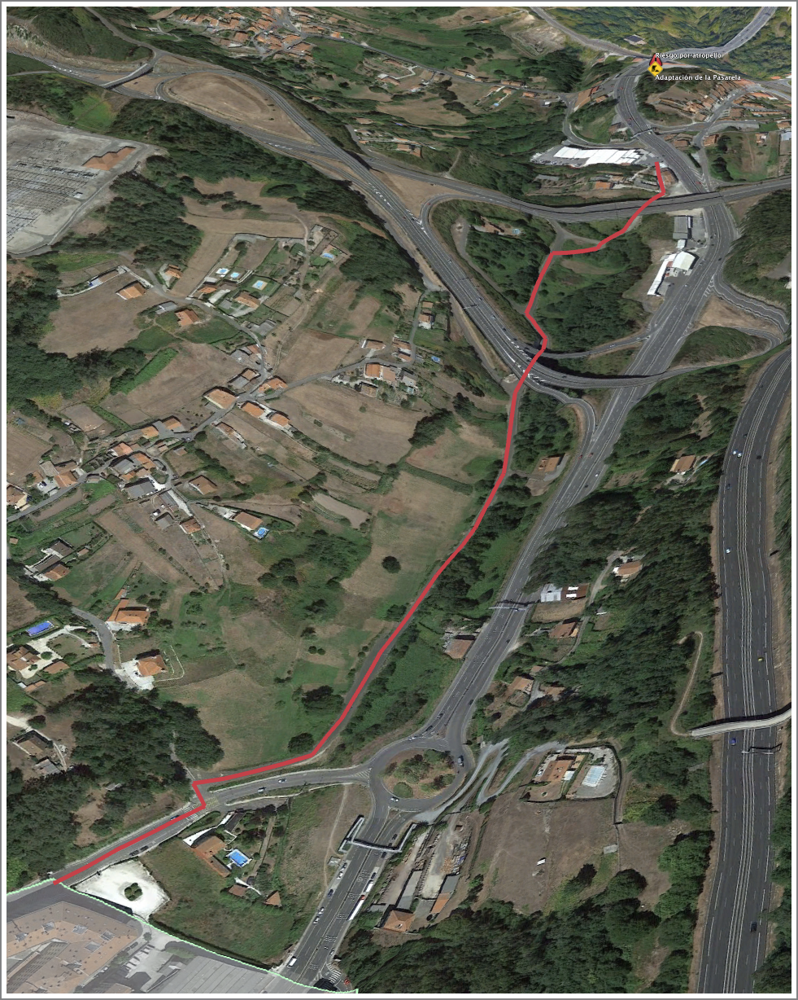
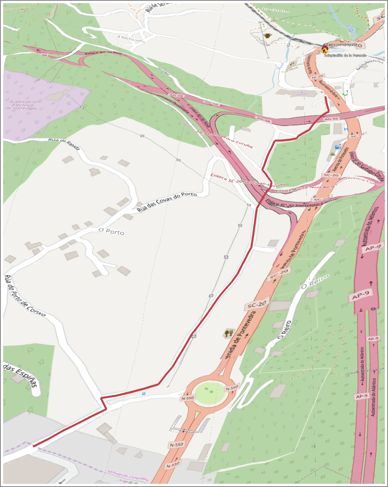

+++
title = 'Tramo A'
date = 2019-03-01T11:11:29+02:00
draft = false
weight = 1
+++

| Alternativas  | Tramo | Distancia | Descripción
|---|---|---|---
|Sin alternativas | Tramo A | 1.100 m | Corresponde al inicio desde el límite administrativo del Concello de Santiago que linda con Ames y concretamente con el núcleo urbano de O Milladoiro. Termina en el concesionario de coches Yáñez.

- [Estado actual](#estado-actual)
  - [Fortalezas](#fortalezas)
  - [Debilidades](#debilidades)
- [Estado con ciclovía](#estado-con-ciclovía)
  - [Oportunidades](#oportunidades)
  - [Amenazas](#amenazas)
- [Perfil del Tramo](#perfil-del-tramo)
- [Sobre el Mapa](#sobre-el-mapa)

A este tramo se accede a través de la Rúa do Porto de Conxo (Ames - O Milladoiro), y comprende un tramo asfaltado, que discurre paralelo a la SC-20. Por él transitan habitualmente peatones y peregrinos, compartiendo estos espacio con vehículos a motor.
Está débilmente iluminado y la separación del tráfico de alta velocidad con respecto al paso de peatones es muy débil (realmente es un arcén). Actualmente no deja muy claro por dónde deberían circular las bicicletas, ya que parece que el espacio marcado es exclusivo de los peatones.

> Tramo del recorrido con espacios débilmente separados y ausencia total de iluminación.

> Tramo del recorrido con circulación de viandantes

La primera parte del tramo tiene un pavimento adecuado. En la desviación que atraviesa por debajo la vía AG-56 (Noia) debe mejorarse el pavimento, dado que el actual está bastante deteriorado, hasta el punto de convertirse en grava en alguna zona.

En este tramo se propone una separación clara entre vehículos a motor, bicicletas y viandantes, figurando de forma clara y explícita por dónde debe circular cada uno de ellos.

> Último tramo debajo de la AG-56

Se propone establecer una barrera física entre el tráfico motorizado por los motivos siguientes:

- La propuesta de vía ciclista entre Milladoiro y Santiago tiene una finalidad vertebradora del tráfico entre estos dos núcleos y debe ser claramente distinguible en todos los tramos de su recorrido.

- Es una vía ciclable para personas de 8 años hasta 80 años (o más!), y personas poco experimentadas en el manejo de la bicicleta, por lo que debe transmitir la sensación de seguridad y exclusividad en todo el recorrido respecto al vehículo motorizado.

> Ilustración de un posible tipo explícito de separación con el tráfico a motor

## Estado actual

### Fortalezas

- Tramo de perfil plano.
- Vía alternativa a vía principal (SC-20) que absorbe todo el tráfico de alta velocidad.
- No presenta aparentes dificultades para aumentar el ancho de la vía.

### Debilidades

- Tráfico no separado ni para peatones ni para ciclistas, careciendo de aceras e iluminación apropiada.
- El pavimento no está pintado ni se distingue ningún carril o arcén, lo que favorece que los vehículos vayan por el centro de la calzada a más velocidad y trazando las curvas con mayor riesgo para la circulación del sentido opuesto.

## Estado con ciclovía

### Oportunidades

- Conexión segura para ciclistas de todas las edades y niveles.
- Conexión segura para peatones.
- Conexión segura para Personas con Movilidad Reducida.
- Conexión segura diurna y nocturna.
- Conexión segura independientemente de la condición meteorológica y visibilidad para el tráfico motorizado.

### Amenazas

- Deterioro de la infraestructura por su mala conservación.
- Infraestructura infrautilizada por la falta de integridad en el recorrido de la que forma parte y de no conectar con el mismo grado de seguridad y facilidad de uso que otros tramos del recorrido.
- Falta de implicación de otros actores sociales como administración y empresas, que fomenten la movilidad en bicicleta dentro de su actividad.

## Perfil del Tramo

> Perfil del Tramo A (eje X invertido). Llano.

## Sobre el Mapa

> Tramo A. Google Satetellite

> Tramo A. Open Cycle Map
