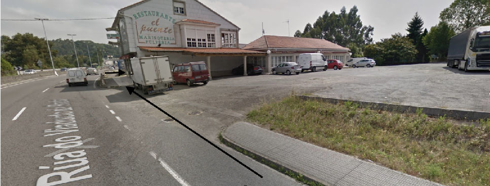
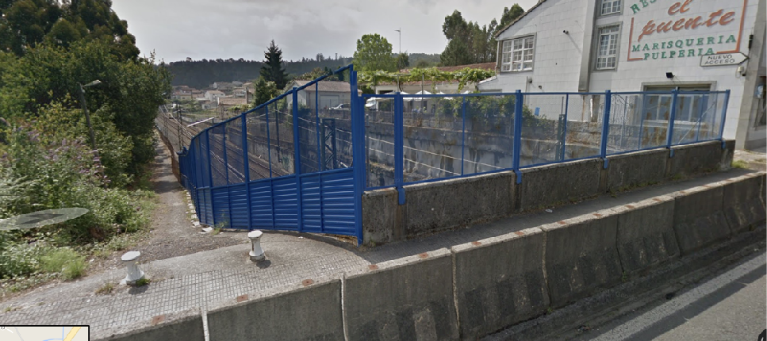
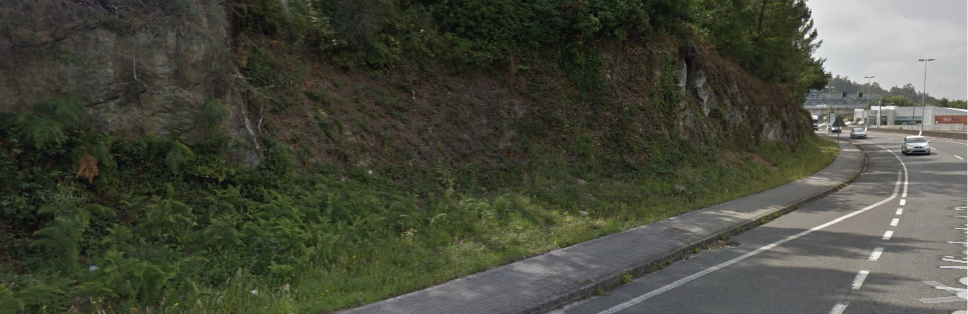

+++
title = 'Tramo Este-B'
date = 2019-03-01T11:11:29+02:00
draft = false
weight = 2
+++

| Alternativas  | Tramo | Distancia | Descripción
|---|---|---|---
| Directa | Tramo Este-B1 | 517 m | Después de cruzar la SC-20 por paso elevado, esta alternativa toma un sendero existente para que sea acondicionado, yendo paralelo a la línea de ferrocarril hasta el paso soterrado peatonal. Tiene un punto de alto riesgo de atropello.
| Rodeo | Tramo Este-B2 | 744 m | Esta alternativa evita el riesgo del acceso al parking, practicando un rodeo en sentido opuesto a la marcha del tráfico motorizado por vía separada, para acceder a la Rúa da Poza Real de Arriba.

- [Tramo E-B1](#tramo-e-b1)
- [Tramo E-B2](#tramo-e-b2)
- [Estado actual](#estado-actual)
  - [Fortalezas](#fortalezas)
  - [Debilidades](#debilidades)
- [Estado con ciclovía](#estado-con-ciclovía)
  - [Oportunidades](#oportunidades)
  - [Amenazas](#amenazas)
- [Sobre el Mapa](#sobre-el-mapa)

En su parte común, ambas alternativas E-B1 y E-B2 deben dirigirse hacia el paso elevado que atraviesa la SC-20. En este transcurso discurren pegados al carril de contramarcha de automóviles. Actualmente o se atraviesa el aparcamiento del concesionario de VW o bien se toma una estrecha acera peatonal.

> Tramo B. En su paso por el frente del concesionario VW para, pasado éste, cruzar por un paso de cebra (detrás furgoneta)

La imagen precedente ilustra la estrecha acera que hay que tomar hasta llegar a la pasarela que atraviesa la SC-20 (al fondo, en azul celeste).

Este paso elevado presenta actualmente la dificultad de su estrechez para la convivencia peatón-ciclista, sus ángulos de giro y la peligrosidad de precipitarse en su punto más alto. No es apto para la circulación de bicicletas y es peligroso en la pasarela que atraviesa la carretera debido a la baja altura de la baranda, de forma que, por una pérdida de equilibro, pudiera provocar que el ciclista pivotase sobre la ella precipitándose hacia la calzada.

> Tramo B. En su paso por el frente del concesionario VW para, pasado éste, cruzar por un paso de cebra (detrás furgoneta)

> Tramo B. Perspectiva de la pasarela actual que atraviesa la SC-20

Esta alternativa debe atravesar la SC-20 situándose en el sentido Santiago de circulación motorizada. Pasada la pasarela ambas opciones divergen.

## Tramo E-B1

Pasada la pasarela se continúa en dirección Santiago y compartiendo sentido de marcha con el tráfico motorizado. En este punto es reseñable el acceso al parking del restaurante “El Puente”. El tráfico viene entorno a una velocidad de 60-80km/h, y sin carril de deceleración se accede directamente al parking. Si en ese momento cruzase un peatón o un ciclista provocaría una situación muy peligrosa dada la tremenda deceleración que debe hacer el vehículo y el tráfico veloz que le sucede y puede darle alcance. Es un punto muy peligroso en la actualidad, ya que carece de señalización horizontal y vertical, y no se dan las condiciones para que sea, tal y como está, un itinerario seguro para ciclistas o peatones.

> Tramo E-B1. Ya es un punto muy peligroso en la actualidad

Pasado el restaurante El Puente, se toma a mano derecha un sendero que confluye con su alternativa en el paso soterrado de la vía del tren.

Esta propuesta acorta el recorrido en más de 200m frente a su alternativa y tiene un perfil muy plano (a falta de la pasarela y algo de desnivel en el sendero), lo que la hace prioritaria sobre su alternativa.

> Tramo E-B1. Sendero paralelo a la vía para re acondicionar

## Tramo E-B2

Pasada la pasarela de la SC-20, esta alternativa pretende evitar el peligroso tramo del parking del restaurante El Puente, a costa de un mayor recorrido (más de 200m), un desnivel menos favorable y un paso soterrado sobre la vía (actualmente escalonado). Su principal dificultad es la necesidad de ir en sentido contrario a la marcha del tráfico motorizado, lo que implica la necesidad de segregar fuertemente un carril bici. Se puede ver en la siguiente imagen que existe espacio para hacer efectiva esta separación.

Sería necesario el acondicionamiento de la rotonda que une con la Rúa da Poza Real de Arriba. Además, sería necesario el acondicionamiento del paso soterrado de la vía del tren, actualmente escalonado, y se tendría que estudiar la viabilidad de hacerlo ciclable. Existe la posibilidad, siguiendo la calzada, de utilizar el paso soterrado para vehículos motorizados, lo que implicaría más recorrido y penalizar más el perfil del tramo.

Esta propuesta de tramo presenta más dificultades que su alternativa. Tiene un perfil más pronunciado, más recorrido, dificultad de separación, y por tanto necesidad de más inversión. El único punto fuerte es que se evita el paso del parking del restaurante El Puente y el acceso al sendero.

## Estado actual

### Fortalezas

- Tramo de perfil plano.
- Aprovechamiento de infraestructuras existentes, como el sendero paralelo a la vía del tren.

### Debilidades

- Muy alta peligrosidad dado el tráfico de alta velocidad
- Infraestructuras no diseñadas para peatones y ciclistas lo que crean dos “*islas poblacionales*”.
- Poco espacio para adaptar las vías.
- Vías de alta capacidad y de alta velocidad y críticas para el tráfico motorizado.
- Ponte da rocha con diseño protagonista de tráfico motorizado.
- Negocios locales muy cerca la calzada.
- Necesidad de cruce de la SC-20
- Dificultad técnica de adaptación al modelo de movilidad sostenible.

## Estado con ciclovía

### Oportunidades

- Conexión de negocios y viviendas particulares aisladas por la SC-20.
- Conexión segura para ciclistas de todas las edades y niveles.
- Conexión segura para peatones.
- Conexión segura para Personas con Movilidad Reducida.
- Conexión segura diurna y nocturna.
- Conexión segura independientemente de la condición meteorológica y visibilidad para el tráfico motorizado.

### Amenazas

- Infraestructura infrautilizada si no se promociona la movilidad sostenible en bicicleta y peatonal en otros ámbitos.
- Infraestructura infrautilizada si no se apoya la formación
- Infraestructura infrautilizada por la falta de integridad en el recorrido de la que forma parte y de no conectar con el mismo grado de seguridad y facilidad de uso que otros tramos del recorrido.
- Falta de implicación de otros actores sociales como administración y empresas, que fomenten la movilidad en bicicleta dentro de su actividad.

## Sobre el Mapa

> Tramo E-B1 (rojo) y E-B2 (amarillo) en Google Satetellite

> Tramo E-B1 (rojo) y E-B2 (amarillo) en. Open Cycle Map
