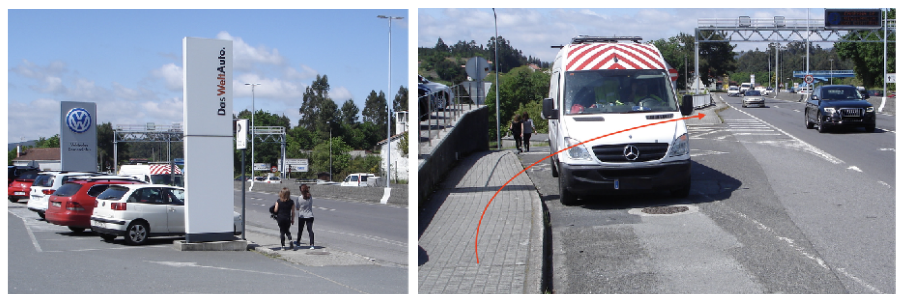
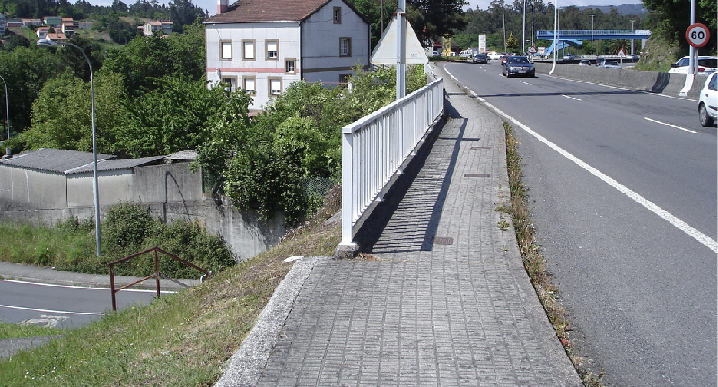
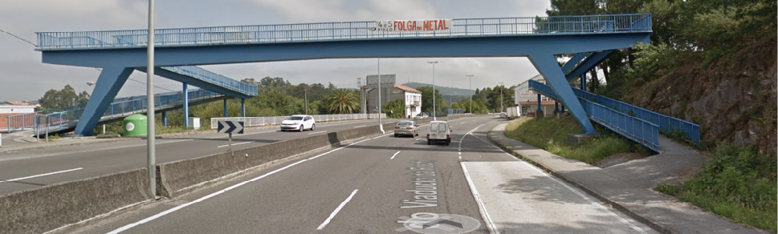
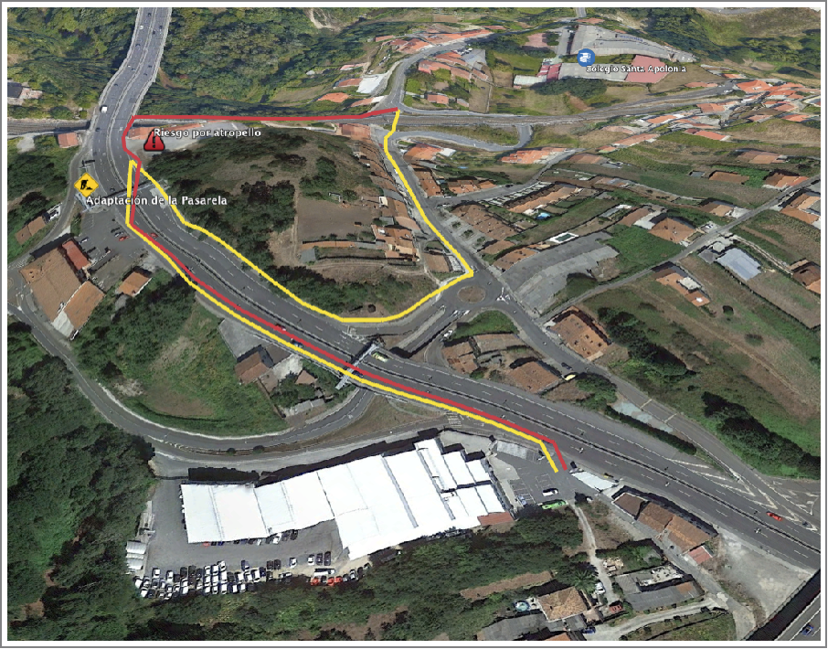
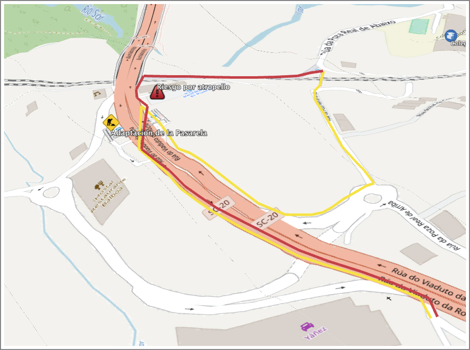

+++
title = 'Tramo Este-B'
date = 2024-09-28T11:11:29+02:00
draft = false
weight = 2
+++

| Alternativas  | Tramo | Distancia | Descripción
|---|---|---|---
| Directa | Tramo Este-B1 | 517 m | Después de cruzar la SC-20 por paso elevado, esta alternativa toma un sendero existente para que sea acondicionado, yendo paralelo a la línea de ferrocarril hasta el paso soterrado peatonal. Tiene un punto de alto riesgo de atropello.
| Rodeo | Tramo Este-B2 | 744 m | Esta alternativa evita el riesgo del acceso al parking, practicando un rodeo en sentido opuesto a la marcha del tráfico motorizado por vía separada, para acceder a la Rúa da Poza Real de Arriba.

- [Tramo E-B1](#tramo-e-b1)
- [Tramo E-B2](#tramo-e-b2)
- [Estado actual](#estado-actual)
  - [Fortalezas](#fortalezas)
  - [Debilidades](#debilidades)
- [Estado con ciclovía](#estado-con-ciclovía)
  - [Oportunidades](#oportunidades)
  - [Amenazas](#amenazas)
- [Sobre el Mapa](#sobre-el-mapa)

En su parte común, ambas alternativas E-B1 y E-B2 deben dirigirse hacia el paso elevado que atraviesa la SC-20. En este transcurso discurren pegados al carril de contramarcha de automóviles. Actualmente o se atraviesa el aparcamiento del concesionario de VW o bien se toma una estrecha acera peatonal.

> Tramo B. En su paso por el frente del concesionario VW para, pasado éste, cruzar por un paso de cebra (detrás furgoneta)

La imagen precedente ilustra la estrecha acera que hay que tomar hasta llegar a la pasarela que atraviesa la SC-20 (al fondo, en azul celeste).

Este paso elevado presenta actualmente la dificultad de su estrechez para la convivencia peatón-ciclista, sus ángulos de giro y la peligrosidad de precipitarse en su punto más alto. No es apto para la circulación de bicicletas y es peligroso en la pasarela que atraviesa la carretera debido a la baja altura de la baranda, de forma que, por una pérdida de equilibro, pudiera provocar que el ciclista pivotase sobre la ella precipitándose hacia la calzada.

> Tramo B. En su paso por el frente del concesionario VW para, pasado éste, cruzar por un paso de cebra (detrás furgoneta)

> Tramo B. Perspectiva de la pasarela actual que atraviesa la SC-20

Esta alternativa debe atravesar la SC-20 situándose en el sentido Santiago de circulación motorizada. Pasada la pasarela ambas opciones divergen.

## Tramo E-B1

<!-- TODO: -->

## Tramo E-B2

<!-- TODO: -->

## Estado actual

### Fortalezas

- Tramo de perfil plano.
- Aprovechamiento de infraestructuras existentes, como el sendero paralelo a la vía del tren.

### Debilidades

- Muy alta peligrosidad dado el tráfico de alta velocidad
- Infraestructuras no diseñadas para peatones y ciclistas lo que crean dos “*islas poblacionales*”.
- Poco espacio para adaptar las vías.
- Vías de alta capacidad y de alta velocidad y críticas para el tráfico motorizado.
- Ponte da rocha con diseño protagonista de tráfico motorizado.
- Negocios locales muy cerca la calzada.
- Necesidad de cruce de la SC-20
- Dificultad técnica de adaptación al modelo de movilidad sostenible.

## Estado con ciclovía

### Oportunidades

- Conexión de negocios y viviendas particulares aisladas por la SC-20.
- Conexión segura para ciclistas de todas las edades y niveles.
- Conexión segura para peatones.
- Conexión segura para Personas con Movilidad Reducida.
- Conexión segura diurna y nocturna.
- Conexión segura independientemente de la condición meteorológica y visibilidad para el tráfico motorizado.

### Amenazas

- Infraestructura infrautilizada si no se promociona la movilidad sostenible en bicicleta y peatonal en otros ámbitos.
- Infraestructura infrautilizada si no se apoya la formación
- Infraestructura infrautilizada por la falta de integridad en el recorrido de la que forma parte y de no conectar con el mismo grado de seguridad y facilidad de uso que otros tramos del recorrido.
- Falta de implicación de otros actores sociales como administración y empresas, que fomenten la movilidad en bicicleta dentro de su actividad.

## Sobre el Mapa

> Tramo E-B1 (rojo) y E-B2 (amarillo) en Google Satetellite

> Tramo E-B1 (rojo) y E-B2 (amarillo) en. Open Cycle Map
