+++
title = 'Tramo Este-C'
date = 2024-09-28T11:11:29+02:00
draft = false
weight = 3
+++

Existen 2 alternativas principales. Ambas conectan el paso soterrado de la vía del tren en la Rúa da Poza Real (Conxo) con el parque del Banquete de Conxo.

| Alternativas  | Tramo | Distancia | Descripción
|---|---|---|---
| Directa y paraleta al tren | Tramo Este-C1+a (previo túnel) y Tramo Este-C1+b (salida túnel) | 1.709 m | Continúa paralelo a las vías del tren por una pista asfaltada que da acceso a unas viviendas, donde se convierte en un sendero que termina siendo intransitable por haberse derrumbado parte del mismo y que accedería directamente al túnel abandonado del antiguo trazado de vía. Atravesando el túnel, se desciende por diferentes opciones de senderos en dirección al parque del Banquete de Conxo.
| Rodeo por Televés | Tramo Este-C2 | 2.157 m | Esta alternativa continua por la Rúa da Poza Real de Abaixo, pasando por el colegio Santa Apolonia, para continuar por la Calle de Torrente y la Rúa da Benéfica de Conxo, pasando la empresa Televés, donde poco después se gira a la derecha por la Rúa da fervenza, enlazando finalmente donde termina actualmente el paseo fluvial de las Brañas do Sar, continuando por este hasta el Banquete de Conxo.

- [Tramo C-1](#tramo-c-1)
  - [Estado actual tramo este-c1](#estado-actual-tramo-este-c1)
    - [Fortalezas tramo este-c1](#fortalezas-tramo-este-c1)
    - [Debilidades tramo este-c1](#debilidades-tramo-este-c1)
  - [Estado con ciclovía tramo este-c1](#estado-con-ciclovía-tramo-este-c1)
    - [Oportunidades tramo este-c1](#oportunidades-tramo-este-c1)
    - [Amenazas tramo este-c1](#amenazas-tramo-este-c1)
- [Tramo C-2](#tramo-c-2)
  - [Estado actual tramo este-c2](#estado-actual-tramo-este-c2)
    - [Fortalezas tramo este-c2](#fortalezas-tramo-este-c2)
    - [Debilidades tramo este-c2](#debilidades-tramo-este-c2)
  - [Estado con ciclovía tramo este-c2](#estado-con-ciclovía-tramo-este-c2)
    - [Oportunidades tramo este-c2](#oportunidades-tramo-este-c2)
    - [Amenazas tramo este-c2](#amenazas-tramo-este-c2)
- [Perfil del Tramo](#perfil-del-tramo)
- [Sobre el Mapa](#sobre-el-mapa)

Situados justo al lado de la actual vía de tren que conecta Santiago con Vigo debemos decidir entre dos alternativas muy diferentes. La siguiente imagen ilustra la situación y a continuación se pasa a describir detalladamente cada alternativa:

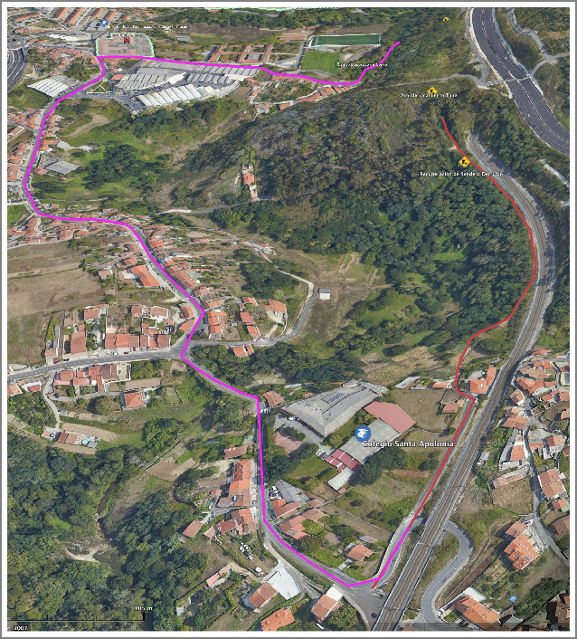

## Tramo C-1

Este tramo discurre paralelo a las vías del tren por una pista asfaltada que da acceso a unas viviendas, hasta transformarse en un sendero que se convierte en intransitable al haberse derrumbado parte del mismo con motivo de las obras del nuevo trazado ferroviario. Investigando acerca de este sendero se pudo corroborar que en su día fue transitable e incluso cartografiado en OpenStreepMap (se ha contactado con el usuario que registró su existencia). El usuario nos trasladó el siguiente mensaje:

> “*Hola, en su día existían. De hecho los recorrí con la bici de montaña. Los senderos los mapeé con conocimiento local y ayuda de un GPS. En Galicia las pistas duran pero los senderos si no son transitados se cubren enseguida de silvas y tojos.*”

Se destaca sobre este punto que es necesaria una obra de reconstrucción del sendero, manteniéndose lo más próximo posible al trazado ferroviario lo que permitiría mantener el perfil prácticamente plano (sin apenas pendiente) hasta la entrada en el túnel abandonado.

Una vez en la boca del túnel se evidencia que es una infraestructura valiosa, que ha dejado de tener uso o propósito y que no requiere de un gran esfuerzo de acondicionamiento para su uso como vía ciclista-peatonal. Es necesario realizar tareas de desbroce en sus bocas, pavimentar y fundamentalmente dotar de iluminación a todo este tramo, dentro y fuera del túnel.

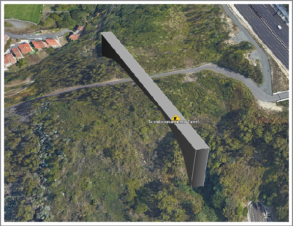

> Túnel abandonado por el uso del actual túnel paralelo (trazado aproximado)

La siguientes imágenes ilustran la necesidad de desbroce pero también evidencian que es un trazado muy adecuado para la bicicleta. Destaca su perfil llano, su anchura, la separación de otro tipo de tráfico, la tranquilidad de su recorrido en ausencia de ruido y su riqueza natural. Sin embargo es una parte del recorrido donde se debe enfatizar en la percepción de seguridad, dotando al lugar de una muy buena iluminación por tratarse de una de las zonas del recorrido más aisladas.

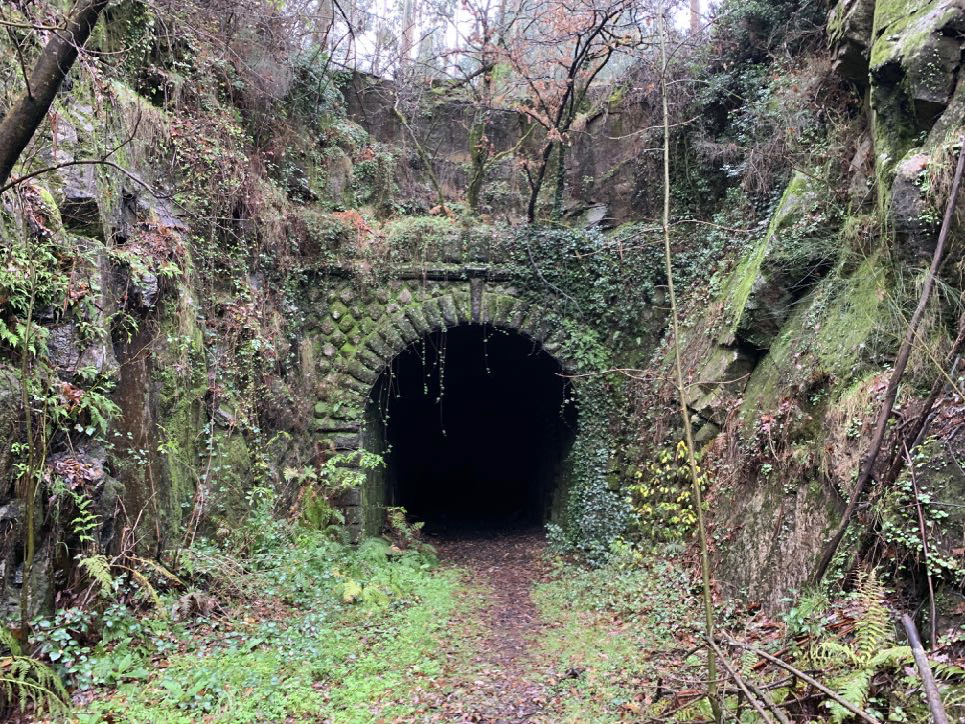

> Boca del túnel en sentido O Milladoiro

Una vez abandonado el túnel, se continúa unos pocos metros por lo que antes eran vías de tren acabando de nuevo en un sendero intransitable.

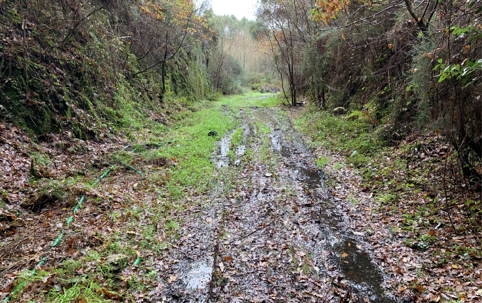

> Boca del túnel a espaldas de la fotografía y en sentido Santiago

Desde este sendero (este microtramo cumple con las características de una vía verde) se accede de nuevo a la senda fluvial de las Brañas do Sar.

La conexión se puede hacer por senderos existentes, en la siguiente imagen se ilustran estas posibilidades. En rojo se detalla la propuesta óptima de recorrido (E-C1+b) atendiendo a las características de una vía ciclista-peatonal. El sendero rosa representa la alternativa (E-C2) que llega igualmente al Banquete de Conxo. Las líneas azul y violeta representan senderos existentes que conectan con la actual senda fluvial de las Brañas do Sar, pero con un perfil muy pronunciado. Este perfil no supondría un problema en dirección a Santiago, pero sí sería un impedimento en sentido contrario, debido a la abrupta subida para alcanzar la cota que toma el túnel.

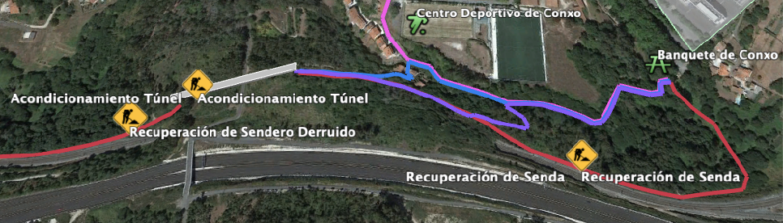

> En Rojo:(E-C1+b); En Violeta: (E-C2); En Azul: (Estrecho y abrupto sendero) En Violeta: (Sendero con pronunciada pendiente)

El sendero propuesto como ideal (en rojo) continua paralelo a la vía del tren. Actualmente se puede acceder a pie salvo en un tramo (de aprox. 90m) en el que, también por derrumbe, se corre el riesgo de precipitarse por un talud. Si este tramo de sendero se recuperase y re-acondicionase sería la opción idónea ya que al aumentar su distancia permite que el perfil (de subida o bajada) sea mucho más suave y factible para cualquier tipo de ciclista.

Este tramo paralelo a la pista conecta con un sendero existente con necesidad de acondicionarlo pero que termina directamente en el parque del paseo de Conxo.

Atendiendo al tramo E-C1 en su conjunto y en relación a sus posible alternativas, ofrece realmente una rápida conexión entre O Milladoiro y Santiago, que es uno de los objetivos fundamentales de esta propuesta. Realmente, en este tramo es donde se puede reducir significativamente el tiempo de conexión de estos dos núcleos poblacionales al tratarse de un recorrido mucho más llano que su alternativa y pudiéndose alcanzar fácilmente una media de 15-20km/h en bicicleta por ella. **En esta situación podríamos estimar que el recorrido de aproximadamente 4,6Km que separan O Milladoiro con la Rúa Pintor Laxeiro (inmediaciones de la estación de tren, límite con el Ensanche), podría realizarse en bicicleta a una media de 15km/h en aproximadamente 18 minutos**.

### Estado actual tramo este-c1

#### Fortalezas tramo este-c1

- Tramo de perfil moderadamente plano.
- Aprovechamiento de valiosa infraestructura, que ha dejado de tener uso o propósito y que no requiere de un gran esfuerzo de acondicionamiento para el uso como vía ciclista-peatonal.
- Trazado muy adecuado para la bicicleta por reunir en buena parte de su recorrido las condiciones de una vía verde.
- La posibilidad poder realizar un recorrido anchura y seguro para ciclistas y peatones, así como el acceso a Vehículos de Movilidad Personal.
- Recorrido de tráfico completamente separado de tráfico motorizado.
- Tranquilidad de su recorrido en ausencia de ruido.
- Riqueza natural.

#### Debilidades tramo este-c1

- Necesidad de significativa inversión
- Varios organismos implicados (Adif, Concello…)
- Percepción de la seguridad por tratarse de una de las zonas del recorrido más aisladas.

### Estado con ciclovía tramo este-c1

#### Oportunidades tramo este-c1

- Muy buena y rápida conexión del barrio de Conxo con Santiago Centro.
- Conexión segura para ciclistas de todas las edades y niveles.
- Conexión segura para peatones.
- Conexión segura para Personas con Movilidad Reducida.
- Conexión segura diurna y nocturna.
- Conexión segura independientemente de la condición meteorológica y visibilidad para el tráfico motorizado.

#### Amenazas tramo este-c1

- Percepción de inseguridad provocada por una mala iluminación (en todo o en parte del recorrido) y por no tener suficiente flujo de ciclistas y viandantes que provoquen menos aislamiento.
- Infraestructura infrautilizada si no se promociona la movilidad sostenible en bicicleta y peatonal en otros ámbitos.
- Infraestructura infrautilizada si no se apoya la formación
- Infraestructura infrautilizada por la falta de integridad en el recorrido de la que forma parte y de no conectar con el mismo grado de seguridad y facilidad de uso que otros tramos del recorrido.
- Falta de implicación de otros actores sociales como administración y empresas, que fomenten la movilidad en bicicleta dentro de su actividad.

## Tramo C-2

Se plantea el tramo E-C2 como alternativa al túnel actualmente abandonado y en desuso partiendo del mismo punto que el tramo precedente (E-C1) y continuando por la Rúa da Poza Real de Abaixo, pasando por el colegio Santa Apolonia.

En la siguiente imagen se puede apreciar que es una calle con mucha afluencia de tráfico motorizado y de estacionamiento. Además, es una calle de escasa iluminación y que requeriría una fuerte separación para bicicletas y peatones.

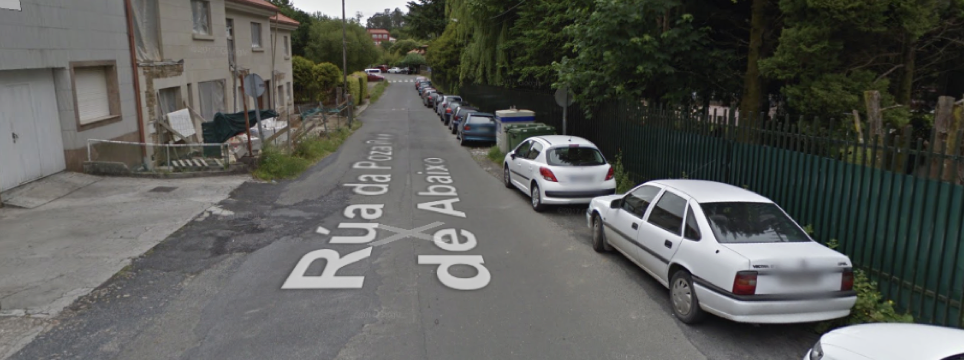

> A la derecha, colegio Santa Apolonia. Perspectiva en sentido a Santiago

En la actualidad carece de aceras en su mayor parte, por lo que una infraestructura ciclista-peatonal adecuada para la movilidad de los grupos de edad comprendidos entre los 8 y los 80 años requeriría de un estudio técnico muy concienzudo. Con toda probabilidad implicaría la eliminación de zonas de aparcamiento y otras cuestiones administrativas.

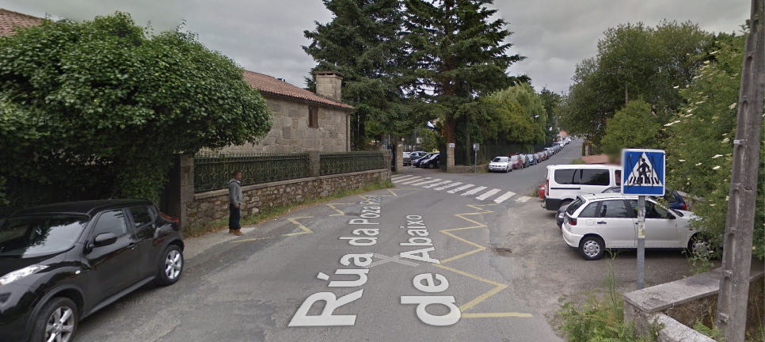

> A la derecha, colegio Santa Apolonia. Perspectiva en sentido a Santiago

Continúa el recorrido por la Rúa da Poza Real de Abaixo hasta llegar a un cruce donde se continuaría por la Rúa de Torrente, en pendiente ascendente yendo en sentido Santiago.

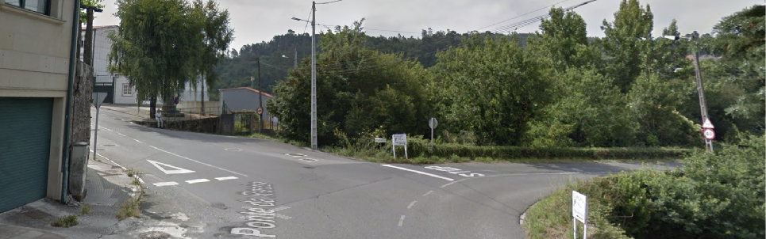

> Carretera de la derecha de la imagen en dirección al colegio Santa Apolonia. Carretera de la izquierda hacia Rúa Torrente.

Se continúa todo recto entrando en la Rúa da Benéfica de Conxo, en la que hay espacio suficiente para una segregación fuerte en forma de carril bici, aunque sacrificando necesariamente zona de aparcamiento para coches.

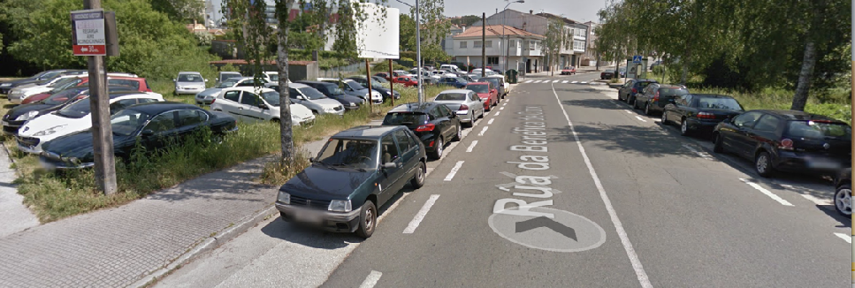

> Rúa Benéfica de Conxo en sentido hacia Santiago.

Se pasa frente a la empresa Televés para poco después girar a la derecha hacia una calle llamada Rúa da Fervenza.

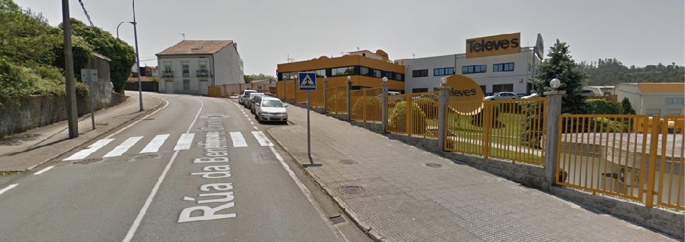

> Empresa Televés en sentido hacia Santiago

Una vez efectuado el giro a derecha y ya sobre la Rúa da Fervenza se pasará junto a los muros del claustro de Nuestra Señora de la Merced de Conxo (Sanatorio Psiquiátrico) atravesando una vía asfaltada que da acceso también a los Campos de Fútbol de Conxo. Esta vía, aunque con tráfico, tiene una circulación más tranquila pero carece de una iluminación adecuada.

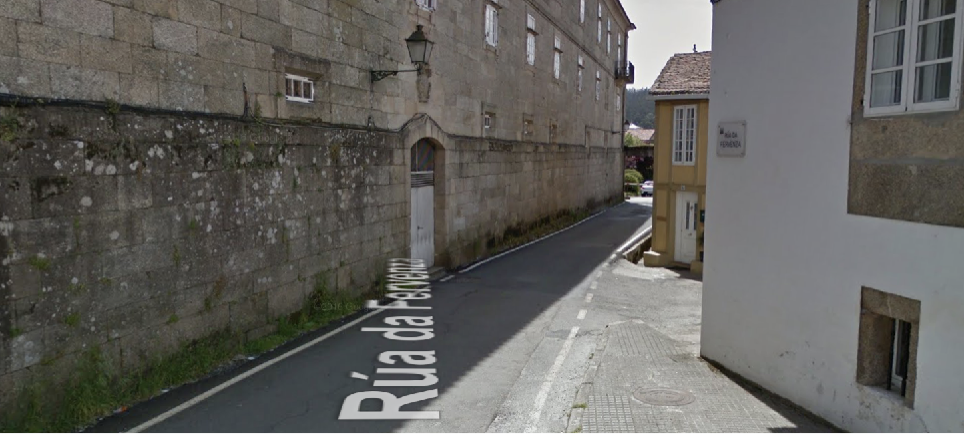

> Giro a la derecha desde la calle Rúa da Benéfica de Conxo entrando a la Rúa Fervenza en sentido para incorporarse al paseo fluvial

Al finalizar esta vía se enlaza con el punto en el que termina actualmente el paseo fluvial de las Brañas do Sar, continuando por este hasta el Banquete de Conxo.

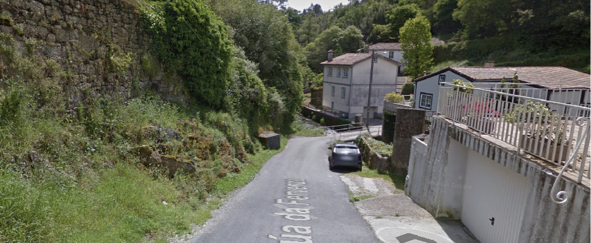

> Al finalizar la Rúa Fervenza que da acceso a viviendas, se encuentra la incorporación al paseo fluvial

### Estado actual tramo este-c2

#### Fortalezas tramo este-c2

- Es actualmente transitable
- Está menos aislado que otros tramos de la vía por que la sensación de seguridad puede ser mayor.
- Conecta un Colegio pasando el trazado justo enfrente de éste.

#### Debilidades tramo este-c2

- Necesidad de una fuerte inversión
- Muy complicada la convivencia entre la circulación motorizada, peatonal y ciclista.
- Necesidad de iluminación
- Necesidad de reducción de las velocidades del tráfico motorizado con badenes y otros mecanismos.

### Estado con ciclovía tramo este-c2

#### Oportunidades tramo este-c2

- Conexión de un nuevo núcleo poblacional con la vía

#### Amenazas tramo este-c2

- Infraestructura infrautilizada si no se promociona la movilidad sostenible en bicicleta y peatonal en otros ámbitos.
- Infraestructura infrautilizada si no se apoya la formación
- Infraestructura infrautilizada por la falta de integridad en el recorrido de la que forma parte y de no conectar con el mismo grado de seguridad y facilidad de uso que otros tramos del recorrido.
- Falta de implicación de otros actores sociales como administración y empresas, que fomenten la movilidad en bicicleta dentro de su actividad.

## Perfil del Tramo

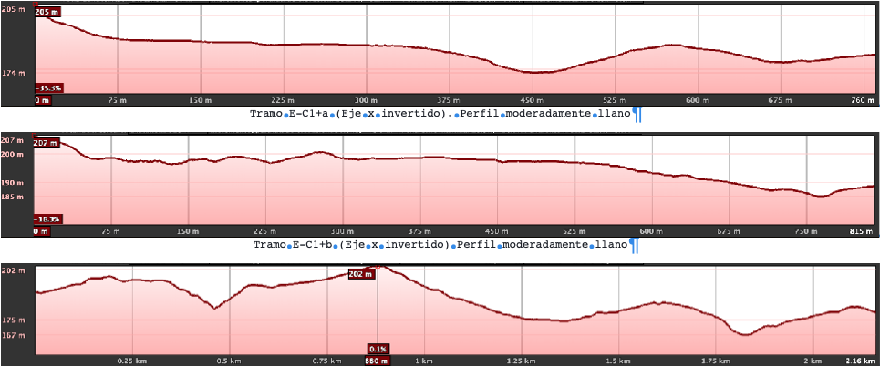

> Tramo E-C2 (Eje x invertido) Perfil presenta un moderado desnivel

## Sobre el Mapa

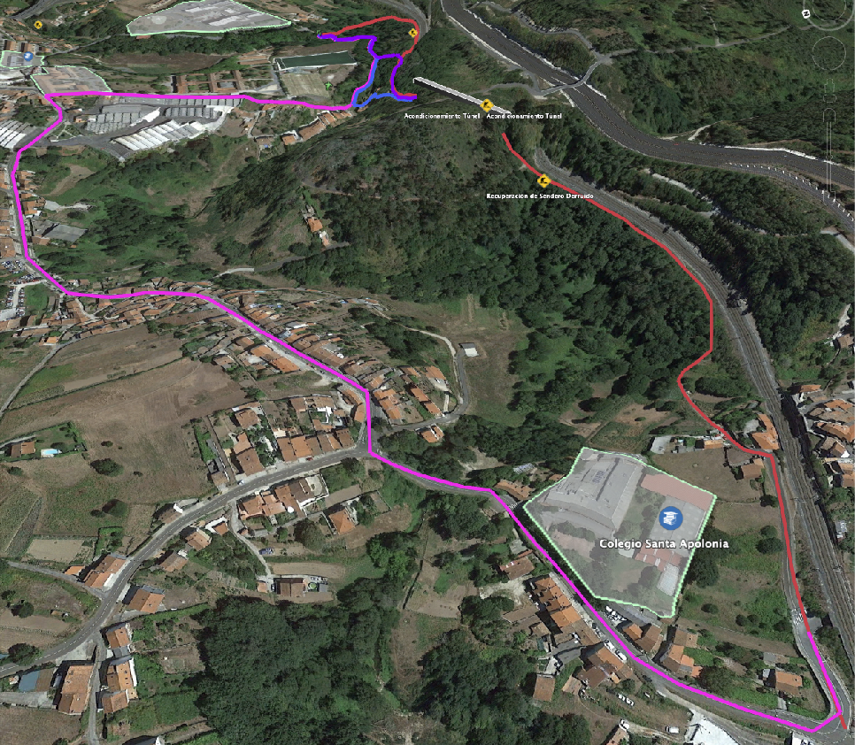

> Tramo E-B1 (rojo) y E-B2 (amarillo) en Google Satetellite

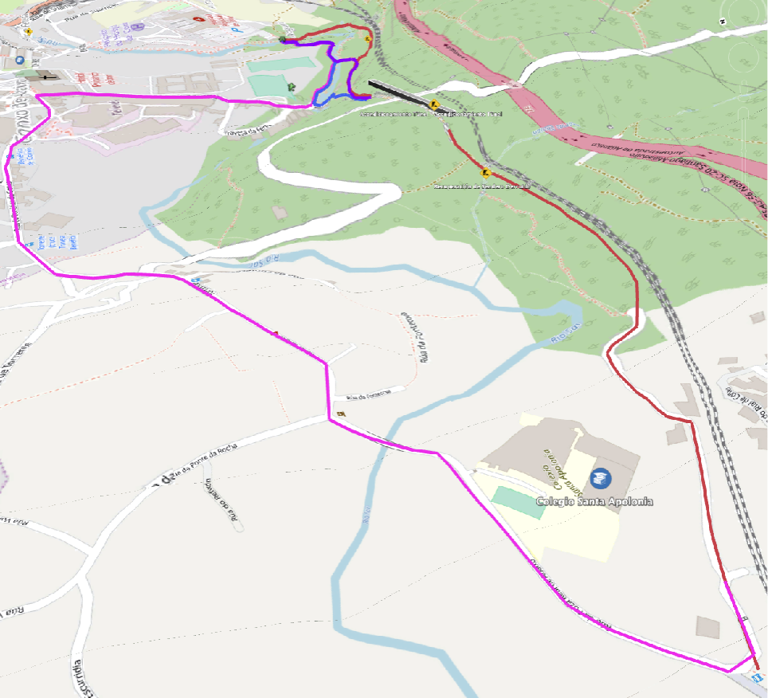

> Tramo E-B1 (rojo) y E-B2 (amarillo) en. Open Cycle Map
