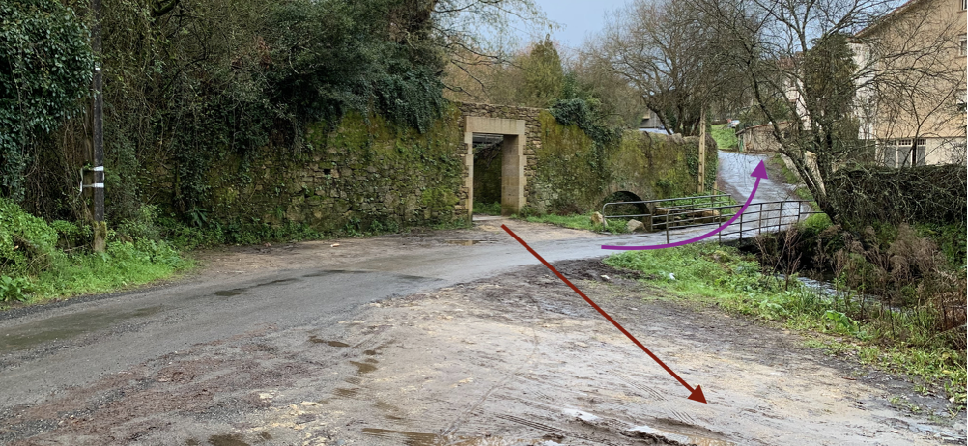

+++
title = 'Tramo Este-D'
date = 2019-03-01T11:11:29+02:00
draft = false
weight = 4
+++

| Alternativas  | Tramo | Distancia | Descripción
|---|---|---|---
| Sin alternativas | Tramo Este-D | 749 m | Partiendo el parque del Banquete de Conxo, del paseo fluvial de las Brañas do Sar, continua paralelo al río hasta llegar al paso soterrado que atraviesa la Avenida de Santiago de Cuba (SC-11) y las vías del tren, donde se bifurcan hacia Pontevedra y Ourense.

- [Estado actual](#estado-actual)
  - [Fortalezas](#fortalezas)
  - [Debilidades](#debilidades)
- [Estado con ciclovía](#estado-con-ciclovía)
  - [Oportunidades](#oportunidades)
  - [Amenazas](#amenazas)
- [Perfil del Tramo](#perfil-del-tramo)
- [Sobre el Mapa](#sobre-el-mapa)

Situados en el parque del Banquete de Conxo se toma la senda de las Brañas do Sar pasando frente al Hospital de Conxo a mano derecha. Se puede acceder fácilmente a este bien por unas escaleras situadas junto al Parque do Banquete o bien utilizando la calzada que se sitúa unos metros más adelante una vez pasado el parque.

Este parque constituye un sitio de ocio y tiempo libre en el que además tuvo lugar un acontecimiento histórico importante para la ciudad y para la memoria colectiva gallega:  el 2 de marzo de 1856, universitarios de las clases más elevadas brindaron juntos por la libertad, igualdad y fraternidad, sirviendo un banquete a las clases más humildes de obreros y artesanos de la ciudad. Actualmente es motivo de una fiesta anual en el mes de abril donde se recuerda este hecho.

> Parque del Banquete de Conxo con el parking del hospital al fondo

Se continúa por la senda, dejando el río Sar a mano izquierda en dirección hacia Santiago Centro. Actualmente la pista es complicada para transitar por ella en bicicleta, e inaccesible desde el punto de vista de personas con vehículos de movilidad personal. La lluvia y la humedad natural de la zona provocan que habitualmente se embarre y por tanto su uso disminuye en la estación invernal.

> Vista del sendero por donde se continúa dejando atrás el parque del Banquete de Conxo

Se continúa hasta atravesar por debajo la Rúa Ramón Baltar (que conecta el Hospital de Conxo, el Centro de Novas Tecnoloxías y Nuestra Señora de la Merced de Conxo entre otros) hasta llegar a un arco de piedra. En ese punto el recorrido más adecuado sería atravesar la Calle Suarribas y continuar por el lateral derecho del Río Sar en dirección a Santiago hasta tomar el túnel que pasa por debajo de las vías férreas y la SC-11. Sin embargo esta opción no es posible debido a que no existe forma de cruzar el río y salvar el desnivel para tomar el túnel.

> Al fondo el arco que da acceso a la senda de las Brañas do Sar en dirección al Banquete de Conxo. En flecha roja, propuesta de recorrido. En fecha lila, recorrido actual.

Actualmente la solución pasa por girar a mano izquierda en la Rúa Suarribas y seguir por un pequeño sendero de poco más de un 1 metro de ancho que pasa entre dos viviendas. Actualmente este paso ya presenta dificultades cuando se cruzan varias personas, agravándose la dificultad cuando se cruzan con sillas de bebés o bicicletas. Es por tanto necesario acometer una obra de acondicionamiento de esta zona para evitar el paso entre las viviendas y adaptar tanto el ancho del recorrido como el resto de condiciones a las del resto de la vía propuesta.

> Es necesario acometer obras para conectar esta salida del túnel con el margen del río a través de una plataforma

A continuación se atraviesa el túnel bajo la Avenida de Santiago de Cuba (SC-11) y las vías del tren, donde se bifurcan hacia Pontevedra y Ourense. Se trata de un paso subterráneo que actualmente está dotado de una buena iluminación y es bastante transitado, pero que necesitaría obras en el acondicionamiento del firme por ser irregular, con baches, y por formarse charcos en su interior.

Una vez en el exterior del túnel se encuentra una fuente y la Senda de las Brañas do Sar continúa hasta el parque de Eugenio Granell.

> Túnel que atraviesa por debajo la SC-11 y las vías del Tren

## Estado actual

### Fortalezas

- Es actualmente transitable.
- Está menos aislado que otros tramos de la vía por que la sensación de seguridad puede ser mayor.
- Conecta con el Centro de Formación de Novas Tecnoloxías de Galicia.
- Conecta con el Hospital de Conxo.
- Conecta un punto de interés de la ciudad como el banquete de Conxo
- Permite y posibilita realizar un recorrido ancho y seguro para peatones y ciclistas, así como el acceso a vehículos de movilidad personal.
- Recorrido completamente separado del tráfico mototizado.
- Riqueza natural
- Tranquilidad del recorrido en ausencia de ruido.

### Debilidades

- Necesidad de acometer una obra para el acceso al túnel por el margen sur del Río Sar
- Necesidad de adaptación del firme para posibilitar y mejorar la circulación de vehículos de movilidad personal y bicicletas.
- Poca iluminación y baja percepción de la seguridad (especialmente en condiciones de poca luz) por tratarse en algunos puntos de zonas boscosas.

## Estado con ciclovía

### Oportunidades

- Muy buena y rápida conexión del barrio de Conxo con Santiago Centro
- Conexión segura para todas las edades y niveles
- Conexión segura diurna y nocturna
- Conexión independiente de las condiciones meteorológicas.

### Amenazas

- Percepción de inseguridad por una mala iluminación.
- Intraestructura infrautilizada si amo se promociona la movilidad sostenible.
- Infraestructura no compatible con la movilidad urbana (aunque sí con el ocio deportivo) por no adaptarse el terreno al presentar barro y otros obstáculos.

## Perfil del Tramo

> Perfil del Tramo A (eje X invertido). Llano.

## Sobre el Mapa

> Google Maps. En Rojo el recorrido propuesto. En lila, la alternativa que se debe utilizar actualmente

> OpenCycleMap. En Rojo el recorrido propuesto. En lila, la alternativa que se debe utilizar actualmente
