+++
title = 'Tramo Este-F'
date = 2019-03-01T11:11:29+02:00
draft = false
weight = 5
+++

Existen 2 alternativas principales. Ambas conectan el paso soterrado de la vía del tren en la Rúa da Poza Real (Conxo) con el parque del Banquete de Conxo

{}
  En la actualidad se está actuando o ya se ha actuado en este tramo, en el contexto del proyecto "***Eixo de Mobilidade Sostible en Santiago de Compostela***" ejecutado por la Axencia Galega de Infraestructuras de la Xunta de Galicia, financiado con Fondos de la Unión Europea (NetxGenerationEU). Te recomendamos que consultes nuestro [blog](https://www.composcleta.org/blog/) o [los recursos que estamos publicando](/ciclovia-milladoiro-santiago/) sobre este proyecto, para disponer de toda la información actualizada.
{}

| Alternativas  | Tramo | Distancia | Descripción
|---|---|---|---
| Aprovechamiento vial asfaltado | Tramo Este-F1 | 1.120 m | Después de cruzar la SC-11 por el paso subterráneo esta alternativa toma la Rúa da Ponte Pereda y la Rúa do Río Arriba, hasta confluir con la otra alternativa por el paseo que circula paralelo a la Rúa do Escultor Camilo Otero hasta la rotonda de la Rúa do Restollal.
| Acondicionamiento sendas Eugenio Granell | Tramo Este-F2 | 1.000 m | Después de cruzar la SC-11 por el paso subterráneo esta alternativa circula por la senda de las Brañas del Río Sar hasta confluir con la otra alternativa.

- [Tramo E-F1](#tramo-e-f1)
  - [Estado actual tramo este-f1](#estado-actual-tramo-este-f1)
    - [Fortalezas tramo este-f1](#fortalezas-tramo-este-f1)
    - [Debilidades tramo este-f1](#debilidades-tramo-este-f1)
  - [Estado con ciclovía tramo este-f1](#estado-con-ciclovía-tramo-este-f1)
    - [Oportunidades tramo este-f1](#oportunidades-tramo-este-f1)
    - [Amenazas tramo este-f1](#amenazas-tramo-este-f1)
- [Tramo E-F2](#tramo-e-f2)
  - [Estado actual tramo este-f2](#estado-actual-tramo-este-f2)
    - [Fortalezas tramo este-f2](#fortalezas-tramo-este-f2)
    - [Debilidades tramo este-f2](#debilidades-tramo-este-f2)
  - [Estado con ciclovía tramo este-f2](#estado-con-ciclovía-tramo-este-f2)
    - [Oportunidades tramo este-f2](#oportunidades-tramo-este-f2)
    - [Amenazas tramo este-f2](#amenazas-tramo-este-f2)
- [Perfil del Tramo](#perfil-del-tramo)
- [Sobre el Mapa](#sobre-el-mapa)

Inmediatamente al abandonar el paso subterráneo de la SC-11 se distinguen dos alternativas. La primera (E-F1) es utilizar una pista asfaltada ya existente y la segunda es continuar por la Senda de las Brañas do Sar.

Antes de abordar estas dos alternativas, se presenta el tramo común a ambas que transita paralelo a la Rúa do Escultor Camilo Otero. Este recorrido tiene un firme adecuado para la circulación en bicicleta (ausencia de charcos y de barro), así como de sillas de ruedas y vehículos de movilidad personal. Sin embargo presenta el actual riesgo de la convivencia con los peatones puesto que es un sendero muy transitado y además por un colectivo de edad avanzada y, en muchos casos, con problemas de movilidad. Esto es debido a que se sitúa junto a este paseo una residencia para personas mayores.

A esta situación en la que actualmente conviven niños y mayores circulando en bicicleta, peatones y personas mayores con problemas de movilidad, se le une el hecho de que el mobiliario urbano se sitúa directamente sobre el firme, provocando que en ciertos tramos haya menos de un metro y medio para circular por éste.

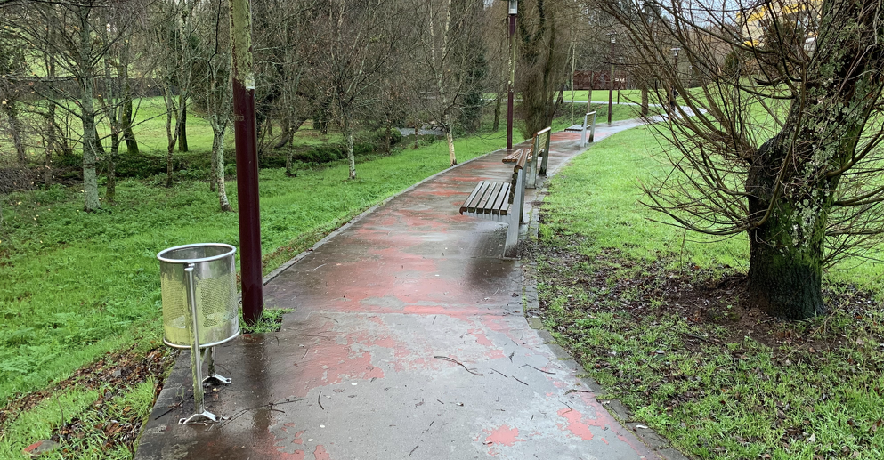

> Mobiliario urbano ocupando el espacio por el que deben circular bicicletas, peatones y personas mayores con problemas de movilidad

Se considera necesario ensanchar la vía, e incluso teniendo en cuenta la situación descrita, separar la circulación de peatones y de ciclistas.

En este punto del recorrido es necesario abordar el acceso a la zona del Ensanche, donde en la actualidad se están haciendo esfuerzos en el calmado de tráfico, tratando de introducir la zona 30 donde peatones y ciclistas tengan prioridad sobre los coches.

Este es uno de estos puntos que pueden dotar a esta vía que conecta O Milladoiro con Santiago de utilidad y de un propósito. Se debe pensar en cómo enlazar esta vía (ramal este) con la zona pacificada del Ensanche, dotando de una infraestructura ciclista que dé acceso a esta zona y a la propia estación de ferrocarril, y que guarde las mismas características en cuento a seguridad y accesibilidad del recorrido, teniendo en cuenta todas las edades y las diferentes perspectivas anteriormente descritas. Es la oportunidad de que las personas de O Milladoiro puedan moverse al centro de Santiago directamente desde sus casas, para aparcar sus bicicletas en la zona del Ensanche y/o moverse por la ciudad.

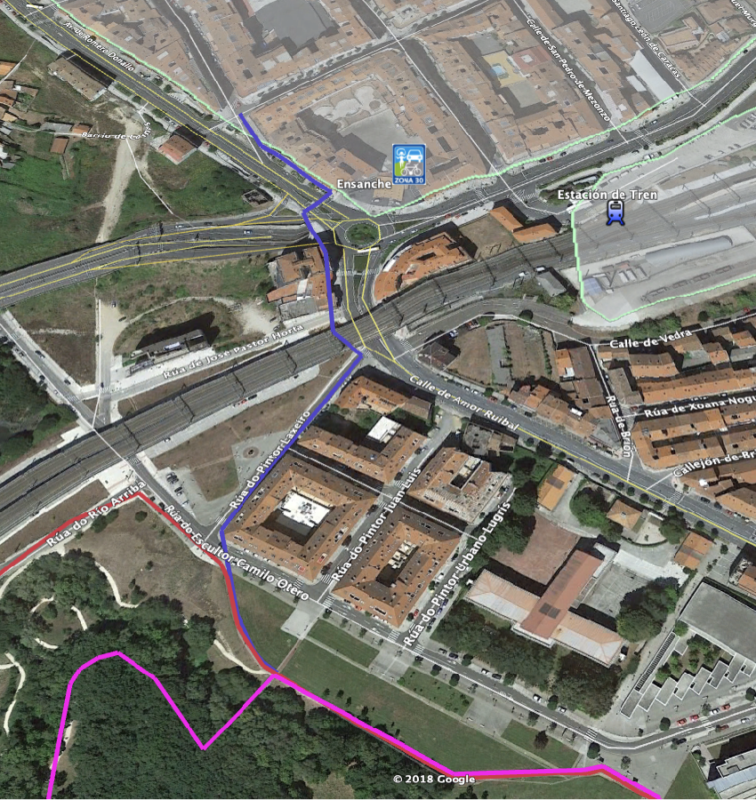

> Acceso Parque Eugenio Granell a Zona Ensanche y Estación Intermodal.

Ambas alternativas llegan a término en la glorieta donde comienza la Rúa do Restollal, que da acceso a otra importante zona comercial de Santiago.

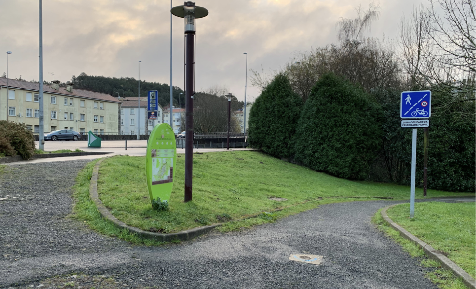

> Término de la glorieta del Restollal.

## Tramo E-F1

Volviendo al paso subterráneo de la SC-11, esta pista asfaltada está en buenas condiciones para la circulación de bicicletas y no tiene apenas tráfico de vehículos, únicamente aquellos que acceden a viviendas o para aparcar.

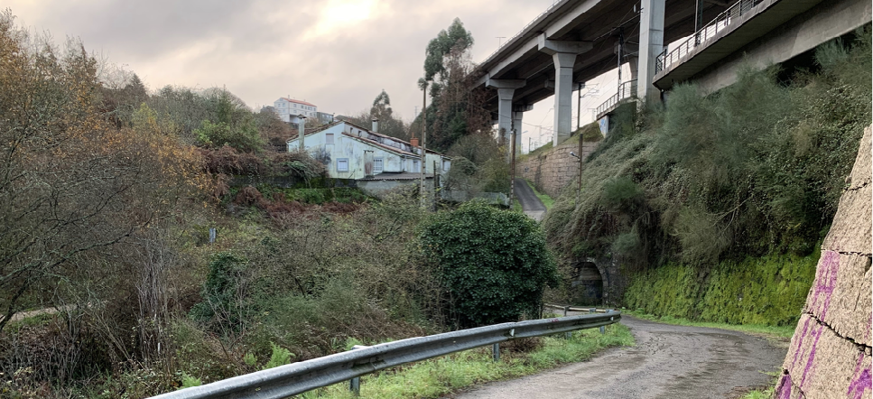

> Salida del túnel y ligera pendiente por la Rúa da Ponte Pereda

Por otra parte carece prácticamente de iluminación, lo que complica la circulación nocturna además de transmitir sensación de inseguridad. Por la baja afluencia de tráfico motorizado no se estima necesario una fuerte segregación aunque sí se considera imprescindible la inclusión de barreras, como badenes, para que los vehículos aminoren drásticamente la velocidad, y señalización vertical que advierta de la preferencia absoluta de las bicicletas sobre el resto de vehículos. También se requeriría señalización horizontal en la calzada para indicar que las bicicletas deben circular por el centro de la vía y que no pueden ser rebasadas.

Por otra parte, debería evitarse el estacionamiento en esta zona, ya que provoca un aumento del tráfico que circula por ella e incrementa el riesgo de atropellos o incidentes entre los vehículos que acceden a aparcar y las bicicletas.

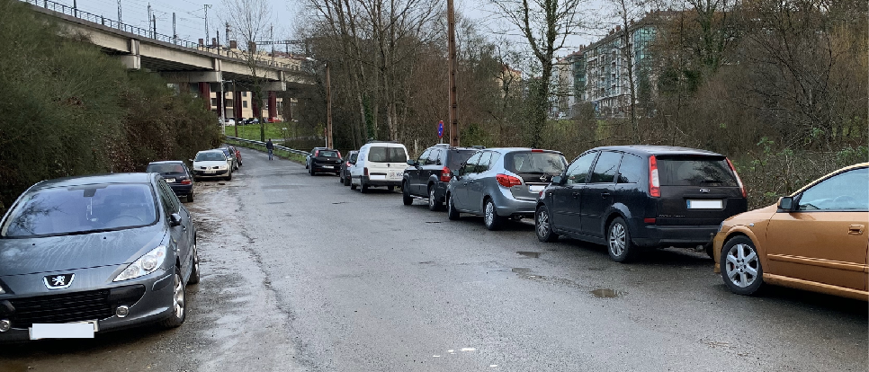

> Vehículos estacionados al margen de la Rúa do Río Arriba. Algunos omitiendo las prohibiciones de la actual señalización vertical

Esta alternativa evita tomar la Senda de las Brañas do Sar y acondicionar el firme de esta en ese tramo, prevaleciendo intacto su estado actual pero al mismo tiempo dando una alternativa a bicicletas y vehículos de movilidad personal. El recorrido es un ciento de metros más largo que su alternativa, pero considerando que puede ser mucho más rápida para recorrer la distancia en bicicleta, la separación con la Senda de las Brañas resulta beneficiosa. Se trata de una vía de prevalencia ciclista sobre peatones, aunque estos pueden utilizar este mismo recorrido de habilitarse un espacio al margen. De este modo se permitiría que las bicicletas tomen mayor velocidad.

### Estado actual tramo este-f1

#### Fortalezas tramo este-f1

- Es actualmente transitable.
- Está menos aislado que otros tramos de la vía por que la sensación de seguridad puede ser mayor.
- Permite y posibilita realizar un recorrido ancho y seguro para  ciclistas, así como el acceso a vehículos de movilidad personal.
- Permite adquirir en bicicleta mayores velocidades.

#### Debilidades tramo este-f1

- Recorrido no separado del tráfico motorizado.
- Se incrementa el recorrido un ciento de metros.
- Inseguro actualmente debido a la falta de iluminación y a que los coches que acceden por estas calles pueden hacerlo irresponsablemente a altas velocidades.

### Estado con ciclovía tramo este-f1

#### Oportunidades tramo este-f1

- Muy buena y rápida conexión del barrio de Conxo con Santiago Centro
- Conexión segura para todas las edades y niveles
- Conexión segura diurna y nocturna
- Conexión independiente de las condiciones meteorológicas.

#### Amenazas tramo este-f1

- Percepción de inseguridad por una mala iluminación.
- Intraestructura infrautilizada si no se promociona la movilidad sostenible.

## Tramo E-F2

Una vez atravesado el paso subterráneo de la SC-11, esta alternativa pasa por delante de la fuente y continúa por el sendero que comunica con las Brañas do Sar. Independientemente de acondicionar su alternativa, se considera que este tramo se debe mantener como espacio ciclable y de uso compartido para circular por ella en bicicleta o en vehículo de movilidad personal.

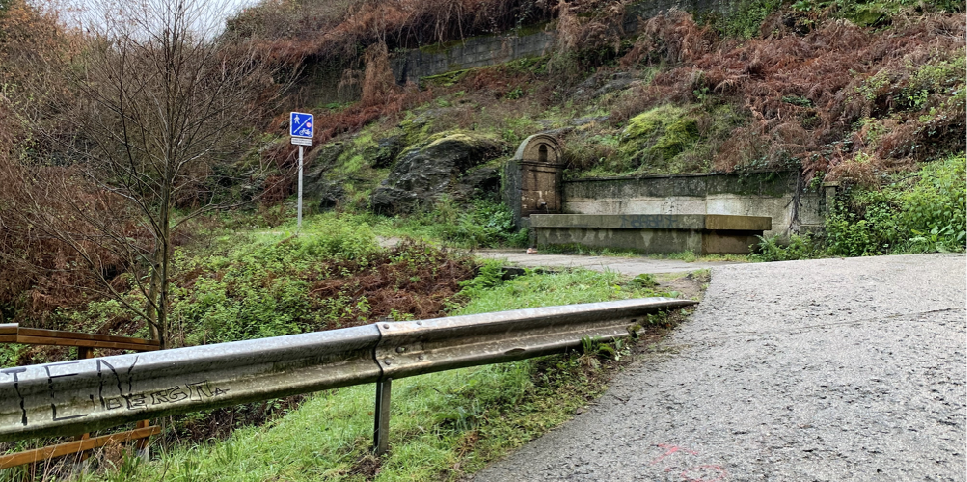

> Continuación de la Senda de las Brañas do Sar por delante de la fuente del parque Eugenio Granell. Al fondo, la indicación de Senda compartida ciclistas peatones.

Atravesar el actual recorrido evidencia que se debe adaptar ciertas infraestructuras para que las bicicletas puedan circular con seguridad. Los actuales puentes que atraviesan el río son estrechos y su superficie es extremadamente deslizante. Además, los listones de madera que conforman su suelo están sujetos longitudinalmente, lo que provoca que las ruedas estrechas de las bicicletas de ciudad se cuelen entre ellas pudiendo provocar una aparatosa caída.

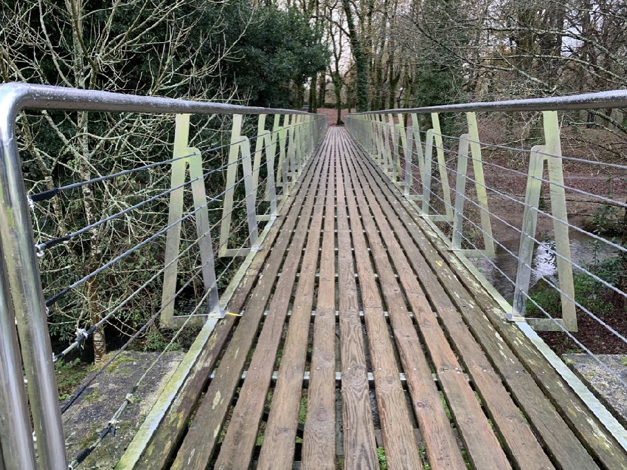

> Imagen de uno de los puentes que atraviesan el río donde se pueden apreciar los listones de madera colocados longitudinalmente y el verdín acumulado en ellos.

Por otra parte de aumentar el número de bicicletas y/o vehículos de movilidad personal la convivencia en estos puntos se dificulta.

La siguiente imagen ilustra la necesidad de adaptación de este otro puente.

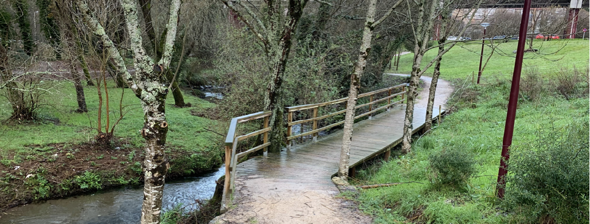

> Otros de los puentes de madera que atraviesan el río Sar

### Estado actual tramo este-f2

#### Fortalezas tramo este-f2

- Es actualmente transitable aunque más como opción de ocio que como movilidad por la ciudad por el barro y la humedad del firme.
- Está menos aislado que otros tramos de la vía por que la sensación de seguridad puede ser mayor.
- Permite y posibilita realizar un recorrido ancho y seguro para peatones y ciclistas, así como el acceso a vehículos de movilidad personal.
- Recorrido completamente separado del tráfico mototizado.
- Riqueza natural
- Tranquilidad del recorrido en ausencia de ruido.

#### Debilidades tramo este-f2

- Necesidad de adaptación del firme para posibilitar y mejorar la circulación de vehículos de movilidad personal y bicicletas.
- Necesidad de iluminación y de incrementar la percepción de seguridad por tratarse en algunos puntos de zonas boscosas.
- Convivencia con peatones, lo que no permite a las bicicletas tomar cierta velocidad.

### Estado con ciclovía tramo este-f2

#### Oportunidades tramo este-f2

- Muy buena y rápida conexión del barrio de Conxo con Santiago Centro
- Conexión segura para todas las edades y niveles
- Conexión segura diurna y nocturna
- Conexión independiente de las condiciones meteorológicas.

#### Amenazas tramo este-f2

- Percepción de inseguridad por una mala iluminación.
- Intraestructura infrautilizada si no se promociona la movilidad sostenible.
- Infraestructura no compatible con la movilidad urbana (aunque sí con el ocio deportivo) por no adaptarse el terreno al presentar barro y otros obstáculos.

## Perfil del Tramo

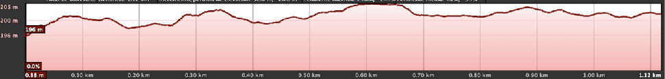

> Tramo E-F1 - Perfil llano

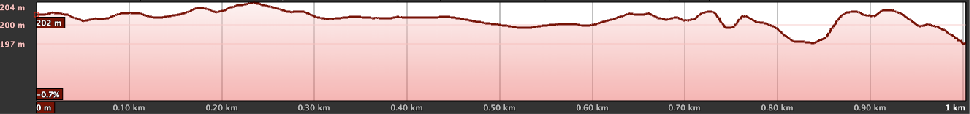

> Tramo E-F2 - Perfil llano

## Sobre el Mapa

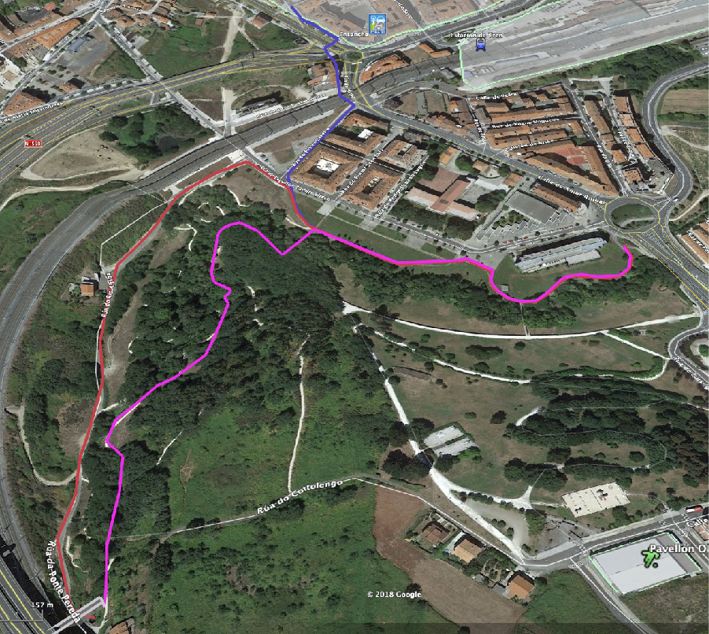

> Google Maps. En Rojo, tramo E-F1. En Rosa, alternativa E-F2.En Violeta, acceso desde la Vía O Milladoiro hasta la zona de Pacificación y Calmado de tráfico del Ensanche.

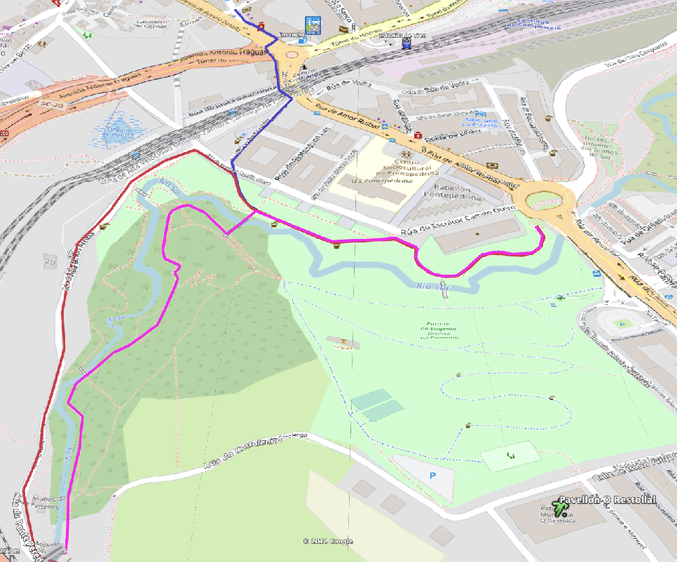

> OpenCycleMap. En Rojo, tramo E-F1. En Rosa, alternativa E-F2.En Violeta, acceso desde la Vía O Milladoiro hasta la zona de Pacificación y Calmado de tráfico del Ensanche.
