+++
title = 'Tramo Este-G'
date = 2024-09-28T11:11:29+02:00
draft = false
weight = 6
+++

| Alternativas  | Tramo | Distancia | Descripción
|---|---|---|---
| Sin alternativas | Tramo Este-G | 1.510 m | Este tramo comprende desde la rotonda del comienzo de la Rúa Restollal hasta la Rúa das Brañas do Sar, en las inmediaciones del Multiusos del Sar.

- [Estado actual](#estado-actual)
  - [Fortalezas](#fortalezas)
  - [Debilidades](#debilidades)
- [Estado con ciclovía](#estado-con-ciclovía)
  - [Oportunidades](#oportunidades)
  - [Amenazas](#amenazas)
- [Perfil del Tramo](#perfil-del-tramo)
- [Sobre el Mapa](#sobre-el-mapa)

El recorrido comienza en dos pasos soterrados que atraviesan la glorieta del Restollal y continúan por la Senda de las Brañas do Sar. A mano izquierda quedarán los huertos urbanos.

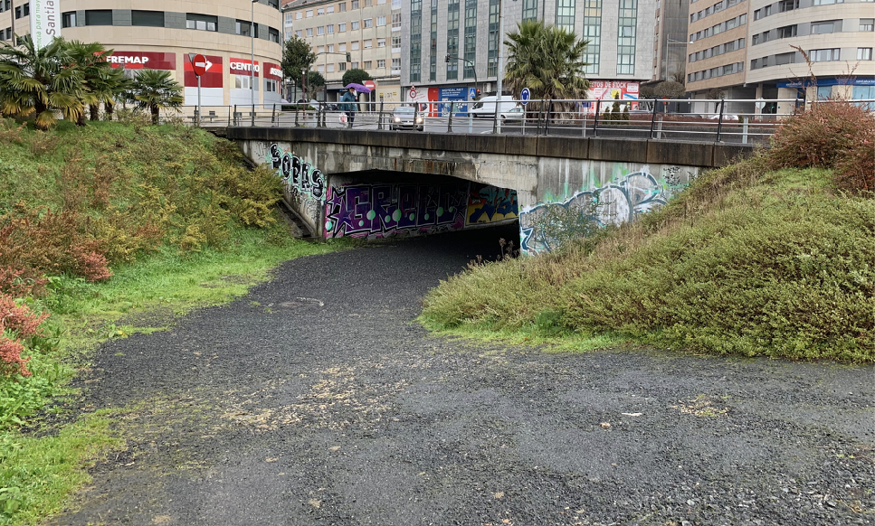

> Pasos soterrados que atraviesan la glorieta del Restollal

El senda toma diferentes bifurcaciones incluyendo las que conectan el camino con la Rúa das Santas Mariñas, que da acceso al CEIP Ramón Cabanillas. Estas bifurcaciones tienen pasos entablados que posibilitan caminar sobre el humedal y diferentes puentes o pasos de piedra que permiten cruzar el río. Se encuentran carteles de Camiño Escolar Seguro, de la [campaña promovida localmente por la Policía Local][1].

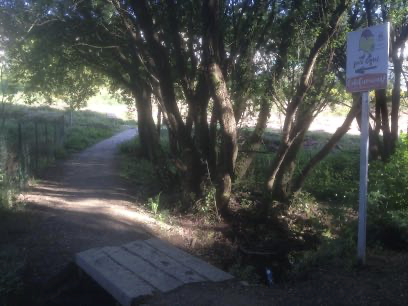

> Señalización "*Cole Camiños*"

En las imágenes siguientes se ilustra una de las bifurcaciones con paso entablado y una senda señalizada con “*Camiño Escolar Seguro*”.

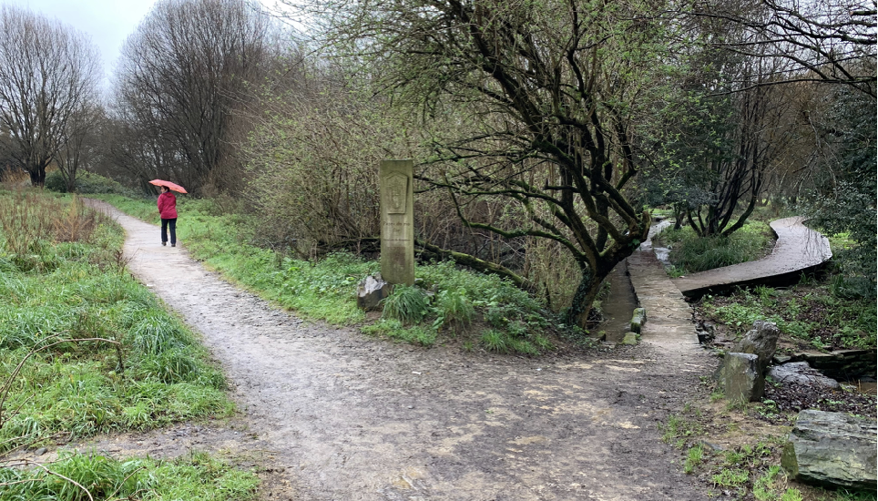

> Bifurcaciones de la Senda de las Brañas do Sar

A los pocos metros desde los pasos subterráneos se proponen dos accesos a la futura Estación Intermodal (Tren y Autobús) desde la propia Senda. Actualmente el recorrido discurre entre caminos que dejan a un lado los huertos urbanos para conectar con la Rúa de Clara Campoamor.

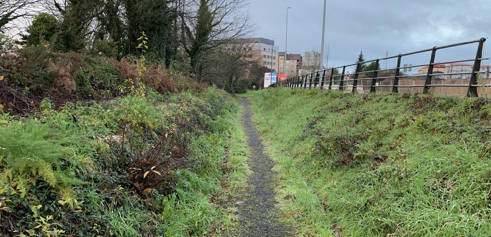

> Conexión Senda Brañas de Sar con Clara Campoamor

También se propone un acceso más directo a la Estación Intermodal, yendo en el sentido opuesto (en dirección O Milladoiro), aprovechando sendas ya existentes y que necesitan ser acondicionadas de acuerdo a las características del resto de la Vía propuesta.

> Panorámica de la actual construcción de la Estación Intermodal. Rúa Clara Campoamor. Al fondo, la estación de Tren (Enero 2019)

Estudiando la memoria descriptiva del Proyecto de Estación Intermodal no se realiza ninguna referencia al acceso en bicicleta a la instalación, ni se prevén medidas específicas para este medio de movilidad. Se hace referencia a que “Las zonas de estancia y espera se sitúan en paralelo a la fachada sur, lo cual permite disfrutar de las vistas existentes sobre el futuro parque de las Brañas do Sar y la Ciudad de la Cultura.” Por lo que se deduce que existirá una conexión Sur entre esta y el Gaiás.

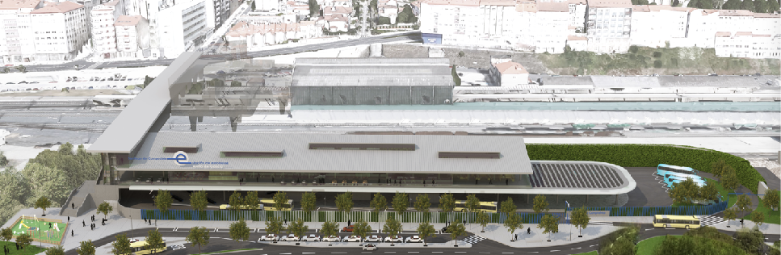

> Vista de la fachada Sur de la nueva Estación Intermodal

Por otra parte, en la misma memoria descriptiva la única referencia en la que se hace mención a las bicicletas es la previsión de una “Consigna de bicicletas”.

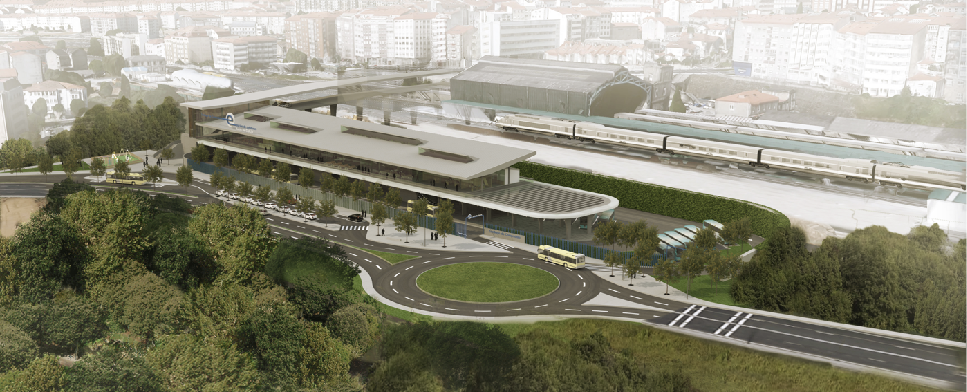

> Vista de la calzada que da acceso a la Estación Intermodal

Según la documentación ambiental del proyecto de construcción de la Estación Intermodal:

> “*La definición de los accesos rodados a la estación desde el vial Clara Campoamor corresponde al Concello de Santiago de Compostela, por lo que la solución que aparece reflejada en los planos del presente proyecto es una propuesta que se deberá validar y definir en detalle en el correspondiente proyecto por parte del Concello.*”

Por lo que la actual propuesta considera que es el Concello de Santiago de Compostela quien debe tener en cuenta la movilidad personal sostenible en lo que respecta a los accesos y vías que conectarán con la estación.

Tomando como referencia los posibles viales anchos y de doble carril para automóviles (probables por la necesidad de circulación de vehículos voluminosos, como autobuses) justificarían aun más la necesidad de una vía separada para ciclistas dotada de unos buenos accesos a la estación, sin detrimento de que en estos viales se instalen barreras que moderen o calmen la velocidad de los automóviles para que los conductores más vulnerables también puedan circular con seguridad por ellas.

Por otra parte se propone un tercer acceso a la estación intermodal empleando infraestructuras ya existentes como la del paso soterrado situado en la rotonda que une la Rúa de Clara Campoamor con la Rúa de Bernardo Barreiro, y adaptando esta conexión a las características que reúne la Vía a O Milladoiro propuesta. En las siguientes imágenes se ilustra este acceso.

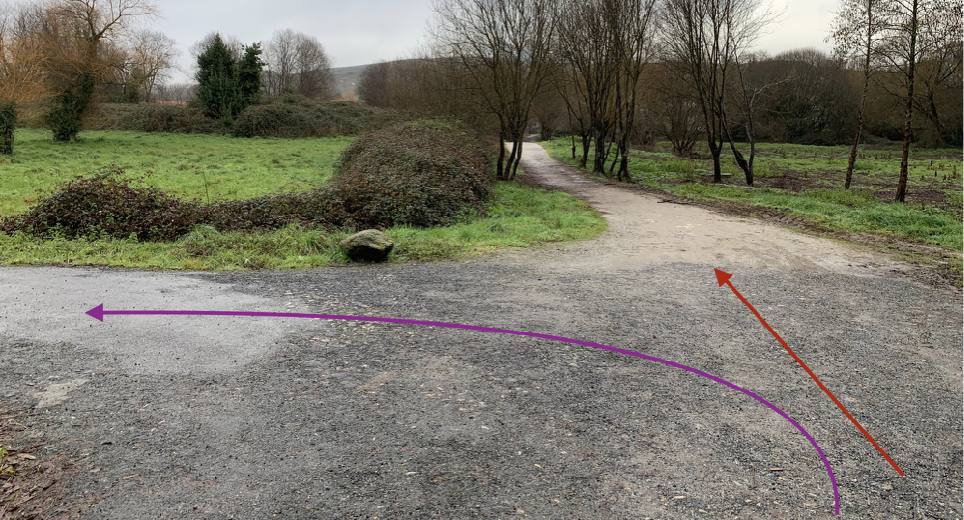

> En la línea Rojo, continuación del recorrido, en morado, acceso a la estación de Tren

La línea Roja señala la continuación del recorrido por la Senda de las Brañas do Sar. La línea lila ilustra el giro para acceder a la estación de tren y al ensanche continuando por una vía asfaltada que llega hasta la misma Senda.

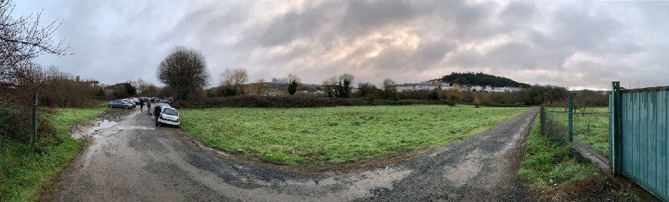

> Pista de gravilla, asfalto y barro ocupada por coche estacionados en Brañas de Sar

La pista de acceso se encuentra actualmente ocupada por automóviles que estacionan en su margen. Se encuentra embarrada en algunos tramos y termina en una explanada actualmente destinada también al estacionamiento de coches.

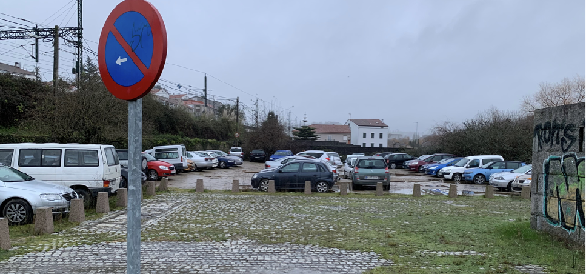

> Esplanada dedicada al aparcamiento de automóviles junto al paso soterrado en Brañas de Sar

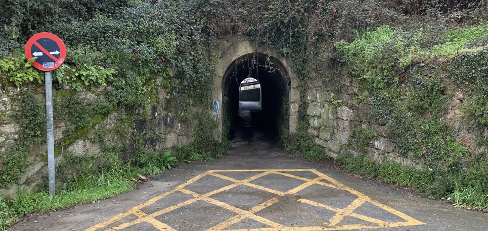

> Paso soterrado que atraviesa las vías del tren

Continuando el recorrido, se pasa junto a la Colegiata Santa María a Real do Sar, un monumento románico de especial significación en la ciudad de Compostela. Fue en su día escuela de infantil y después centro educativo, asta que en 2010 cerró sus puertas. Actualmente y desde hace dos años se ubica en él el colegio Montessorri Compostela.

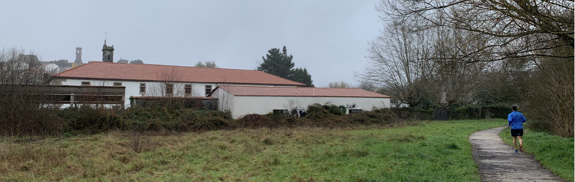

> Colegiata del Sar y Colegio Montessori Compostela

La senda actual transcurre entre el muro de la Colegiata y el río Sar, dando lugar a un estrecho pasadizo que a día de hoy presenta dificultades tanto a peatones como a ciclistas que quieren atravesarlo. Por su estrechez impide que se crucen peatones con bicicletas.

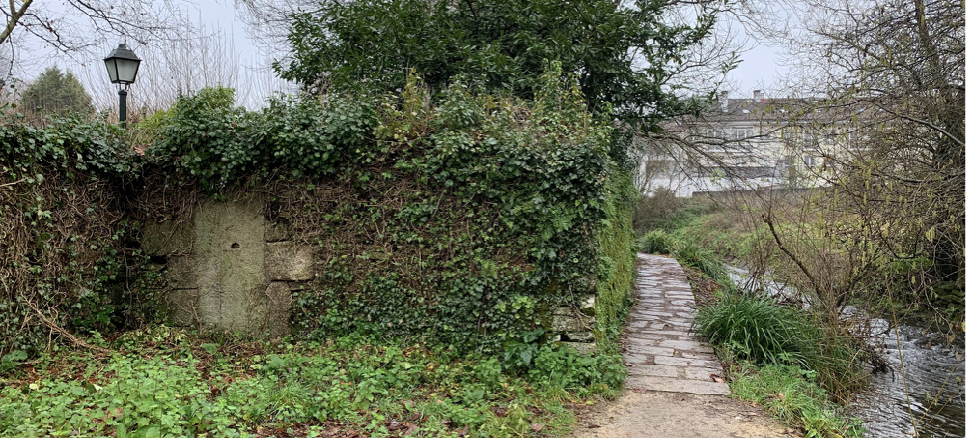

> Paso estrecho entre el muro de la Colegiata y el río Sar

En este punto es necesario acometer una obra que solucione este estrecho paso, dotando al lugar de las mismas características de accesibilidad del resto de la vía a Milladoiro. Aunque requiere una solución técnica, por lógica existen fundamentalmente dos opciones: crear una pasarela que cruce el río y que permita transitar por el margen opuesto hasta el Ponte do Sar(evitando la estrechez entre el muro y el río), o plantear una plataforma elevada sobre río donde el recorrido es más estrecho, que ensanche esos quince o veinte metros que plantean mayor problemática para la circulación, aprovechando el actual paso, (no obstante demasiado estrecho) que además requeriría de la adaptación del firme.

En la siguiente imagen se puede ver en el margen derecho el espacio para acometer el acceso al Ponte do Sar, y en el margen izquierdo (junto al muro) la zona que requería de adaptación del firme.

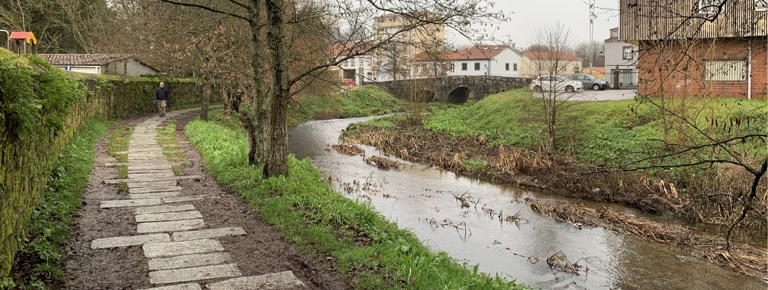

> Márgenes del río Sar aproximándose a Ponte do Sar

Teniendo en cuenta que, tal y como figura en los antecedentes de esta propuesta, en noviembre de 2018 la senda toma el carácter de senda compartida peatón-ciclista, en la Ponte do Sar el paso por el puente no es accesible debido a unos escalones que imposibilitan la circulación de ciclos. Es necesario por tanto hacer un rodeo para volver a incorporarse en la senda, circunstancia que debe ser corregida atendiendo a las características de accesibilidad del resto de la Vía a O Milladoiro.

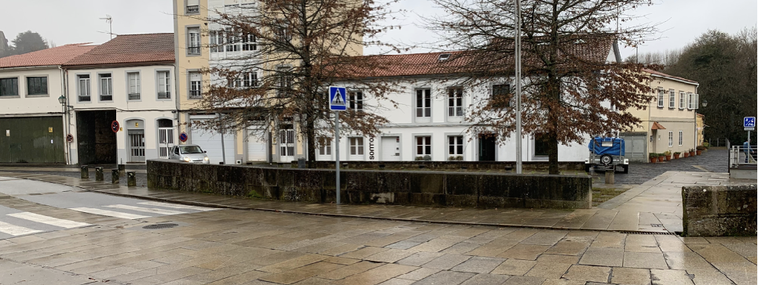

> La Senda de las Brañas do Sar en su paso por Ponte do Sar

Conectando con la Rúa de Sar también se prevé un buen acceso de esta vía con el casco antiguo, subiendo por esta misma calle y tomando la Rúa do Olvido o Rúa do Castrón Douro. Es una pendiente significativa comparado con la escasa pendiente dominante en todo el recorrido de la vía propuesta, pero el recorrido no es significativamente largo y conectaría con la Senra y Rúa da Ensinanza.

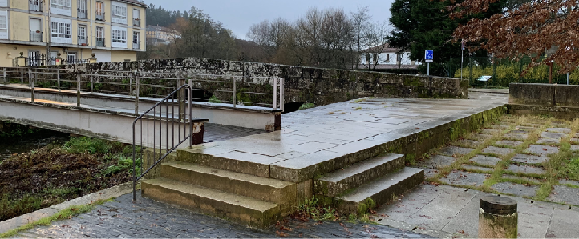

> Escalones que cortan el acceso a la Senda para Ciclos

Cruzada la Rúa de Sar se encuentra actualmente una plataforma que podría ilustrar como ejemplo del problema de paso anteriormente descrito junto al muro de la colegiata. Sin embargo esta plataforma presenta deficiencias, no tanto viéndola desde una perspectiva de peatón, sino por lo resbaladiza que es cuando se moja y por el ángulo de 90º que forma, disminuyendo considerablemente la visibilidad y obligando a un giro más abrupto. Por tanto se debe adaptar esta instalación atendiendo a las características de accesibilidad del resto de la Vía a O Milladoiro.

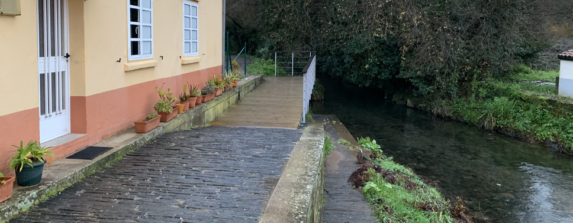

> Pasarela sobre el río que es necesaria re-adaptar

Continuando por la Senda, actualmente intransitable para vehículos de movilidad personal a causa del barro, se llega la Rúa das Brañas do Sar, donde entre dos viviendas se gira a la izquierda para incorporarse a una pista asfaltada.

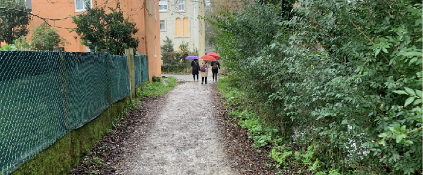

> Senda hasta la Rúa das Brañas do Sar (que pasa entre las edificaciones)

## Estado actual

### Fortalezas

- Es actualmente transitable.
- Acceso a servicios y a zonas muy significativas de la ciudad como la nueva estación intermodal, el ensanche, la estación de Tren
- Acceso a colegios y en la línea de la iniciativa  “Camiños Seguros"
- Está menos aislado que otros tramos de la vía por lo que la sensación de seguridad es mayor.
- Permite y posibilita realizar un recorrido ancho y seguro para peatones y ciclistas, así como el acceso a vehículos de movilidad personal.
- Recorrido completamente separado del tráfico mototizado.
- Riqueza natural
- Tranquilidad del recorrido en ausencia de ruido.

### Debilidades

- Necesidad de acometer una obra en Ponte do Sar
- Necesidad de adaptación del firme para posibilitar y mejorar la circulación de vehículos de movilidad personal y bicicletas.
- Zona boscosa y problemas de iluminación.
- Necesidad de iluminación y mejora de la percepción de la seguridad por tratarse en algunos puntos de zonas boscosas.

## Estado con ciclovía

### Oportunidades

- Muy buena y rápida conexión del barrio de Conxo con Santiago Centro
- Conexión segura para todas las edades y niveles
- Conexión segura diurna y nocturna
- Conexión independiente de las condiciones meteorológicas.

### Amenazas

- Percepción de inseguridad por una mala iluminación.
- Intraestructura infrautilizada si amo se promociona la movilidad sostenible.
- Infraestructura no compatible con la movilidad urbana (aunque sí con el ocio deportivo) por no adaptarse el terreno al presentar barro y otros obstáculos.

## Perfil del Tramo

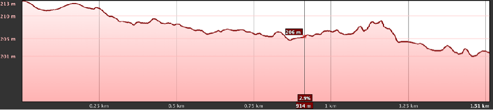

> Perfil del tramo.Totalmente llano

## Sobre el Mapa

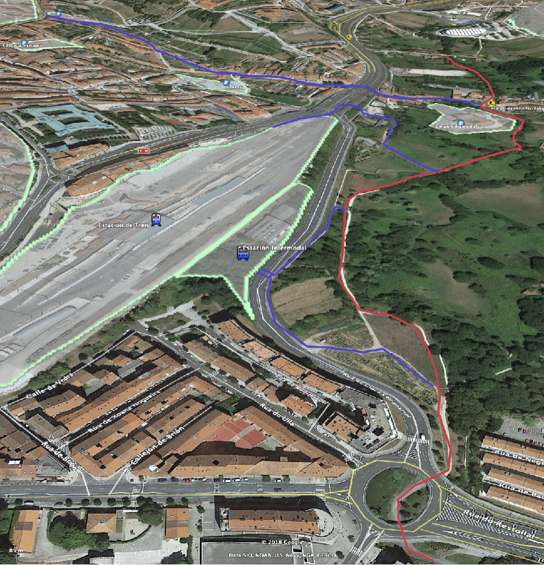

> Google Maps - Tramo E-G y accesos

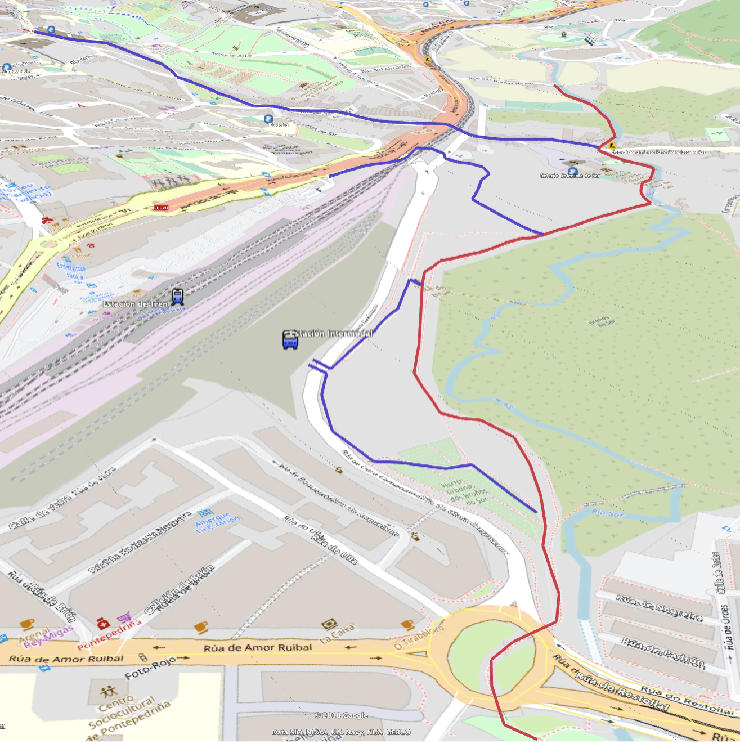

> OpenCycleMap - Tramo E-G y accesos

<!-- Referencias externas -->
[1]: http://policialocal.santiagodecompostela.gal/info.php?sec=33 'Policía Local de Santiago de Compostela. Camino escolar seguro'
