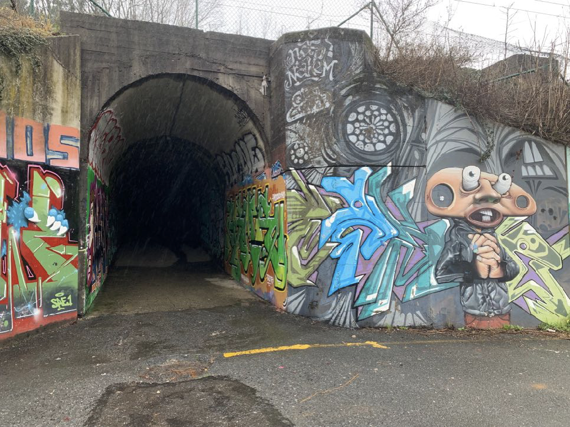
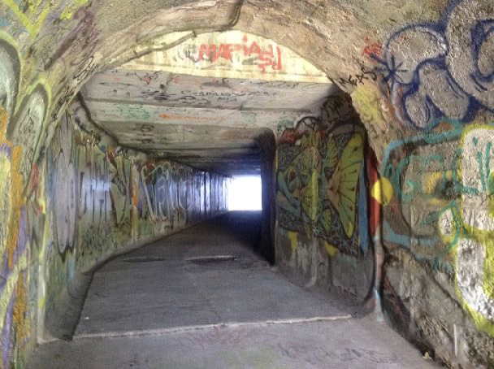
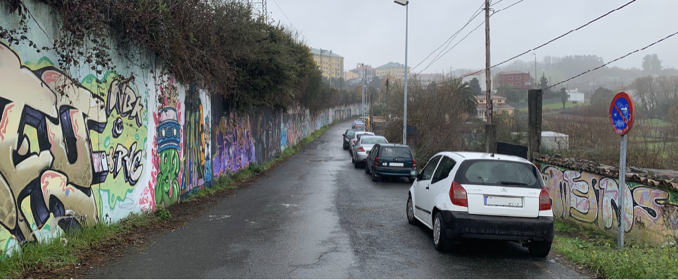
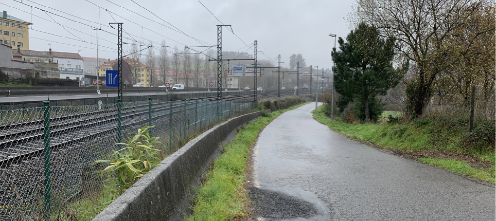
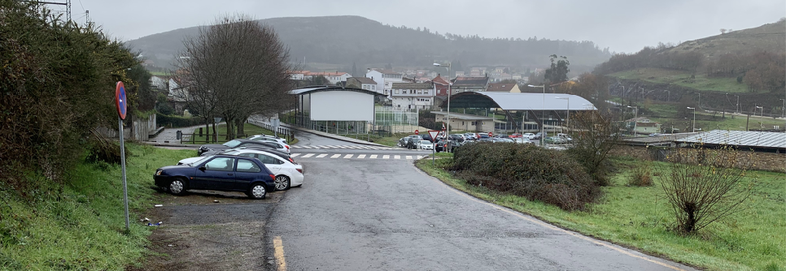
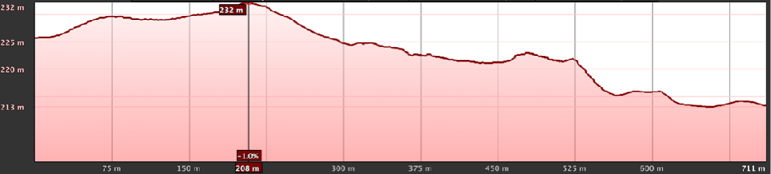
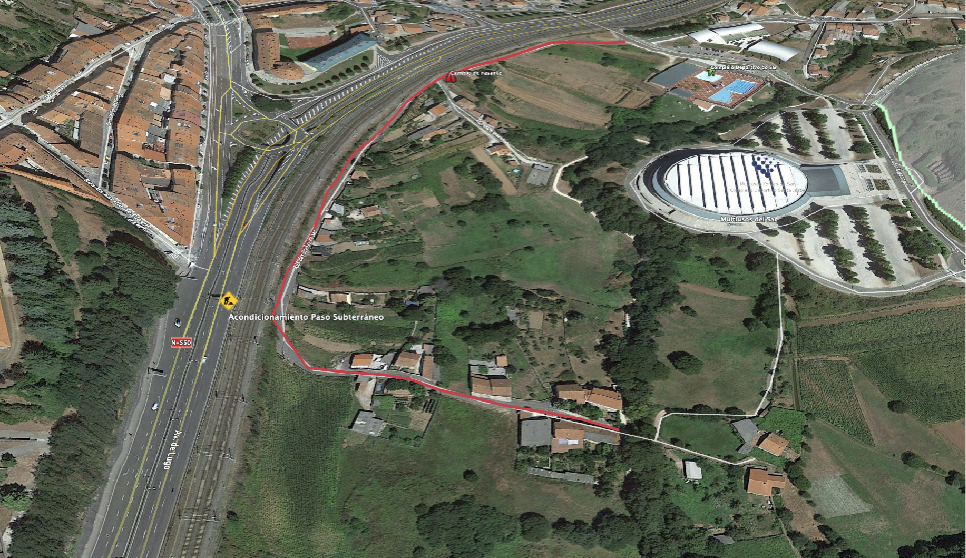
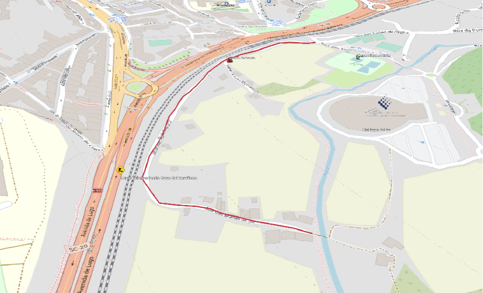

+++
title = 'Tramo Este-H'
date = 2019-03-01T11:11:29+02:00
draft = false
weight = 7
+++

{}
  En la actualidad se está actuando o ya se ha actuado en este tramo, en el contexto del proyecto "***Eixo de Mobilidade Sostible en Santiago de Compostela***" ejecutado por la Axencia Galega de Infraestructuras de la Xunta de Galicia, financiado con Fondos de la Unión Europea (NetxGenerationEU). Te recomendamos que consultes nuestro [blog](https://www.composcleta.org/blog/) o [los recursos que estamos publicando](/ciclovia-milladoiro-santiago/) sobre este proyecto, para disponer de toda la información actualizada.
{}

| Alternativas  | Tramo | Distancia | Descripción
|---|---|---|---
| Sin alternativas | Tramo Este-H | 711 m | Este tramo comienza en el cruce de la Rúa das Brañas do Sar en su intersección con la Senda actual hasta llegar a la Rúa das Fontes do Sar justo en el paso subterráneo que atraviesa las vías del tren, enfrente de las pistas de pádel.

- [Estado actual](#estado-actual)
  - [Fortalezas](#fortalezas)
  - [Debilidades](#debilidades)
- [Estado con ciclovía](#estado-con-ciclovía)
  - [Oportunidades](#oportunidades)
  - [Amenazas](#amenazas)
- [Perfil del Tramo](#perfil-del-tramo)
- [Sobre el Mapa](#sobre-el-mapa)

En la Rúa das Brañas do Sar, una pista asfaltada que fundamentalmente da acceso a las viviendas de la zona continúa el recorrido. Se propone esta alternativa como única, sin considerar siquiera continuar por la Senda das Brañas, porque minimizaría el impacto sobre estas, y por el aprovechamiento de una infraestructura ya existente y que se puede adaptar con facilidad para la circulación de bicicletas y personas. Por otra parte, teniendo en cuenta la conexión a servicios y a barrios con amplia densidad de población, esta pista dispone de un paso subterráneo que conectaría la Vía O Milladoiro con la Avda. de Lugo y la Avda. Quiroga Palacios.

> Entrada del paso subterráneo por la Rúa Brañas do Sar

Este paso subterráneo carece actualmente de ningún tipo de iluminación y su acceso por la Avda. de Lugo no está adaptado para bicicletas ni para vehículos de movilidad personal. Presenta una rampa cuya pendiente debe exceder los 25º (aunque disponga de pasamanos) lo que hace imposible que por ella puedan subir sillas de ruedas, carritos de bebé o bicicletas. Por tanto se debe dar una solución técnica que implique aumentar la longitud del acceso para minimizar la pendiente a menos de 10º para que sea operativa, además de dotar de una iluminación adecuada al paso subterráneo y aumentar con ello la percepción de seguridad.

> Interior del paso subterráneo

Continuando por la Rúa Brañas do Sar en sentido a la Rúa Fontes do Sar, a mano izquierda estará un muro, y a mano derecha un margen con viviendas y muros de fincas que se utiliza fundamentalmente para estacionar los automóviles, lo que deja un paso estrecho para que se crucen dos vehículos. El acceso a esta pista es poco frecuentado en relación a otros puntos de la ciudad porque fundamentalmente sirve de acceso a las viviendas y para aparcar. Sin embargo y dado que dependiendo de la visibilidad, hora del día o climatología, la velocidad que toman los automóviles podría suponer un riesgo para los peatones y ciclistas que transitan por ella, se debe poner barreras para limitar la velocidad. Carece actualmente de señalización horizontal sobre el firme, la única señalización vertical es para impedir el estacionamiento en determinadas zonas. Se debe indicar la presencia de bicicletas o peatones reservando o priorizando el paso de las mismas.

> La calzada se estrecha por el estacionamiento de vehículos

Por otra parte sería preciso mejorar la iluminación de la zona dado que puede ser insuficiente para la circulación nocturna por esta vía. También, si se reserva un paso de la calzada para la circulación de peatones y bicicletas, podría marcarse esta separación con elementos reflectantes sobre la calzada o tacos de goma para impedir la ocupación de esa zona a los vehículos.

También es reseñable un cambio de rasante que se sitúa en el cruce de la Rúa do Catadoiro, donde es necesario acometer medidas específicas que minimicen el riesgo de atropello en ese punto.

> Zonas poco iluminadas y ausencia de señalización horizontal y vertical

El tramo termina frente a las pistas de pádel y junto al paso subterráneo de las vías del tren. Continuando se podría acceder al barrio de O Viso (vía tranquila de acceso al Bosque de Galicia y al parque del Lago). Girando a pocos metros a la derecha se sitúa una zona deportiva que incluye las pistas de tenis y de pádel y las piscinas. Continuando, también a pocos metros se sitúa el Multiusos del Sar. Para el acceso al Gaiás (Cidade da Cultura) se tomaría la Avd. Manuel Fraga donde se puede prever de igual forma una separación para las bicicletas por su acusada pendiente.

> Fin del tramo frente a las pistas de pádel y paso subterráneo

## Estado actual

### Fortalezas

- Es actualmente transitable.
- Acceso a servicios deportivos de la ciudad.
- Conexión del Barrio do Viso.
- Dispone de una infraestructura que conecta la Vía con la Avda. de Lugo.
- Las bicicletas pueden tomar mayores velocidades en este tramo.
- Conexión rápida y segura del Barrio de Fontiñas con la zona Este de Santiago
- Acceso a colegios y en la línea de la iniciativa  “Camiños Seguros"
- Está menos aislado que otros tramos de la vía por que la sensación de seguridad es ser mayor.
- Recorrido completamente separado del tráfico mototizado.
- Riqueza natural
- Tranquilidad del recorrido en ausencia de ruido.

### Debilidades

- Compartición del espacio con vehículos a motor
- Problemas de iluminación.
- Necesidad de iluminación y percepción de la seguridad por tratarse en algunos puntos de zonas boscosas.

## Estado con ciclovía

### Oportunidades

- Muy buena y rápida conexión del barrio de Fontiñas con la estación Intermodas y con Santiago Centro.
- Conexión adaptada con Avda. Lugo
- Adaptando el tramo permite y posibilita realizar un recorrido ancho y seguro para peatones y ciclistas, así como el acceso a vehículos de movilidad personal.
- Conexión segura para todas las edades y niveles
- Conexión segura diurna y nocturna
- Conexión independiente de las condiciones meteorológicas.

### Amenazas

- Percepción de inseguridad por una mala iluminación.
- Intraestructura infrautilizada si amo se promociona la movilidad sostenible.
- Infraestructura no compatible con la movilidad urbana (aunque sí con el ocio deportivo) por no adaptarse el terreno al presentar barro y otros obstáculos.
- Convivencia con los vecinos.

## Perfil del Tramo

> Tramo E-H. Perfil (eje x invertido). Moderada pendiente salvando un desnivel de 20m

## Sobre el Mapa

> Google Maps - Tramo E-H

> OpenCycleMap - Tramo E-H
