+++
title = 'Tramo Este-I'
date = 2019-03-01T11:11:29+02:00
draft = false
weight = 8
+++

| Alternativas  | Tramo | Distancia | Descripción
|---|---|---|---
| Sin alternativas | Tramo Este-I | 1.360 m | Este tramo comienza en la Rúa Fontes do Sar, frente a las pistas de pádel pasando por el paso subterráneo por debajo de las vías del tren, continuando por la Calle de Londres (conectando con el carril bici de Fontiñas) y por la Calle Roma en dirección a San Lázaro donde termina.

- [Estado actual](#estado-actual)
  - [Fortalezas](#fortalezas)
  - [Debilidades](#debilidades)
- [Estado con ciclovía](#estado-con-ciclovía)
  - [Oportunidades](#oportunidades)
  - [Amenazas](#amenazas)
- [Perfil del Tramo](#perfil-del-tramo)
- [Sobre el Mapa](#sobre-el-mapa)

El tramo comienza en la Rúa Fontes do Sar y pasa por el paso soterrado que atraviesa las vías del tren. Sobre la calzada es habitual que circule mucho tráfico, incluyendo vehículos pesados como camiones y autobuses. Atendiendo a que el carácter general de la Vía a O Milladoiro es primar la tranquilidad y separación del tráfico, y teniendo en cuenta que va desde los grupos de edad desde los 8 a los 80 años y que la calzada presenta una ligera pendiente, compartir el espacio con los vehículos motorizados sobre la calzada puede suponer un problema de gran percepción de riesgo.
Las aceras de las que actualmente dispone el paso subterráneo podrían ser lo suficientemente anchas para presentar un carril bici sobre las mismas, de un sólo sentido de circulación, con una limitación a 10Km/h y con una segregación débil (pintado sobre ellas), de forma que quede suficiente espacio para los peatones. Por la otra acera se podría disponer de la misma invirtiendo el sentido de la marcha.
También es necesario mejorar la iluminación del túnel, dado que la actual iluminación está más adaptada para la circulación de automóviles que para peatones o ciclistas.

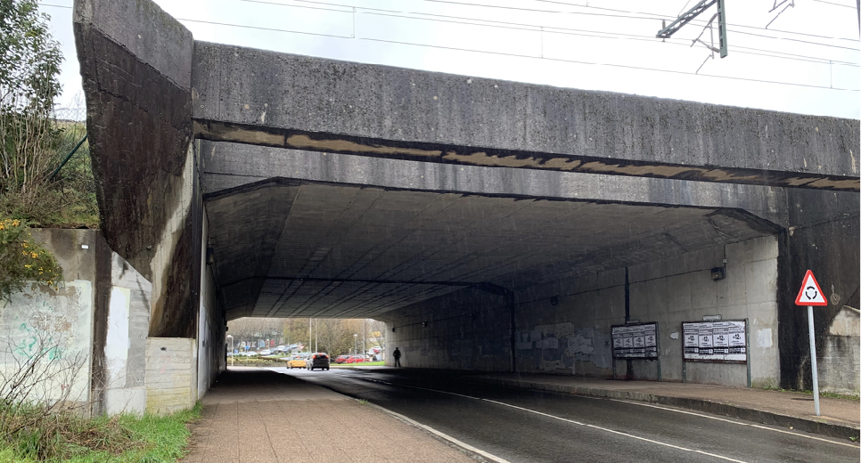

> Paso soterrado de la Rúa das Fontes do Sar.

Continuando por la Rúa das Fontes do Sar se propone extender el actual carril bici que atraviesa la Calle de Londres. Existe espacio suficiente en esta calle para adaptar la circulación a las bicicletas. Se ve innecesario la existencia de un doble carril de circulación, que eleva de facto la velocidad de circulación de los automóviles; y teniendo en cuenta que la Calle de Londres es de un sólo carril de circulación e igualmente el paso se estrecha llegando al paso soterrado, el doble sentido pierde su propósito.

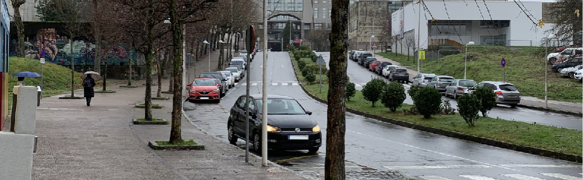

> Dobre sentido innecesario en la Rúa da Fontes do Sar.

Atendiendo a las características del actual carril bici del Barrio de Fontiñas, debemos indicar que es una vía apropiada para la circulación de las diferentes perspectivas de esta propuesta (bicicletas, peatones, VMP), aunque caben matices y aspectos de mejora. La separación del tráfico de personas y bicicletas favorece que estas últimas circulen a mayor velocidad y reduzcan los tiempo en cuento a alcanzar sus destinos. Sin embargo, es un hecho que actualmente los peatones invaden estas zonas destinadas exclusivamente para las bicicletas y existe un riesgo si las bicicletas toman la velocidad que les permite esta infraestructura.

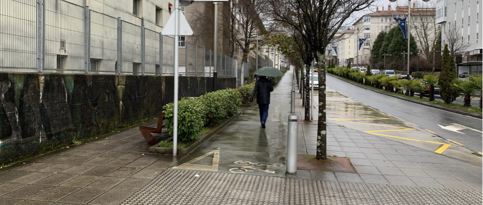

> Es habitual que los peatones invadan los carriles bici

Por ello, la tónica actual es evitar los carriles bici sobre aceras en la medida que esto sea posible y bajarlos separados a nivel de la calzada. Por otra parte, un mayor tránsito de bicicletas sobre ellos (favorecido con políticas de movilidad activa) acostumbraría a los peatones a no invadirlos. Estos carriles-bici del barrio de Fontiñas, por otra parte, están infrautilizados debido a que carecen de un propósito. Son unos pocos metros de carril-bici que no llevan a ninguna parte. Se debe tener en cuenta que coger la bicicleta para moverse por la ciudad supone realmente un beneficio si se trata de recorridos algo más largos, pero no para recorrer tan sólo unos pocos metros.

Desde la perspectiva del ciclista urbano que utiliza la bici como medio de movilidad y que carece de suficiente experiencia para compartir infraestructuras con un tráfico no calmado y habitualmente violento, la longitud del carril-bici actual no soluciona en nada su posibilidad de circular con seguridad por la ciudad, lo que provoca que este medio no termine de instaurarse con normalidad.

Otra aspecto reseñable es el paso del carril-bici sobre la calzada. Sería favorable mejorar la señalización vertical incluso con señales lumínicas para advertir a conductores de automóviles que pasan bicicletas y que éstas llevan preferencia. En la imagen que se ilustra a continuación se aprecia que el automóvil tiene un espacio entre el paso de cebra y el paso para bicicletas donde se puede colocar sin invadir ninguno de los citados espacios y con buena visibilidad para incorporarse a la rotonda. Sin embargo esto no sucede en el cruce de la Rúa París, donde o bien el automóvil invade y se sitúa sobre el paso de cebra para tener visibilidad y esperar el paso, o se sitúa y obstaculiza el carril para bicicletas.

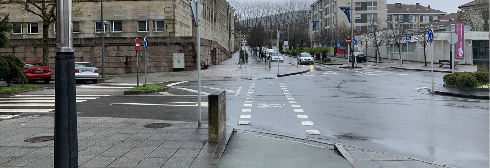

> En el cruce del carril bici sobre la calzada hay espacio suficiente y visibilidad para el automóvil.

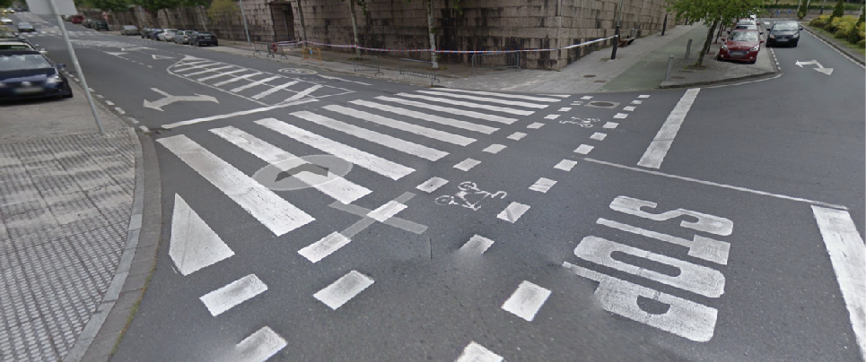

> En el cruce del carril bici sobre la calzada no hay espacio suficiente y visibilidad para el automóvil.

En todo caso este es el tramo actualmente mejor adaptado de esta propuesta y es necesario trasladar la seguridad que se aprecia en este al resto del recorrido.
Continuando y tomando a la izquierda por la Rúa Roma termina el carril-bici sin que este llega a ningún sitio de utilidad o propósito. Se propone continuar el carril por la Rúa Londres aprovechando la amplitud de esta vía.

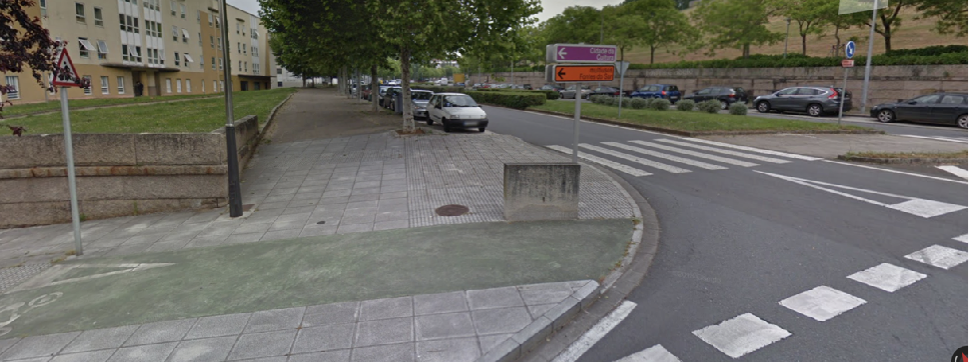

> Término del carril bici sin que lleve a ningún sitio.

Es una vía que tiene una moderada pendiente (alrededor de un 5%) y en el que actualmente (y aunque está limitada la velocidad a 30Km/h) circulan los coches a una velocidad muy elevada, seguramente por la apreciación de los conductores de ser una avenida ancha y de poco tránsito peatonal.

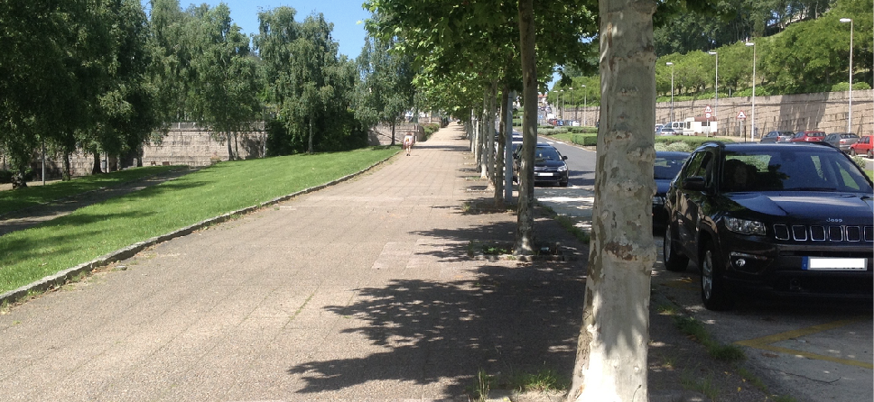

> Calle de Roma en uno de sus laterales.

Por otra parte es de destacar que esta calle presenta una gran oportunidad al respecto de la movilidad sostenible y activa, ya que en ella se encuentran dos colegios (CEIP Fontiñas para Infantil y CEIP Fontiñas para Primaria) y un Instituto de Secundaria y Formación Profesional. Además tiene acceso a una zona comercial, que activaría una mayor afluencia de personas en bicicleta.

La calle presenta una anchura suficiente, no es muy transitada por una gran afluencia de peatones, carece de acceso a garajes (ya que se encuentran por la paralela, París) y todo un lateral carece de viviendas. Son circunstancias ventajosas para una infraestructura ciclista separada.

Presenta algún punto actualmente conflictivo desde el punto de vista de la seguridad, concretamente el punto que da acceso al parking subterráneo de Área central, ya que hay un acusado cambio de rasante que pone en riesgo a los peatones y a las bicicletas que bajan por la calzada.

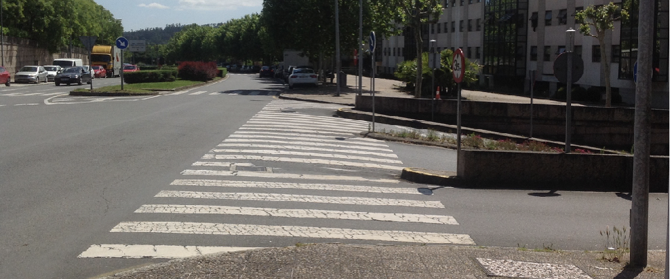

> Punto de riesgo para peatones y ciclistas debido al cambio de rasante que se produce en el acceso al Parking de Área Central

Finalmente y llegados al punto de intersección de la Rúa Roma con la Avda. do Camiño Francés (N-634), por donde discurre actualmente el Camino de Santiago, se termina la descripción del ramal este de esta propuesta. En la contextualización se analiza la por qué termina en este punto el ramal de la Vía a O Milladoiro.

## Estado actual

### Fortalezas

- "En la actualidad dispone ya de infraestructura ciclista adaptada en parte del tramo.
- Acceso a colegios y en la línea de la iniciativa  “Camiños Seguros"
- Acceso a servicios comerciales.
- Las bicicletas pueden tomar mayores velocidades en este tramo.
- Conexión rápida y segura del Barrio de Fontiñas con la zona Este de Santiago
- Conexión con otras vías frecuentadas por ciclistas como el Camino de Santiago, Albergues de peregrinos.

### Debilidades

- "Necesidad de adaptación de todo el tramo
- Carriles bici “que no llevan a ninguna parte”
- Inseguridad jurídica por utilizar aceras que brindan seguridad al ciclista sin molestar al peatón frente a utilizar la calzada donde los vehículos no respetan el límite 30Km/h.

## Estado con ciclovía

### Oportunidades

- Muy buena y rápida conexión del barrio de Fontiñas con la estación Intermodas y con Santiago Centro.
- Conexión adaptada con Avda. Lugo
- Adaptando el tramo permite y posibilita realizar un recorrido ancho y seguro para peatones y ciclistas, así como el acceso a vehículos de movilidad personal.
- Conexión segura para todas las edades y niveles
- Conexión segura diurna y nocturna
- Conexión independiente de las condiciones meteorológicas.
- Brinda oportunidades para el cicloturismo y conectar infraestructuras que conformes una red autonómica para la bicicleta.

### Amenazas

- Inseguridad si no se aplican las correctas medidas de separación de vehículos vulnerables.
- Intraestructura infrautilizada si amo se promociona la movilidad sostenible.

## Perfil del Tramo

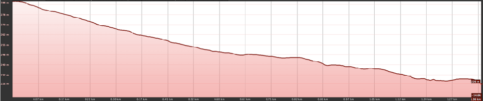

> Perfil moderadamente en pendiente (eje x invertido) Ronda una pendiente de entorno al 5%

## Sobre el Mapa

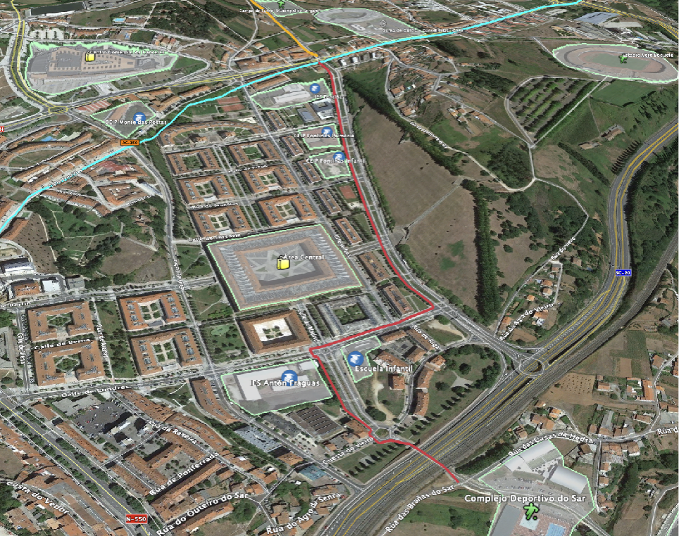

> Google Maps - Tramo E-I (línea roja). Línea Azul, Camino de Santiago. Línea Naranja, posibilidad de conexión con Vía Verde Sionlla

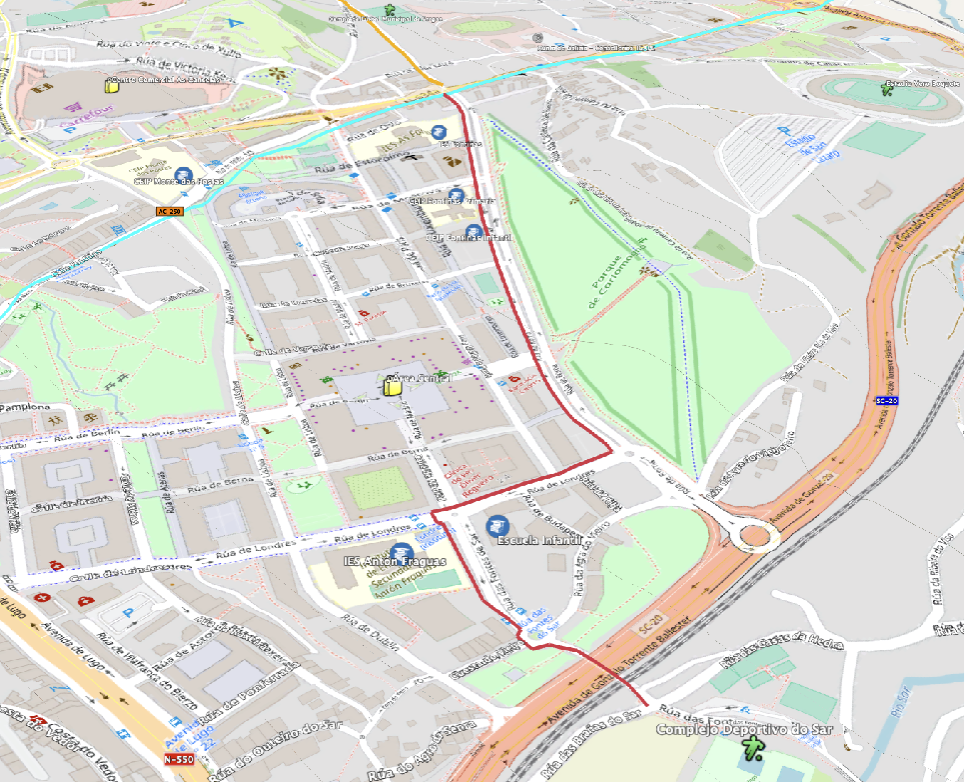

> OpenCycleMap - Tramo E-I (línea roja). Línea Azul, Camino de Santiago. Línea Naranja, posibilidad de conexión con Vía Verde Sionlla
