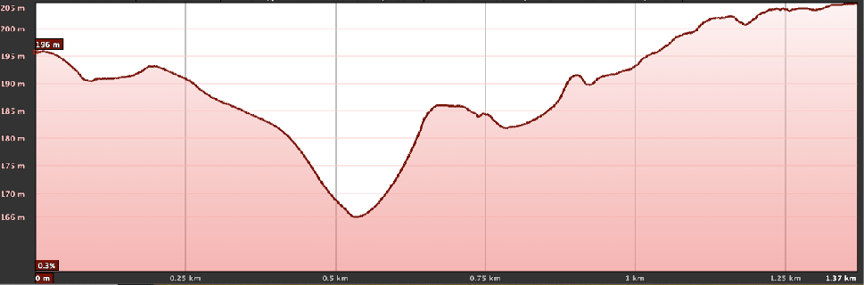

+++
title = 'Tramo Oeste-B'
date = 2024-09-28T11:11:29+02:00
draft = false
weight = 9
+++

Existen 2 alternativas.  Ambas conectan la SC-20 desde el paso elevado que la atraviesa con la Rúa da Volta do Castro

| Alternativas  | Tramo | Distancia | Descripción
|---|---|---|---
| Paso inferior a la rotonda de Volta do Castro | Tramo Oeste-B1 | 1.370 m | Continuando por la SC-20 por la margen izquierda en dirección Santiago, implicaría la construcción de un paso inferior a la rotonda de Volta do Castro.
| Evitanto rotonda. Aprovechando un tramo del camino de Santiago | Tramo Oeste-B2 | 1.340 m | Esta alternativa evita el paso de la rotonda de Volta do Castro, a través del enlace de la margen derecha de la SC-20 en dirección Santiago, con un tramo del Camino de Santiago.

Este tramo comienza en el punto en el que termina la zona común de las alternativas Este-B1 y Este-B2, la zona del paso elevado que atraviesa la SC-20. A partir de aquí, existirían dos alternativas, cuya elección viene principalmente condicionada por la forma de afrontar el paso desde la SC-20 a la altura del viaducto Ponte da Rocha, hasta la Rúa Volta do Castro.

> Debajo del tablero (ampliado) da Ponte da Rocha, mirando en dirección sur (O Milladoiro)

En la primera de las alternativas (Oeste-B1)supone atravesar el viaducto en sentido contrario a la marcha de los vehículos hasta llegar a la rotonda elevada de Ponte da Rocha donde se propone la construcción de un paso inferior bajo el ramal de la AC-543 que sale de la rotonda de Volta do Castro, que permita la conexión de la SC-20 con la Rúa Volta do Castro. La segunda alternativa (Oeste-B2) evitaría la construcción de dicha infraestructura, y discurriría por la margen derecha de la SC-20 en dirección Santiago hasta la conexión con el Camino de Santiago a través de la Rúa da Escurridia.

> Tramo Oeste (W)-B, trazado de las alternativas B1 (izquierda) y B2 (derecha)

## Tramo Oeste-B1

Desde el punto de la SC-20 en el que se encuentra el paso elevado se continúa por la margen izquierda (en dirección Santiago). En este tramo existe una acera que se ve interrumpida por la salida de la SC-20 hacia la Rúa do Churruchao, para la que no existe carril de desaceleración. Por tanto, es un punto con riesgo de atropello.

> Tramo W-B1, vista de la salida de la SC-20 hacia la Rúa do Churruchao a mano izquierda

Pasado este desvío, se continúa por delante de unas edificaciones y comienza la Rúa do Viaducto da Rocha, provista de una acera con un muro de separación del tráfico rodado que concluye en una zona sin acondicionar. En esta zona actualmente se sitúa una zona de venta de coches usados, pasada la cual, existe una señal que prohíbe continuar el paso a peatones.

> Tramo W-B1, vista de la salida del paso de la SC-20 por delante de edificaciones.

> Tramo W-B1, vista de la acera con un muro para la separación del tráfico

> Tramo W-B1, vista de la zona de venta de coches usados

> Tramo W-B1, vista del final de la SC 20 acercándose a la rotonda de volta do Castro, con una señal que prohíbe el paso a peatones.

Tal y como está actualmente este tramo, no se dan las condiciones para que sea un itinerario seguro para bicicletas o peatones. Su acondicionamiento requeriría de la ampliación de la zona de acera existente en la actualidad, para permitir su uso compartido por peones y bicicletas. Al menos en la zona del Viaducto da Rocha, esto implicaría la construcción de una estructura que permita la separación del tráfico rodado para que la circulación de bicicletas pueda hacerse con total seguridad y de forma confortable. Podría emplearse una [barrera acústica][1] o panel para aislar el ruido de los coches y la suciedad, agua y polución (en los días de lluvia los camiones pueden mojar a los ciclistas y viandantes), como se muestra en la siguiente imagen con la particularidad de que el paso para ciclistas y peatones quede protegido por la pantalla:

> Pantalla acústica para protección del ruido y salpicaduras.En esta imagen no se protege al ciclista con el apantallamiento

Además, para salvar el paso de la rotonda de Volta do Castro sería necesario construir y habilitar un paso inferior que atravesando el ramal de la AC-543 que sale de la rotonda, permita la incorporación a la Rúa Volta do Castro por la zona en la que está localizada.

> Tramo W-B1, en rojo se marca la zona propuesta para la construcción de un paso inferior

La incorporación desde la salida de este paso inferior a la vía principal de la Rúa Volta do Castro implicaría riesgo por su incorporación en sentido de contra-marcha y por ser también la zona de entrada a TRedess, aspectos a tener en cuenta para el acondicionamiento de esta vía. Además la pendiente de la parte final de este tramo tendría que ser evaluada para verificar su idoneidad para el uso por personas con movilidad reducida.

Tanto el paso inferior como la vía de conexión con la rúa Volta do Castro deberían ser acondicionadas adecuadamente en cuestiones de iluminación. Aun así, no dejan de ser zonas relativamente apartadas y poco frecuentadas que podrían comprometer bastante la sensación de seguridad.

> Tramo W-B1, zona de salida del paso inferior propuesto (izquierda) y zona de incorporación a la vía principal de la Rúa d Volta do Castro (derecha).

### Estado actual tramo Oeste-B1

#### Fortalezas tramo Oeste-B1

- Tramo de perfil bastante plano.
- Trazado conecta directamente con la entrada en la ciudad desde O Milladoiro.

#### Debilidades tramo Oeste-B1

- Necesidad de fuerte inversión.
- Muy alta peligrosidad dado el tráfico de alta velocidad.
- Infraestructuras no diseñadas para peatones y ciclistas lo que crean dos “islas poblacionales”.
- Poco espacio para adaptar las vías
- Vías de alta capacidad y de alta velocidad y críticas para el tráfico motorizado.
- Ponte da Rocha con diseño protagonista de tráfico motorizado.
- Negocios locales muy cerca de la calzada.
- Dificultad técnica de adaptación al modelo de movilidad sostenible.

### Estado con ciclovía tramo Oeste-B1

#### Oportunidades tramo Oeste-B1

- Conexión de las núcleos de O Milladoiro y Santiago de Compostela (negocios y viviendas particulares).
- Conexión segura para los ciclistas de cualquier edad y nivel.
- Conexión segura para peatones y personas con movilidad reducida.
- Conexión segura diurna y nocturna, aunque para ello es FUNDAMENTAL la SEGURIDAD de tramos como el paso inferior y tramos no urbanos.
- Conexión segura independientemente de la meteorología y visibilidad para el tráfico motorizado.

#### Amenazas tramo Oeste-B1

- Infraestructura infrautilizada si no se promociona la movilidad sostenible en bicicleta y peatonal en otros ámbitos.
- Infraestructura infrautilizada si no se apoya la formación
- Infraestructura infrautilizada por la falta de integridad en el recorrido de la que forma parte y de no conectar con el mismo grado de seguridad y facilidad de uso que otros tramos del recorrido. Es FUNDAMENTAL la SEGURIDAD de tramos como el paso inferior y tramos no urbanos.
- Falta de implicación de otros actores sociales como administración y empresas, que fomenten la movilidad en bicicleta dentro de su actividad.

<!-- Referencias externas -->
[1]: https://teoriadeconstruccion.net/blog/pantallas-antiruido/ 'Pantallas antiruido'

## Tramo Oeste-B2

Desde el punto de la SC-20 en el que se encuentra el paso elevado se continúa por la margen derecha (en dirección Santiago). Como ya se ha comentado en la descripción del tramo Este-B, este paso elevado presenta actualmente dificultades por su estrechez para la convivencia peatón-ciclista, sus ángulos de giro y la peligrosidad de precipitarse en su punto más alto, por lo que no es apto para la circulación de bicicletas.

A partir de este punto, esta alternativa compartiría el trazado del tramo E-B1 hasta la zona del sendero que sale a mano derecha paralelo a la vía del tren, y que por tanto presentaría las dificultades y riesgos ya señalados en la descripción de dicho tramo E-B1.

A partir de aquí, el camino avanza por la Rúa do Viaducto da Rocha por una acera separada del tráfico rodado a través de un pequeño muro de hormigón, que al igual que ocurre en la alternativa W-B2 no tiene en ancho suficiente para poder ser una vía de uso compartido entre peatones y ciclistas.

> Tramo W-B2, punto inicio de este tramo a partir de su separación del trazado del tramo E-B1. Vista de la acera con el muro de separación del tráfico rodado.

Esta vía finaliza con la salida a mano derecha hacia la Rúa da Escurridia, que es zona de paso del Camino de Santiago.

> Tramo W-B2, vista de la salida desde la SC-20 de la rúa da Escurridia (con flecha roja)

> Tramo W-B2, dos vistas del estado de la rúa da Escurridia

A partir de aquí, se cruzaría la Rúa da Volta do Castro hacia la Rúa da Volta do Castro de Abaixo (señalizada actualmente como vía sin salida), y se conectaría con la vía principal de la Rúa da Volta do Castro.

> Tramo W-B2, vista de la zona en la que la rúa da Escurridia acaba en la rúa da Volta do Castro (izquierda), y vista de la zona de incorporación desde la rúa da Escurridia a la rúa volta do Castro, y de esta a la rúa da Volta do Castro de Abaixo (izquierda)

> Tramo W-B2, vista de la rúa da Volta do Castro de Abaixo.

> Tramo W-B2, vista de la incorporación desde la rúa da Volta do Castro de Abaixo a la pista que contacta con la vía principal de la rúa Volta do Castro (actualmente sin salida)

> Tramo W-B2, vista de la incorporación desde la pista anterior a la vía principal de la rúa da Volta do Castro.

La incorporación desde la Rúa Volta do Castro de Abaixo a la vía principal de la Rúa Castro de Abaixo a través de la pista que puede verse en las imágenes anteriores presentaría riesgo de atropello, al coincidir con la vía de incorporación que viene desde la Avenida Antonio Fraguas.

Por otra parte, tanto la Rúa da Escurridia como la Rúa da Volta do Castro de Abaixo deberían ser acondicionadas adecuadamente en cuestiones de iluminación. Además debe ser posible la identificación de la infraestructura en todo momento, de modo que se identifique la vía para el uso ciclista (puntos kilométricos, color de la calzada, señalización vertical, horizontal...). Aun así, hay tramos que no dejan de ser zonas relativamente apartadas y poco frecuentadas que podrían comprometer bastante la sensación de seguridad.

### Estado actual tramo Oeste-B2

#### Fortalezas tramo Oeste-B2

- Tramo de perfil significativamente plano.
- Aprovechamiento de alguna infraestructura existente, como la utilizada por el Camino de Santiago

#### Debilidades tramo Oeste-B2

- Necesidad de fuerte inversión
- Muy alta peligrosidad dado el tráfico de alta velocidad
- Infraestructuras no diseñadas para peatones y ciclistas lo que crean dos “islas poblacionales”.
- Poco espacio para adaptar las vías
- Vías de alta capacidad y de alta velocidad y críticas para el tráfico motorizado.
- Ponte da rocha con diseño protagonista de tráfico motorizado.
- Negocios locales muy cerca de la calzada.
- Necesidad de cruce de la SC-20
- Dificultad técnica de adaptación al modelo de movilidad sostenible.
- Uso compartido con el Camino de Santiago

### Estado con ciclovía tramo Oeste-B2

#### Oportunidades tramo Oeste-B2

- Conexión de las núcleos de O Milladoiro y Santiago de Compostela (negocios y viviendas particulares)
- Conexión segura para los ciclistas de cualquier edad y nivel
- Conexión segura para peatones y personas con movilidad reducida
- Conexión segura diurna y nocturna, aunque para ello es FUNDAMENTAL la SEGURIDAD (tramos no urbanos poco frecuentados)
- Conexión segura independientemente de la meteorología y visibilidad para el tráfico motorizado

#### Amenazas tramo Oeste-B2

- Infraestructura infrautilizada si no se promociona la movilidad sostenible en bicicleta y peatonal en otros ámbitos.
- Infraestructura infrautilizada si no se apoya la formación
- Infraestructura infrautilizada por la falta de integridad en el recorrido de la que forma parte y de no conectar con el mismo grado de seguridad y facilidad de uso que otros tramos del recorrido. Es FUNDAMENTAL la SEGURIDAD (tramos no urbanos poco frecuentados)
- Falta de implicación de otros actores sociales como administración y empresas, que fomenten la movilidad en bicicleta dentro de su actividad.

## Perfil del Tramo

> Perfil de elevación W-B1

> Perfil de elevación W-B2
