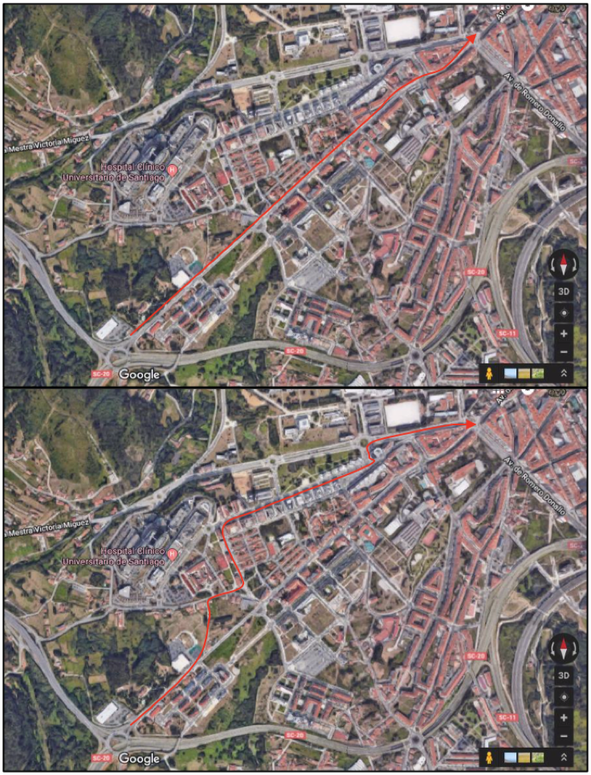
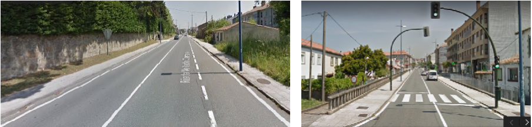
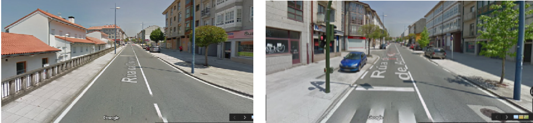
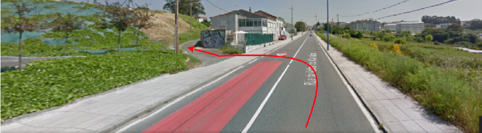
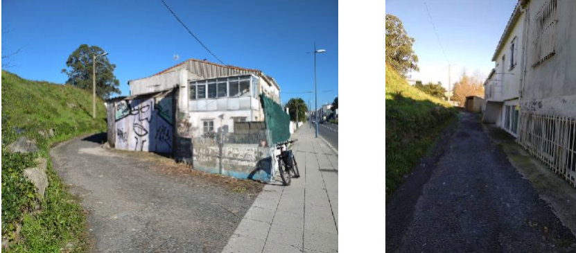
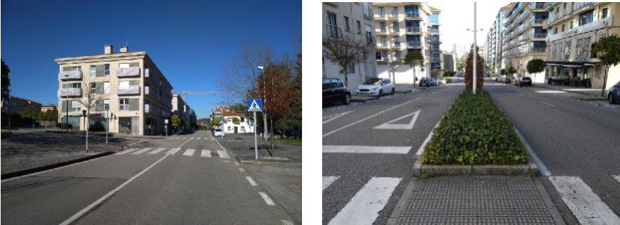
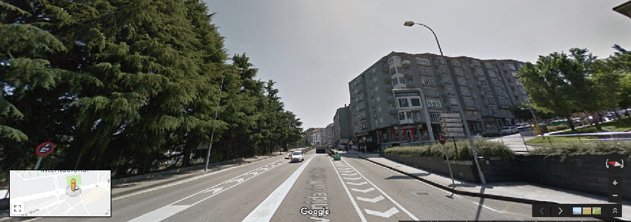

+++
title = 'Tramo Oeste-C'
date = 2019-03-01T11:11:29+02:00
draft = false
weight = 10
+++

Existen 2 alternativas. Ambas conectan la entrada en Santiago por la Rúa da Volta do Castro con la rotonda de Rosalía de Castro

| Alternativas  | Tramo | Distancia | Descripción
|---|---|---|---
| Por la carretera principal | Tramo Oeste-C1 | 1.400 m | Esta alternativa sigue la carretera principal de entrada a Santiago desde Pontevedra, por la rúa de Volta do Castro, hasta la rotonda de la carretera de circunvalación con Romero Donallo. Es la entrada más directa para el centro de la ciudad.
| Evitando la carretera principal | Tramo Oeste-C2 | 1.700 m | Esta alternativa evita el paso por la carretera principal de entrada a Santiago (la utilizada en la alternativa anterior), y para ello utiliza un trazado alternativo a través de la Rúa de Barcelona en el que la densidad de tráfico es considerablemente menor.

- [Tramo Oeste-C1](#tramo-oeste-c1)
  - [Estado actual tramo Oeste-C1](#estado-actual-tramo-oeste-c1)
    - [Fortalezas tramo Oeste-C1](#fortalezas-tramo-oeste-c1)
    - [Debilidades tramo Oeste-C1](#debilidades-tramo-oeste-c1)
  - [Estado con ciclovía tramo Oeste-C1](#estado-con-ciclovía-tramo-oeste-c1)
    - [Oportunidades tramo Oeste-C1](#oportunidades-tramo-oeste-c1)
    - [Amenazas tramo Oeste-C1](#amenazas-tramo-oeste-c1)
- [Tramo Oeste-C2](#tramo-oeste-c2)
  - [Estado actual tramo Oeste-C2](#estado-actual-tramo-oeste-c2)
    - [Fortalezas tramo Oeste-C2](#fortalezas-tramo-oeste-c2)
    - [Debilidades tramo Oeste-C2](#debilidades-tramo-oeste-c2)
  - [Estado con ciclovía tramo Oeste-C2](#estado-con-ciclovía-tramo-oeste-c2)
    - [Oportunidades tramo Oeste-C2](#oportunidades-tramo-oeste-c2)
    - [Amenazas tramo Oeste-C2](#amenazas-tramo-oeste-c2)

Este recorrido comienza en el punto en el que termina el tramo Oeste-B, en la entrada a la ciudad por la rúa de Castro de Abaixo, una vez superada la zona de la rotonda de Volta do Castro. A partir de aquí existirían dos alternativas.

La primera de ellas (Oeste-C1) utiliza la vía de entrada en la ciudad más directa, pero requeriría del acondicionamiento (reurbanización) y reordenación del tráfico en todo el eje formado por “rúa volta do Castro-Choupapa-Santa Marta de Arriba-Avda Rosalía de Castro”, o cuando menos su conversión en una zona en la que se pudiese asegurar el cumplimiento de una velocidad máxima de circulación para el tráfico motorizado de 30 km/hora (¿“zona 30”?).

La segunda alternativa (Oeste-C2) evitaría la inversión necesaria para acondicionar la vía anterior, pero a cambio supone un trazado más incómodo para la circulación de bicicletas y peatones por la existencia de mayores desniveles, y el paso por zonas menos transitadas de cara a la circulación nocturna.

> Tramo Oeste (W)-C, vista del trazado de las alternativas C1 (arriba) y C2 (abajo)

## Tramo Oeste-C1

Una vez superada la zona de la rotonda de Volta do Castro, este tramo continúa por toda la vía principal de entrada a Santiago desde O Milladoiro: Rúa Volta do Castro, Rúa da Choupana, Rúa de Santa Marta de Arriba, y Avda Rosalía de Castro hasta la rotonda que enlaza con la Avda. de Romero Donallo.

Este trazado es la vía más directa para acceder a la ciudad desde la zona de O Milladoiro. La pendiente es la más tendida, y en su trazado se incluyen varios centros educativos y comercios, lo que la convierte de entrada en la vía más lógica y cómoda de acceso. Por este motivo, habitualmente soporta una elevada densidad de tráfico, especialmente en las horas punta de entrada y salida de la ciudad. Además, a través de diversas vías con salida de este eje se accede fácilmente a zonas estratégicas de la ciudad como el CHUS o el Campus Sur de la USC. Actualmente la circulación en bicicleta por esta zona no resulta segura, debe hacerse compartiendo la carretera con los vehículos y en una zona en la que la velocidad está limitada a 50 km/hora, pero en la que en ausencia de atascos es habitual que se circule incluso a más velocidad. Además, los ciclistas que se desplazan hacia el centro de la ciudad (subiendo) lo hacen a una velocidad todavía más lenta, lo que incrementa la posibilidad de que se produzcan adelantamientos inadecuados por parte de los vehículos.

Si bien existen algunos tramos en los que las zonas peatonales son bastante anchas, por lo que podría barajarse la construcción de zonas separadas par la circulación de bicicletas, existen otras en las que no se dispone de arcén, el espacio destinado a las aceras es limitado, y no es posible ganar espacio por la existencia de edificaciones.

Estas cuestiones dificultan en parte la proyección de una vía ciclista segura que permita mantener en todo el trazado una separación con respecto al tráfico rodado sin plantearse la reducción a un único sentido de circulación. Por lo que prácticamente la única opción existente para que esta vía disponga de un mínimo de seguridad para la circulación de bicicletas manteniendo el doble sentido de circulación para el tráfico rodado, sería su limitación de velocidad máxima a 30 km/hora, asegurando con la construcción de las infraestructuras adecuadas que los vehículos circulan como máximo a esta velocidad.

> Tramo Oeste (W)-C1, vista de dos zonas con limitaciones de espacio en las calles Volta do Castro (izquierda) y Santa Marta de Arriba (derecha).

> Tramo Oeste (W)-C1, vista de dos zonas con espacio suficiente en las calles Choupana (izquierda) y Santa Marta de Arriba (derecha).

### Estado actual tramo Oeste-C1

#### Fortalezas tramo Oeste-C1

- Perfil sin pendientes excesivas y vía directa de entrada en la ciudad
- Comunicación con lugares estratégicos de la ciudad como zonas comerciales y residenciales.
- Existen zonas con espacio suficiente para separar el tráfico de bicicletas.

#### Debilidades tramo Oeste-C1

- Peligrosidad dada la elevada densidad de tráfico
- Existen zonas en las que no existe espacio suficiente para adaptar las vías
- Dificultad técnica de adaptación al modelo de movilidad sostenible.

### Estado con ciclovía tramo Oeste-C1

#### Oportunidades tramo Oeste-C1

- Continuación de la conexión de los núcleos de O Milladoiro y Santiago de Compostela (negocios y viviendas particulares)
- Conexión segura para los ciclistas de cualquier edad y nivel
- Conexión segura diurna y nocturna al tratarse de una zona bien iluminada y transitada

#### Amenazas tramo Oeste-C1

- Infraestructura infrautilizada si no se asegura suficiente grado de seguridad y comodidad en todo su recorrido.
- Infraestructura infrautilizada si no se promociona la movilidad sostenible en bicicleta y peatonal en otros ámbitos.
- Falta de implicación de otros actores sociales como administración empresas y Universidad, que fomenten la movilidad en bicicleta dentro de su actividad.

## Tramo Oeste-C2

Una vez superada la zona de la rotonda de Volta do Castro, esta opción trata de constituir una alternativa de entrada a la ciudad a través vías de circulación que soportan menor densidad de vehículos, y que por ello puedan resultar más seguras para la circulación de bicicletas.

Partiendo de la rúa Volta do Castro, una vez pasado el Eroski, se cogería a mano izquierda (en dirección Santiago) una pequeña vía, la Ruela da Volta do Castro, para comunicar con la zona de la Travesa da Choupana. Esta vía (Ruela da Volta do Castro), aunque asfaltada, requeriría de un mejor acondicionamiento tanto en el firme, como en la iluminación. Presenta además los siguientes inconvenientes:

- El acceso desde la Rúa da Volta do Castro, que en dirección Santiago implica un giro a mano izquierda, atravesando un carril de circulación de vehículos en sentido contrario, en una zona bastante transitada. Bien es cierto que ya existe un paso para peatones, por lo que podría incluirse una señal semafórica y su adaptación también para el paso de bicicletas.

- Aunque disponga de iluminación, no deja de ser una zona relativamente apartada y muy poco frecuentada que podría comprometer bastante la sensación de seguridad.

> Tramo Oeste (W)-C2, vista de la zona de incorporación a la ruela da volta do Castro

> Tramo Oeste (W)-C2, dos vistas de la ruela da volta do Castro.

Una vez en la Travesa da Choupana, se accedería por la Rúa Sempre en Galiza hasta la Avda de Barcelona. La Rúa Sempre en Galiza no soporta elevada densidad de tráfico, por lo que su conversión en Zona 30 podría ser suficiente para mejorar la seguridad para el caso de circulación de bicicletas.

La Avda de Barcelona presenta varias ventajas que hacen posible la construcción de una vía separada del tráfico de vehículos: existe doble carril en los dos sentidos de circulación, y dispone de amplias aceras.

> Tramo Oeste (W)-C2, vistas de la rúa Sempre en Galiza (izquierda) y de la Av.de Barcelona (derecha)

Una vez finalizada la Avda de Barcelona, se accede a la Avda do Mestre Mateo, un punto más complicado por la densidad de tráfico de entrada y salida en la ciudad que soporta.

Desde la rotonda en la que desemboca la Avda de Barcelona se accedería sin más complicaciones a la zona del Campus Sur. El acceso desde esta rotonda hasta la zona de la rotonda que comunica con Romero Donallo, sin embargo, resulta más complicado. La construcción de un paso subterráneo bajo esta rotonda ha supuesto que en parte de la Avda Mestre Mateo apenas se disponga de un carril de circulación en cada uno de los sentidos y de unas aceras no excesivamente anchas. Por tanto, la circulación de bicicletas por esta zona de la Avda. Mestre Mateo requeriría de un análisis más en detalle para verificar su idoneidad.

> Tramo Oeste (W)-C2, vistas de la Av.Mestre Mateo

### Estado actual tramo Oeste-C2

#### Fortalezas tramo Oeste-C2

- Perfil sin pendientes excesivas
- Vía directa de entrada en la ciudad
- Comunicación con lugares estratégicos de la ciudad como el CHUS, el Campus Sur de la USC, y zonas residenciales.
- Existen zonas con espacio suficiente para separar el tráfico de bicicletas."

#### Debilidades tramo Oeste-C2

- Peligrosidad dada la elevada densidad de tráfico
- Existen zonas en las que no existe espacio suficiente para adaptar las vías
- Dificultad técnica de adaptación al modelo de movilidad sostenible.

### Estado con ciclovía tramo Oeste-C2

#### Oportunidades tramo Oeste-C2

- Continuación de la conexión de los núcleos de O Milladoiro y Santiago de Compostela (negocios y viviendas particulares)
- Conexión segura para los ciclistas de cualquier edad y nivel
- Conexión segura diurna y nocturna siempre y cuando se ASEGURE la sensación de SEGURIDAD (tramos no frecuentados)

#### Amenazas tramo Oeste-C2

- Infraestructura infrautilizada por la falta de integridad en el recorrido de la que forma parte y de no conectar con suficiente grado de seguridad y comodidad con otros tramos del recorrido.
- Infraestructura infrautilizada si no se promociona la movilidad sostenible en bicicleta y peatonal en otros ámbitos.
- Falta de implicación de otros actores sociales como administración empresas y Universidad, que fomenten la movilidad en bicicleta dentro de su actividad.
