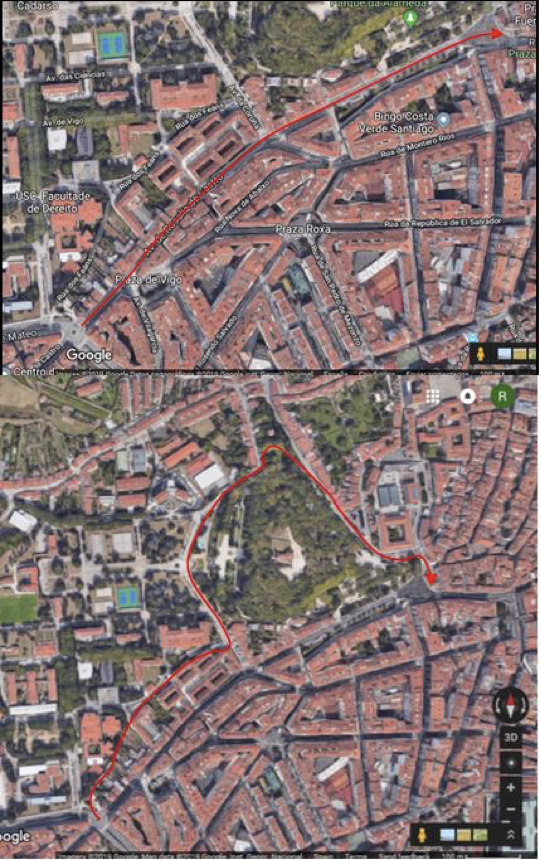
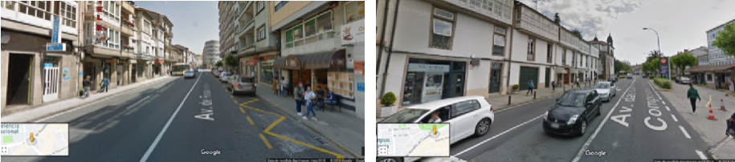
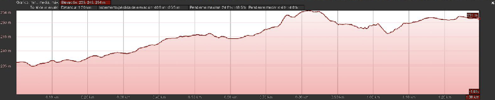
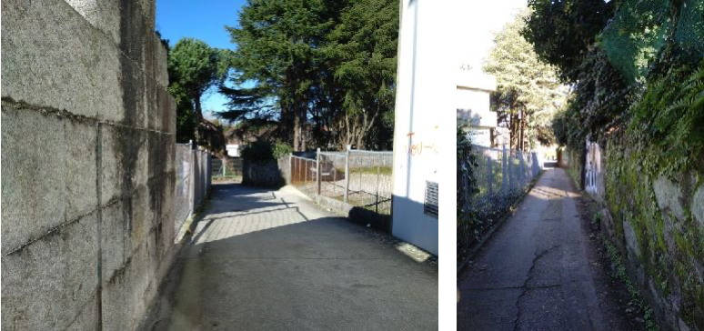
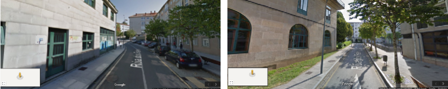

+++
title = 'Tramo Oeste-D'
date = 2024-09-28T11:11:29+02:00
draft = false
weight = 11
+++

| Alternativas  | Tramo | Distancia | Descripción
|---|---|---|---
| Directa | Tramo Oeste-D1 | 750 m | Esta alternativa continúa por la carretera de entrada a Santiago por la Avda De Rosalía de Castro.
| Rodeo por campus sur | Tramo Oeste-D2 | 1.300 m | Esta alternativa utiliza un trazado alternativo con menor densidad de tráfico rodado acercándose más a la zona del Campus sur y bordeando la Alameda.

- [Tramo Oeste-D1](#tramo-oeste-d1)
- [Tramo Oeste-D2](#tramo-oeste-d2)
  - [Estado actual tramo Oeste-D](#estado-actual-tramo-oeste-d)
    - [Fortalezas tramo Oeste-D](#fortalezas-tramo-oeste-d)
    - [Debilidades tramo Oeste-D](#debilidades-tramo-oeste-d)
  - [Estado con ciclovía tramo Oeste-D](#estado-con-ciclovía-tramo-oeste-d)
    - [Oportunidades tramo Oeste-D](#oportunidades-tramo-oeste-d)
    - [Amenazas tramo Oeste-D](#amenazas-tramo-oeste-d)

Este recorrido comienza en el punto en el que termina el tramo Oeste-C, en la rotonda en la que confluyen la Avda Rosalía de Castro, la Avda. Mestre Mateo y la Avda Romero Donallo. A partir de aquí existirían dos alternativas: la primera de ellas (Oeste-D1) utiliza la vía de entrada en la ciudad más directa a través de la Av.de Rosalía de Castro, que actualmente soporta una elevada densidad de tráfico rodado. La segunda alternativa (Oeste-D2) evitaría el paso por esta zona de elevado tráfico, pero a cambio supone un trazado más incómodo para la circulación de bicicletas al no ser tan directo, e incluir el paso por zonas menos transitadas.

> Tramo Oeste (W)-D, vista del trazado de las alternativas D1 (arriba) y D2 (abajo)

## Tramo Oeste-D1

La primera de las alternativas continúa por la vía principal de entrada en la ciudad a través de la Avda Rosalía de Castro, la Av. Das Casas de Compostela y la Av. De Xoán Carlos I hasta llegar a la Plaza de Galicia.

Al igual que ocurría en el caso de la zona W-C1, la pendiente de esta alternativa es la más tendida y su trazado el más directo para comunicar con la zona nueva y con la zona vieja de la ciudad,lo que la convierte en la vía más lógica y cómoda de acceso. Por este motivo, habitualmente soporta una elevada densidad de tráfico, especialmente en las horas punta de entrada y salida de colegios y comercios. Actualmente la circulación en bicicleta por esta zona no resulta segura, debe hacerse compartiendo la carretera con los vehículos y sin que exista mayor reducción de la velocidad de circulación.  

El espacio disponible es limitado mientras se siga manteniendo el doble sentido de circulación del tráfico rodado, por lo que si esto no se modifica no es posible proyectar una vía ciclista segura que permita mantener en todo el trazado una separación con respecto al tráfico rodado. De no ser así, la única opción para que esta vía disponga de un mínimo de seguridad para la circulación de bicicletas sería la limitación de la velocidad máxima a 30 km/hora (¿“zona 30”?), junto con la construcción de las infraestructuras adecuadas para impedir que los vehículos circulen a más velocidad.

> Tramo Oeste (W)-D1, vistas de la Av.Rosalía de Castro (izquierda) y de la Av.das Casas de Compostela (derecha)

> Perfil de elevación W-D1

## Tramo Oeste-D2

Esta alternativa contempla el paso por la Rúa dos Feáns, desde su comienzo en la zona de la rotonda en la que confluyen la Avda Rosalía de Castro, la Avda. Mestre Mateo y la Avda Romero Donallo, hasta acabar en el mismo punto que la alternativa W-D1 pero bordeando la alameda por la parte más próxima al Campus Sur de la USC.

La primera parte de este recorrido necesitaría acondicionamiento, especialmente en cuestiones de iluminación, aunque también por el estado del pavimento. Aun así, esta primera parte no deja de ser una vía relativamente apartada y muy poco frecuentada que podría comprometer bastante la sensación de seguridad. Actualmente no es posible la circulación de tráfico rodado por ella. La segunda mitad de este trazado sí sería compartida con tráfico rodado, aunque no soporta mucha densidad de vehículos.

> Tramo Oeste (W)-D2, diferentes vistas de la primera mitad de la rúa dos Feáns

> Tramo Oeste (W)-D2, diferentes vistas de la segunda mitad de la rúa dos Feáns

Una vez en la Av da Coruña, el recorrido bordea la Alameda a través de la Av. de Compostela hacia la rúa Campo do Cruceiro do Galo. Desde esta última, a través de la rúa do Campiño da Ferradura, se procedería a la incorporación a la rúa San Clemente hasta llegar a la  Av. de Xoán Carlos I.

### Estado actual tramo Oeste-D

#### Fortalezas tramo Oeste-D

- Comunican con lugares estratégicos de la ciudad como el Campus Sur de la USC y centros escolares.

#### Debilidades tramo Oeste-D

- Peligrosidad dada la elevada densidad de tráfico
- No existe espacio suficiente para adaptar las vías
- Dificultad técnica de adaptación al modelo de movilidad sostenible.

### Estado con ciclovía tramo Oeste-D

#### Oportunidades tramo Oeste-D

- Conexión segura para los ciclistas de cualquier edad y nivel
- Conexión segura diurna y nocturna siempre y cuando se ASEGURE la sensación de SEGURIDAD (tramos no frecuentados)

#### Amenazas tramo Oeste-D

- Infraestructura infrautilizada si no cuenta con el suficiente grado de seguridad y comodidad en su conexión con otros tramos del recorrido.
- Falta de implicación de otros actores sociales como administración empresas y Universidad, que fomenten la movilidad en bicicleta dentro de su actividad.
