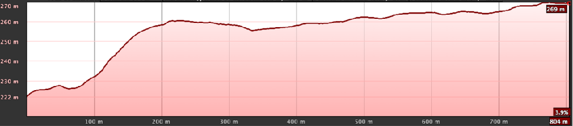

+++
title = 'Tramos de acceso'
date = 2024-09-28T11:11:29+02:00
draft = false
weight = 12
+++

**Acceso desde el Tramo Este-F: Parque Eugenio Granell hasta zona 30 Ensanche**. Perfil con una pendiente muy ligera que salva un desnivel de 20m.

> Eje x invertido

**Acceso desde el Sur a estación Intermodal desde el Tramo Este-G.** Salva 30 m de desnivel

**Acceso desde el Norte a estación Intermodal desde el Tramo Este-G.** Salva 7m de desnivel.

**Acceso desde Ponte do Sar a Calle de la Enseñanza desde el Tramo Este-G**. Moderada pendiente que salva 50m de desnivel.

**Acceso desde paso soterrado a Puerta del Camino desde el Tramo Este-H**. Abrupta pendiente de pendiente que salva 30m de desnivel en aproximadamente 100m de recorrido.

