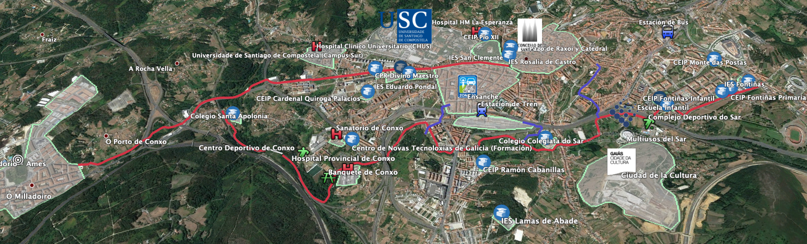

+++
title = 'Propuesta Ciclovía: O Milladoiro - Santiago'
linktitle = 'Ciclovía Milladoiro-Santiago'
date = 2024-09-28T11:11:29+02:00
draft = false
+++

El presente “Proyecto sobre una Vía Ciclista y Peatonal entre O Milladoiro y Santiago de Compostela”, se redacta por iniciativa de la Asociación Cívica Composcleta en el año 2019.
El equipo redactor de la misma es un grupo de trabajo creado para tal fin dentro del contexto de la asociación.

El objeto de esta propuesta es reclamar un recorrido entre Santiago de Compostela y O Milladoiro que permita el desplazamiento en bicicleta, a pie, en silla de ruedas o en vehículos para personas con movilidad reducida.

## Recusos sobre el proyecto

{}

## Nuestra propuesta original

A continuación exponemos nuestra propuesta original del año 2019.

> [!WARNING]
> Ten en cuenta que nuestra propuesta original **se ha mejorado sustancialmente en el actual proyecto de ejecución** de la Ciclovía Santiago-Milladoiro.


