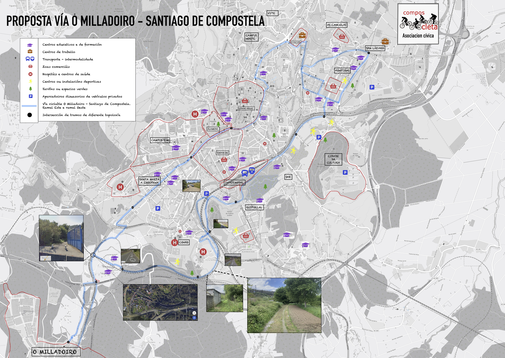

+++
title = 'Propuesta Ciclovía: O Milladoiro - Santiago'
linktitle = 'Ciclovía Milladoiro-Santiago'
date = 2025-02-19T11:11:29+02:00
draft = false
weight = 1
+++

El presente “Proyecto sobre una Vía Ciclista y Peatonal entre O Milladoiro y Santiago de Compostela”, fue redactado por iniciativa de la Asociación Cívica Composcleta en el año 2019.
El equipo redactor de la misma fue un grupo de trabajo creado para tal fin dentro del contexto de la asociación.

El objeto de esta propuesta fue reclamar un recorrido entre Santiago de Compostela y O Milladoiro que permita el desplazamiento en bicicleta, a pie, en silla de ruedas o en vehículos para personas con movilidad reducida.

## Recusos sobre el proyecto

<!-- {} -->
En estos enlaces dispones de los recursos en PDF de la propuesta:

- [Redacción completa del Proyecto original de Composcleta en PDF][1]
- [Mapa de trazado con puntos de interés elaborado por Composcleta][2]
- [Mapa de trazado (sin puntos de interés) elaborado por Composcleta][3]
- [Xunta de Galicia - Antecedentes de la propuesta][4]
- [Xunta de Galicia - Memoria do Proxecto][5]

## Nuestra propuesta original

A continuación exponemos nuestra propuesta original del año 2019. Esta propuesta se empezó a desarrollar en el año 2022 por la Xunta de Galicia y financiado por la Unión Europea con los fondos *NextGenerationEU*, tal y como se expresa en la memoria técnica de la Administración Autonómica:

> Se debe señalar como antecedente técnico el documento Propuesta Vía Ciclista Peatonal
Santiago – O Milladoiro, redactado por la Asociación Cívica Composcleta, cuyo objetivo
principal es: “reclamar un recorrido entre Santiago de Compostela y O Milladoiro que permita
el desplazamiento en bicicleta, a pie, en silla de ruedas o en vehículos para personas con
movilidad reducida.”, dicho documento es redactado en abril de 2019.

[!WARNING]
Ten en cuenta que nuestra propuesta original **se ha mejorado sustancialmente en el actual proyecto de ejecución de la *Axencia Galega de Infraestructuras*** de la Ciclovía Santiago-Milladoiro, en Septiembre del 2022, y gracias a los Fondos Europeos *Next-Generation*. Se ha modificado el trazado inicialmente propuesto pero conservando su ensencia y propósito.



<!-- Enlaces externos -->
[1]: https://drive.google.com/file/d/1YgRav3a-tzktjF1yDnBfhi20wG3X_ajo/view?usp=sharing 'Redacción completa del Proyecto en PDF'
[2]: https://drive.google.com/file/d/1zvja9ugbFcTxoC74sxxwcoojlYmPj1an/view?usp=sharing 'Mapa de trazado con puntos de interés'
[3]: https://drive.google.com/file/d/1EWq8s3XmAyA5tL6KE4l5kYHjgH4mkuI2/view?usp=sharing 'Mapa de trazado (sin puntos de interés)'
[4]: https://drive.google.com/file/d/1zvUW8clz9PXUoEUt4VtuBJ7-Kuytpqba/view?usp=sharing 'Xunta de Galicia - Antecedentes de la propuesta'
[5]: https://drive.google.com/file/d/10_tEl0HtElrVm97EtXQZvkUpub3ZiyDy/view?usp=sharing 'Xunta de Galicia - Memoria do Proxecto'
