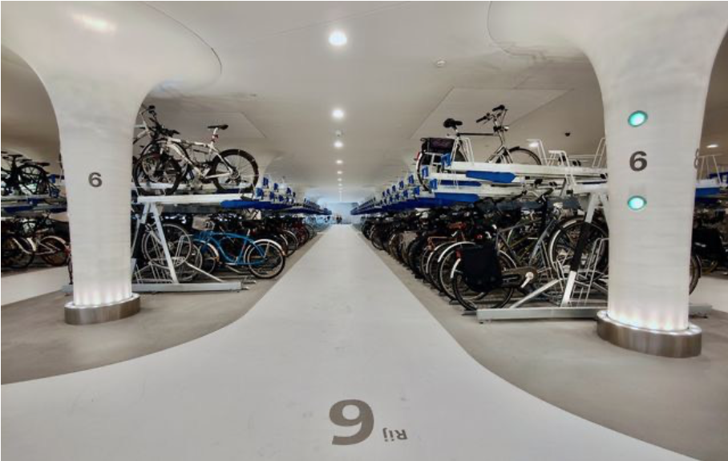

El objeto de esta propuesta es **instar a ADIF a que realice unos accesos para bicicletas y peatones que discurran por dentro de la estación y que conecten con el actual proyecto de red ciclable de la ciudad**.

La propuesta incluye las siguientes actuaciones en terrenos de ADIF:

- **Carril bici de aproximadamente 800m de recorrido, integrado con el actual de Clara Campoamor y que transite por el actual aparcamiento**; Desde la rotonda de Clara Campoamor bajo la Avenida de Lugo, hasta la entrada en el aparcamiento desde la Rúa do Hórreo,

- Carril bici de doble sentido de 300m, fuera de los terrenos de ADIF, por la **Rúa de Vedra, que comunique la explanada de entrada a la estación de autobuses con la Rúa de Amor Ruibal**.

- Estacionamiento de seguridad para al menos 100 bicicletas (equivalente al espacio de unas 10-15 plazas para coches del parking cubierto). Vigilado, cubierto, gratuito y lo más próximo a la zona de embarque posible.

    

En la actualidad no hay una infraestructura de uso público diseñada conectada y segura específicamente para peatones ni para bicicletas o vehículos destinados a personas con movilidad reducida, lo que provoca una clara situación de riesgo cuando estos ciudadanos tratan de desplazarse y/o acceder a la estación. Adif no puede quedar ajena a esta necesidad de cambio y colaborar con la administración local y autonómica para garantizar una movilidad coherente en la ciudad.

Y, por otra parte, esta propuesta encaja dentro de las grandes líneas europeas de fomento de la movilidad sostenible y de la reducción de las emisiones de gases de efecto invernadero.

## Alcance

Delimitar este alcance, en cuanto al nivel de profundidad técnico que se debe asumir, no es un asunto menor. Si bien es cierto que, por limitaciones de la capacidad técnica de Composcleta y de sus propios recursos, **la asociación no puede asumir un análisis técnico pormenorizado de la intervención**.

Por otra parte, la propuesta se limita a la conexión de las rúas de Bernardo Barreiro de Váquez Varela, Clara Campoamor y Rúa del Hórreo. Esto es apenas 1km de recorrido. Aún así, la propuesta forma parte de una estrategia integral que incluye la red ciclable de la ciudad.
