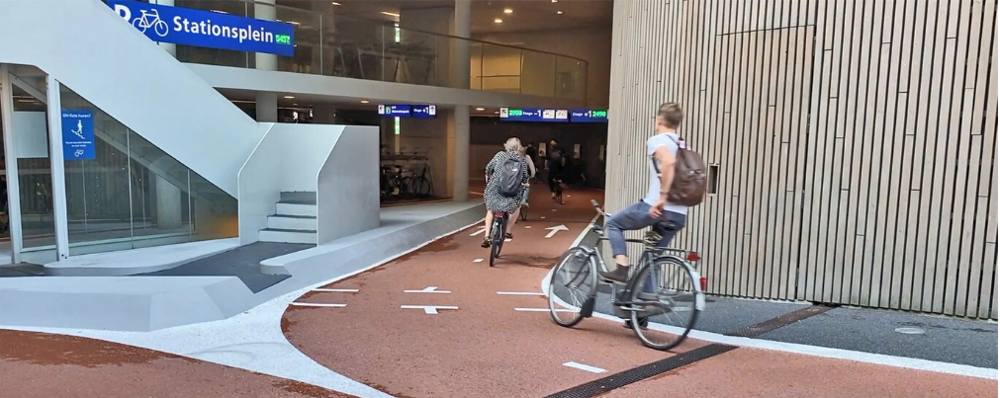

De acuerdo a lo expresado en el Dossieres previos, se identifican unas premisas o
principios básicos aplicables también a esta propuesta:

- **Seguridad**: Vía segura para cualquier ciclo-usuario,que evite todo lo posible la coincidencia con tráfico a motor intenso y a alta velocidad.

- **Coherencia**: Rutas sin interrupciones, con continuidad en su recorrido durante todo el año y que lleven de modo directo de punto a punto, sin dar largos rodeos innecesarios; e integradas con infraestructuras de la ciudad.

- **Comodidad**: Rutas que permitan el tráfico fluido de bicicletas y resulten sencillas de utilizar para todo tipo de usuarios y bicicletas, con bajas pendientes, superficie compacta y servicios en su recorrido, con un propósito de movilidad rápida y cómoda.

- **Atractivo**: Rutas que pongan en valor el entorno ambiental, histórico, cultural y social por el que pasan, comunicando zonas atractivas de la ciudad e integrándose con otras opciones para conformar una red ciclable más amplia.

