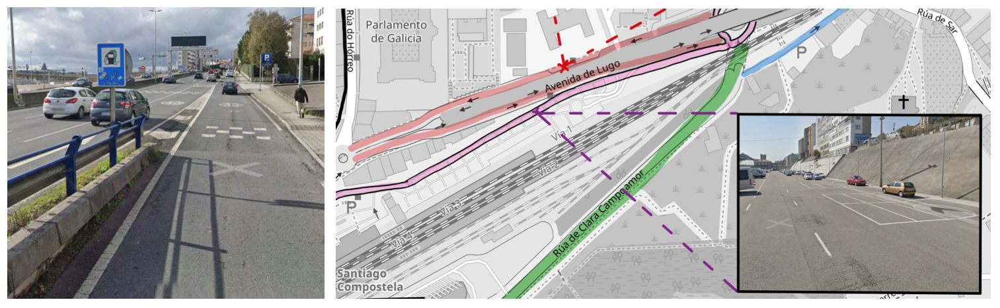
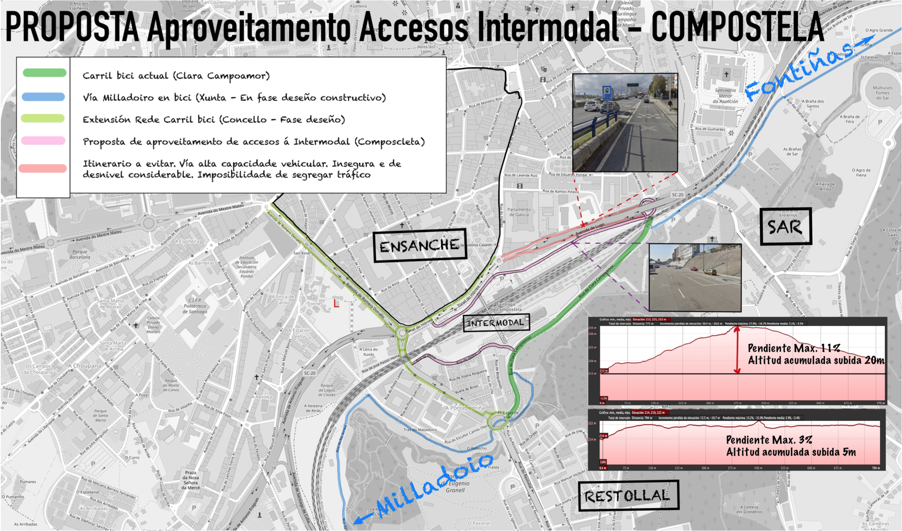

El presente documento “*Propuesta Accesos Estación Intermodal peatonales y en bicicleta de Santiago de Compostela*”, se redacta por iniciativa de la Asociación Cívica Composcleta. Dejamos como recursos los siguientes:

- [Propuesta Accesos Estación Intermodal peatonales y en bicicleta de Santiago de Compostela en PDF][1]
- [Mapa en PDF de la Propuesta Corredor peatonal-ciclista Intermodal][2]

El equipo redactor de la misma es un grupo de trabajo creado para tal fin dentro del contexto de la asociación.

**El objeto de esta propuesta es reclamar unos accesos adecuados desde la perspectiva peatonal y de las personas usuarias de la bicicleta, que permita el acceso a la estación Intermodal de una forma cómoda, segura** y alternativa a los medios motorizados en contraste a la situación actual, carente de accesibilidad y diseñada exclusivamente por y para para los vehículos motorizados privados.

Dentro del propósito general de este documento, y partiendo del actual contexto donde se están realizando proyectos de una gran inversión para la movilidad en bicicleta, y fundamentalmente estos integrados en las inmediaciones y contexto de la Estación Intermodal.

Existe una infraestructura de carril bici segregado en la Rúa Clara Campoamor, que próximamente conectará además con la Vía Milladoiro, obra que se está ejecutando en el Contexto de la Consellería de Infraestructuras de la Xunta de Galicia y que conectará Santiago con el núcleo limítrofe de Milladoiro, dando acceso a este gran grupo de población con la estación. Esta importante infraestructura diseñada fundamentalmente para la movilidad en bicicleta y VMPs también conectará importantes barrios de la ciudad como Conxo, Sar, Pontepedriña, Fontiñas y San Caetano.

Con esta propuesta se pretende realizar una infraestructura ciclista segura, coherente, cómoda, atractiva e integrada con la Estación Intermodal, que pueda resultar en un activo importante para la promoción de las bicicletas en una ciudad y un país, en el que no hay un uso tan arraigado como en el resto de Europa.

Se ha incidido en el **aspecto de la intermodalidad para que la bicicleta sea absolutamente compatible con otros medios de transporte público y de bajo coste medioambiental como el tren y el autobús**. Se apuntan una serie de recomendaciones y de buenas prácticas basados en estudios y trabajos técnicos, atendiendo también al conocimiento y experiencia de la implantación de la bicicleta en otras ciudades.

El itinerario propuesto se diseña por dentro de la estación, con el propósito de dotar a la estación Intermodal de un verdadero acceso peatonal y ciclista tanto por el extremo SW de la estación como por el extremo NE.

Además del propio acceso a la estación, se prevé que este acceso sea estratégico para una red de carril bici integrada en la ciudad, y aprovechando que la topografía de la estación proporciona un recorrido llano que salva el desnivel, permitiendo por ejemplo, conectar el barrio de Sar con el Ensanche de una forma segura, rápida y sin prácticamente desnivel.

La estación se insiste se asienta en un terreno estratégico ya que la alternativa de conexión, y dada la topografía, implica que Sar y El Hórreo se tuviesen que conectar por la SC-20. Vía donde es inevitable en este momento hacer que el tráfico motorizado, circulando por una vía que se asemeja más a una autopista urbana y donde habitualmente se excede el límite 30 marcado por la señalización, deba compartir espacio con la bicicleta.

Además, esta alternativa anteriormente descrita (y representada con líneas rojas sobre el mapa) presenta un desnivel donde en determinados puntos presenta una elevada pendiente contrastando con el acceso que estamos proponiendo y que actualmente se emplea como parking descubierto de vehículos privados.

El recorrido empleando la SC-20 para llegar al hórreo desde Sar, presenta desniveles de hasta el 11% y se comparte la calzada en subida con vehículos motorizados donde realmente contrastan y mucho, las velocidades que pueden asumir estos frente a las bicis y VMPs, sin posibilidad de segregación de este tráfico.

La estación dispone de unos terrenos en desuso, que podrían permitir el acceso peatonal y ciclable que ahora proponemos. Esto permitiría **conectar con el actual carril bici de Clara Campoamor, con el acceso NE de la estación**.

Por el lado SW, tenemos **un acceso al ensanche** y a carriles bici construídos o en propuesta de construcción.

<!-- Referencias externas -->
[1]: https://drive.google.com/file/d/1S6DQKkw_Onm4yAp_D0Kjb3AwD3gDzpRA/view?usp=sharing 'Propuesta Accesos Estación Intermodal peatonales y en bicicleta de Santiago de Compostela en PDF'
[2]: https://drive.google.com/file/d/1NOzbQqFIEob3aAFnnegfOKen99hpf_Wv/view?usp=sharing 'Mapa en PDF de la Propuesta Corredor peatonal-ciclista Intermodal'
