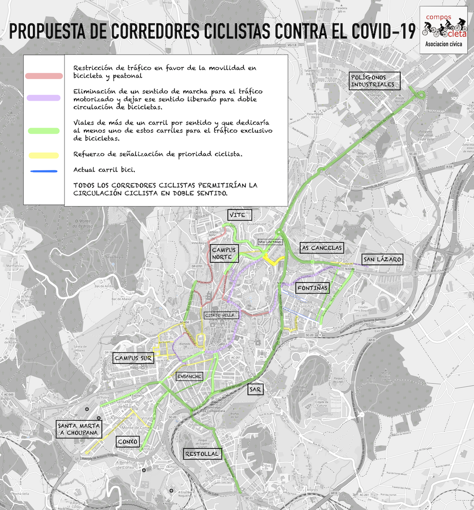

Esta propuesta fue elaborada por un grupo de miembros de la asociación Composcleta que de forma diaria y desde hace años, utilizan la bicicleta como medio de desplazamiento por la ciudad. Es una propuesta planteada por personas con mucha experiencia circulando en bicicleta en nuestro entorno, pero pensada **con la perspectiva de favorecer el acceso de nuevos usuarios de la bicicleta**, destacando que uno de los principales motivos por los que muchas personas no optan por este medio, es la percepción de falta de seguridad debido al tráfico motorizado y a la propia ordenación de éste.
Nuestra propuesta se desarrolla fundamentalmente en una distribución temporal de los espacios públicos:

- Buscando **vías ciclistas rápidas y directas** de acceso a diferentes barrios de Compostela.

- Conectando el resto de la ciudad con complejos hospitalarios como el **C.H.U.S.**

- Conectando con **centros de trabajo** donde se concentra un gran número de personas (Consellerías, Polígonos, Centros de Formación, Zona comercial).

- Se busca una **reasignación temporal del espacio** ocupado habitualmente por tráfico motorizado, que debido a la pandemia se ve significativamente reducido, para que sea ocupado por ciclistas urbanos y peatones, a falta de un plan general de movilidad en la ciudad.

- Se busca **ampliar el espacio para peatones fuera de las aceras** cuando estas son significativamente estrechas e insuficientes, compartiendo la calzada en algunos tramos con ciclistas (sobretodo en el eje norte-sur que discurre por Basquiños, San Roque, Rodas, Puerta del Camino, Virxe da Cerca, hasta la plaza de Galicia).

- Subscribimos la **delimitación de los “*corredores ciclistas*”**, con pintura amarilla (dada su provisionalidad), o con cintas, conos, vallados o jardineras. Pero siempre garantizando una separación con el tráfico a motor dado el perfil de nuevo usuario de la bicicleta.

Concretamos estas medidas sobre una propuesta de corredores sobre el mapa de la ciudad. Las actuaciones en cada vía están indicadas con un código de colores según la naturaleza de la propuesta en ellas (restricción de tráfico motorizado, asignación de un carril de circulación a bicicletas, etc.):

- **(VERDE)**: En vías de más de un carril por sentido. Dedicar al menos un carril exclusivamente para bicis mediante señalización horizontal en calzada y, temporalmente con cintas, conos, etc; De modo análogo a las actuaciones existentes en otras ciudades.

- **(MORADO)**: Eliminación de un sentido de circulación para coches (haciendo la vía de un único sentido para ellos, y dotando el otro carril para uso exclusivo de bicicletas o para uso compartido con peatones por si el espacio para estos no fuera suficiente sobre la acera.

- **(ROJO)**: Restricción de circulación de vehículos a motor (excepto servicios esenciales).

- **(AMARILLO)**: En Vías donde la única alternativa actual es el uso compartido de la calzada con vehículos a motor, y en donde es necesario dotar de medidas adicionales de señalización o más limitación de velocidad para favorecer la convivencia con ciclistas.

Es importante destacar que **TODOS LOS ITINERARIOS PROPUESTOS SON EN DOBLE SENTIDO PARA BICIS**.

**A continuación** concretamos por los principales nombres de vías para la implantación temporal de los “corredores ciclistas” y según las medidas a implementar:

- **Corte de un sentido de Circulación:**

  - Basquiños, Rodas, Rúa da Virxe da Cerca, Rúa da Ensinanza, Tránsito da Mercé hasta la Plaza de Galicia. (Tráfico motorizado sentido hacia el sur). Doble sentido para bicicletas.
  - Rúa dos Concheiros y Rúa de Angustias en sentido exclusivamente ascendente para tráfico motorizado. Doble sentido para bicicletas.
  - Rúa das Fontiñas y Rúa do Valiño en sentido hacia el Este para tráfico motorizado. Doble sentido para bicicletas.
  - Avenida da Coruña en sentido hacia el Norte para tráfico motorizado. Doble sentido para bicicletas.

- **Dedicación de carriles existentes exclusivamente para la bicicleta:**

  - Avenida do Cruceiro da Coruña: Delimitación de un carril bici con una fuerte percepción de seguridad y de segregación del tráfico a motor, con conos, pintura...
  - Avenida do Camiño francés dedicando un carril exclusivamente para bicicletas.
  - Avenida de Lugo, dedicando un carril central exclusivamente para bicicletas.
  - Rúa do Restollal dedicando un carril exclusivamente para bicicletas.
  - Rúa Roma e Rúa Paris por su suficiente anchura, reservar un espacio para bicicletas.
  - Avenida de Ferrol y Avenida Barcelona con un carril exclusivamente para bicicletas.

> Dispones de este mapa en formato PDF y con alta resolución en [los recursos de este propuesta](/corredores-bici-santiago)
