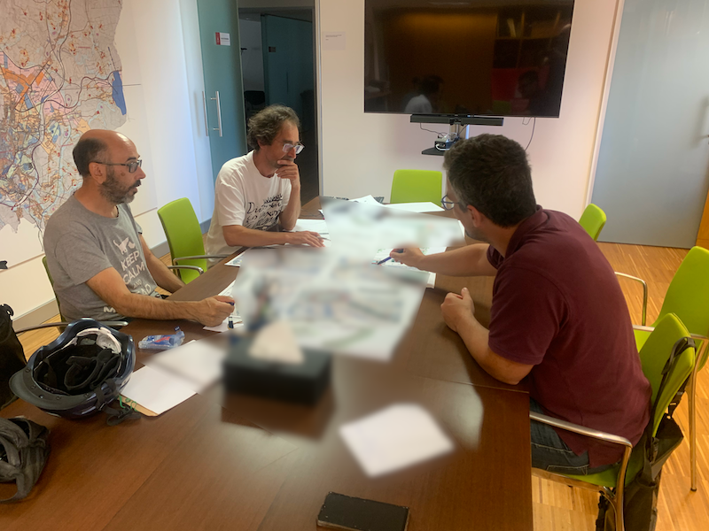

A continuación podrás ver documentos de trabajo que la asociación publica respecto a diferentes propuestas o ideas sobre la movilidad sostenible.

{}
  **Todos los recursos aquí publicados son de dominio público**. Los documentos de trabajo que nos facilitan las administraciones no los verás publicados en esta web. Si tienes interés en trabajar con Composcleta y con las administraciones, hazte socio y participa del grupo de trabajo de Infraestructuras y Movilidad Sostenible de la asociación.

  Parte de esta sección de [nuestra web](www.composcleta.org) está y seguirá estando permanentemente construyéndose.
{}

A continuación puedes ver los diferentes propuestas o proyectos:



Puedes utilizar la barra lateral o botón contextual (en el móvil) para acceder estructuradamente a todas las secciones de forma más cómoda.

